# Selvstudium: Udforsk webportalen til Power BI-rapportserver i en VM
I dette selvstudium skal du oprette en virtuel Azure-maskine med Power BI-rapportserver, der allerede er installeret, så du kan få vist, redigere og administrere eksempler på Power BI og sideinddelte rapporter samt KPI'er.

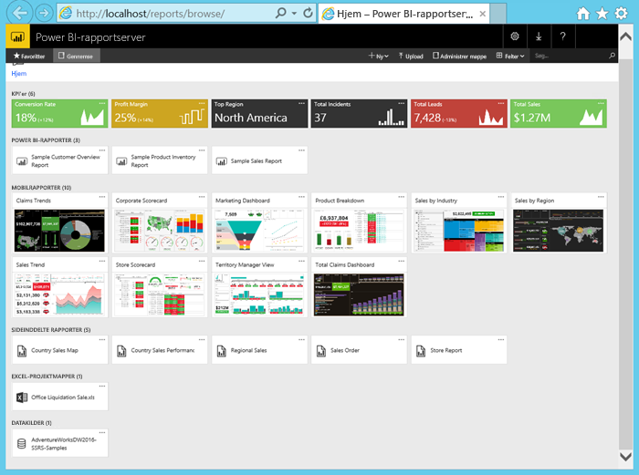

Her er de opgaver, du skal udføre i dette selvstudium:

> [!div class="checklist"]
> * Opret en VM, og opret forbindelse til den
> * Start og udforsk webportalen til Power BI-rapportserver
> * Markér et element som favorit
> * Få vist og rediger en rapport i Power BI
> * Få vist, administrer og rediger en sideinddelt rapport
> * Få vist en Excel-projektmappe i Excel Online

Til dette selvstudium skal du have et Azure-abonnement. Hvis du ikke har en, skal du oprette en [gratis konto](https://azure.microsoft.com/free/?WT.mc_id=A261C142F), før du begynder.

## Opret en virtuel maskine til Power BI-rapportserveren

Power BI-teamet har heldigvis oprettet en VM, der leveres sammen med Power BI-rapportserveren, som allerede er installeret.

1. Gå til Azure Marketplace, og åbn [Power BI-rapportserveren](https://azuremarketplace.microsoft.com/marketplace/apps/reportingservices.technical-preview?tab=Overview).  

2. Vælg **Hent det nu**.
3. Vælg **Fortsæt** for at acceptere udbyderens vilkår for anvendelse og politik om beskyttelse af personlige oplysninger.

    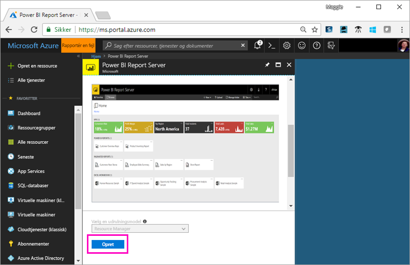

4. **Trin 1 Grundlæggende**: Angiv **VM-navn** til **reportservervm**.

5. Opret et brugernavn og en adgangskode.

6. For **Ressourcegruppe** skal du bevare **Opret ny** og kalde den **reportserverresourcegroup**.

    Hvis du gennemgår selvstudiet mere end én gang, skal du give ressourcegruppen et andet navn efter den første gang. Du kan ikke bruge samme navn på ressourcegruppen to gange i ét abonnement. 

7. Bevar de andre standarder > **OK**.

    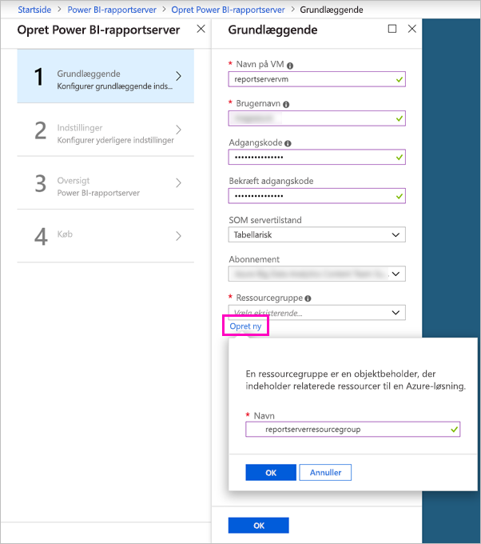

8. **Trin 2 Indstillinger**: Bevar standardindstillingerne > **OK**.

9. **Trin 3 Oversigt** > **OK**.

10. **Trin 4**: Gennemgå vilkårene for anvendelse og politikken om beskyttelse af personlige oplysninger > **Opret**.

    Processen til **afsendelse af udrulning for Power BI-rapportserveren** tager flere minutter.

## Opret forbindelse til din virtuelle maskine

1. Vælg **Virtuelle maskiner** i venstre navigationsrude i Azure. 

2. I feltet **Filtrer efter navn** skal du skrive "rapport". 

3. Vælg den VM, der hedder **REPORTSERVERVM**.

    

4. Vælg **Opret forbindelse** under den virtuelle maskine REPORTSERVERVM.

    

5. Vælg **Opret forbindelse** i dialogboksen Forbindelse til Fjernskrivebord.

6. Angiv det navn og den adgangskode, du har oprettet for VM'en > **OK**.

7. I næste dialogboks får du besked om, at identiteten af fjerncomputeren ikke kan identificeres. Vælg **Ja**.

   Sådan – din nye VM åbnes.

## Power BI-rapportserver på den virtuelle maskine

Når din VM åbner, vises følgende elementer på skrivebordet.

|Tal  |Hvad er det  |
|---------|---------|
| | Starter SQL Server Data Tools for at oprette sideinddelte rapporter (. RDL) |
| | Eksempel på Power BI-rapporter (.PBIX)  |
| | Links til dokumentation til Power BI-rapportserveren   |
| | Start Power BI Desktop optimeret til Power BI-rapportserver (marts 2018)  |
| | Åbner webportalen til Power BI-rapportserveren i browseren   |

Dobbeltklik på ikonet **Webportalen Rapportserver**. Browseren åbner `http://localhost/reports/browse`. Du kan se forskellige filer grupperet efter type på webportalen. 

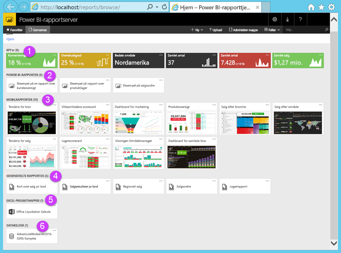

|Tal  |Hvad er det  |
|---------|---------|
| | KPI'er oprettet på webportalen |
| |  Power BI-rapporter (.PBIX)  |
| | Mobilrapporter, der er oprettet i Mobile Report Publisher til SQL Server  |
| |  Sideinddelte rapporter, der er oprettet i Report Builder eller SQL Server Data Tools  |
| | Excel-projektmapper   | 
| | Datakilder til sideinddelte rapporter | 

## Tag dine favoritter
Du kan mærke rapporter og KPI'er, som skal være favoritter. De er lettere at finde, fordi de alle sammen er samlet i en enkelt Favoritter-mappe, både i webportalen og i Power BI-mobilappsene. 

1. Klik på ellipsen (**...**) i øverste højre hjørne af **Avance** > KPI > **Føj til Favoritter**.
   
    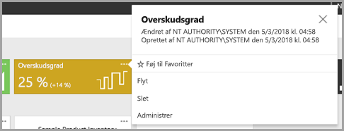
2. Vælg **Favoritter** på båndet på webportalen for at se den sammen med andre favoritter på siden Favoritter på webportalen.
   
    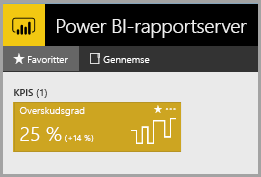

3. Vælg **Gennemse** for at vende tilbage til webportalen.
   
## Vis elementer i listevisning
Som standard vises indholdet på webportalen i Felt-visning.

Du kan skifte til Liste-visning, hvor det er nemt at flytte eller slette flere elementer ad gangen. 

1. Vælg **Felter** > **Liste**.
   
    

2. Gå tilbage til visning af felter: Vælg **Liste** > **Felter**.

## Power BI-rapporter

Du kan få vist og interagere med Power BI-rapporter på webportalen og starte Power BI Desktop direkte fra webportalen.

### Se Power BI-rapporter

1. Under **Power BI-rapporter** på webportalen skal du vælge **Eksempel på kundeoversigtsrapport**. Rapporten åbnes i browseren.

1. Vælg USA-blokken i træstrukturen for at se, hvordan den fremhæver relaterede værdier i de andre visuelle elementer.

    

### Rediger i Power BI Desktop

1. Vælg **Rediger i Power BI Desktop**.

1. Vælg **Tillad** for at give dette websted tilladelse til at åbne et program på din computer. 

     Rapporten åbnes i Power BI Desktop. Bemærk navnet på den øverste linje "Power BI Desktop (marts 2018)". Det er den version, der er optimeret til Power BI-rapportserveren.

    

     Brug den version af Power BI Desktop, der er installeret på VM'en. Du kan ikke skifte mellem domæner for at uploade en rapport.

3. Udvid tabellen Kunder i ruden Felter, og træk feltet Beskæftigelse til Filtre på rapporteringsniveau.

    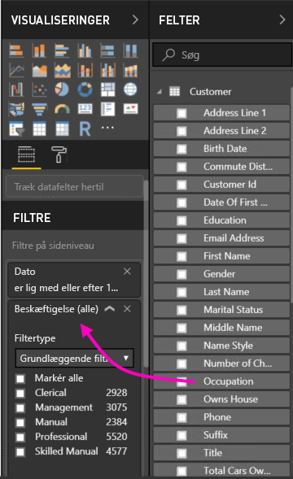

1. Gem rapporten.

1. Gå tilbage til rapporten i browseren, og vælg ikonet **Opdater** for browseren.

    

8. Udvid ruden **Filtre** til højre for at se filteret **Beskæftigelse**, som du har tilføjet. Vælg **Professional**.

    

3. Vælg **Gennemse** for at vende tilbage til webportalen.

## Sideinddelte rapporter (.RDL)

Du kan få vist og administrere sideinddelte rapporter og starte Report Builder fra webportalen.

### Administrer en sideinddelt rapport

1. Under **Sideinddelte rapporter** på webportalen skal du vælge ellipsen (...) ud for **Salgsordre** > **Administrer**.

1. Vælg **Parametre**, og skift standardværdien for **SalesOrderNumber** til **SO50689** > **Anvend**.

   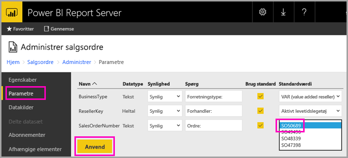

3. Vælg **Gennemse** for at vende tilbage til webportalen.

### Se en sideinddelt rapport

1. Vælg **Salgsordre** på webportalen.
 
3.  Du kan se, at den åbnes med den parameter for **Ordre**, som du har angivet, **SO50689**. 

    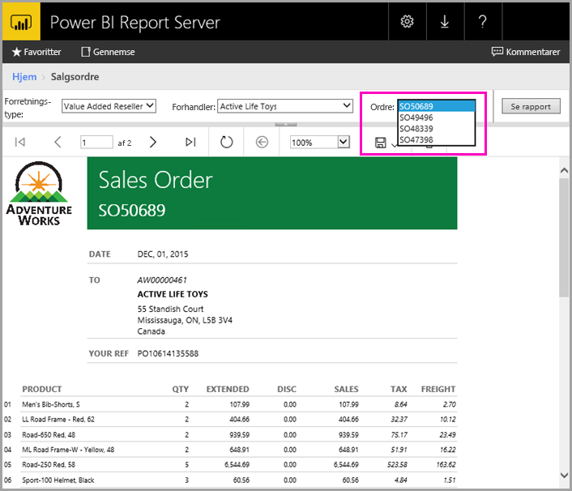

    Du kan ændre parameteren her – sammen med andre parametre – uden at ændre standardværdierne.

1. Vælg **Ordre** **SO48339** > **Vis rapport**.

4. Du kan se, at dette er side 1 af 2. Vælg højre pil for at se den næste side. Tabellen fortsætter på denne side.

    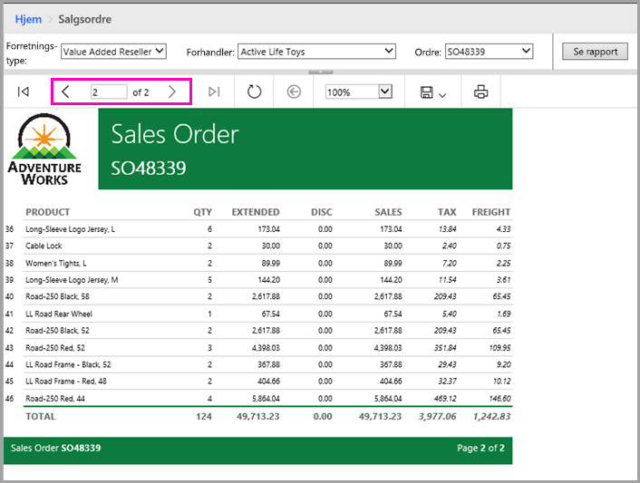

5. Vælg **Gennemse** for at vende tilbage til webportalen.

### Rediger en sideinddelt rapport

Du kan redigere sideinddelte rapporter i Report Builder, og du kan starte Report Builder direkte fra browseren.

1. På portalen skal du vælge ellipsen (...) ud for **Salgsordre** > **Rediger i Report Builder**.

1. Vælg **Tillad** for at give dette websted tilladelse til at åbne et program på din computer.

1. Rapporten Salgsordre åbnes i designvisning i Report Builder.

    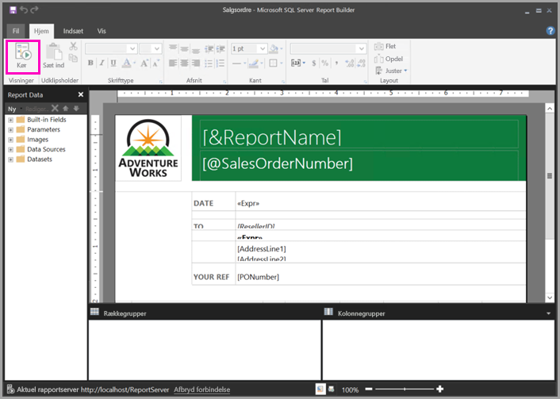

1. Vælg **Kør** for at få vist rapporten.

    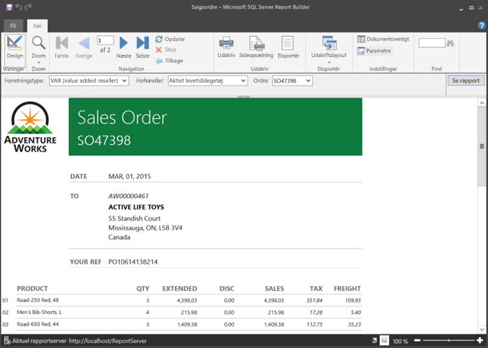

5. Luk Report Builder, og gå tilbage til browseren.

## Se Excel-projektmapper

Du kan få vist og interagere med Excel-projektmapper i Excel Online i Power BI-rapportserveren. 

1. Vælg Excel-projektmappen **Office Liquidation Sale.xlsx**. Du bliver måske bedt om at angive legitimationsoplysninger. Vælg **Annuller**. 
    Den åbnes på webportalen.
1. Vælg **Apparat** i udsnitsværktøjet.

    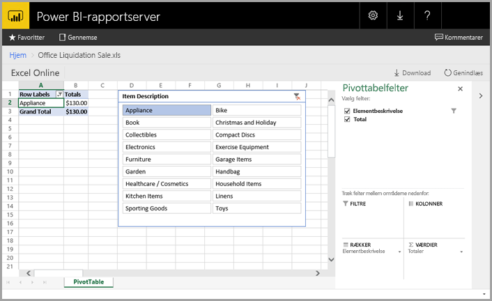

1. Vælg **Gennemse** for at vende tilbage til webportalen.

## Fjern ressourcer

Nu, hvor du er færdig med dette selvstudium, kan du slette ressourcegruppen, den virtuelle maskine og alle relaterede ressourcer. 

- Det kan du gøre ved at vælge ressourcegruppen for VM'en og vælge **Slet**.

## Næste trin

I dette selvstudium har du oprettet en VM med Power BI-rapportserveren. Du har prøvet nogle af funktionerne på webportalen, og du har åbnet en Power BI-rapport og en sideinddelt rapport i deres respektive editors. Denne VM har SQL Server Analysis Services-datakilder installeret, så du kan prøve at oprette dine egne Power BI-rapporter og sideinddelte rapporter med de samme datakilder. 

Du kan få mere at vide om, hvordan du opretter rapporter til Power BI-rapportserveren, ved at læse videre.

> [!div class="nextstepaction"]
> [Opret en Power BI-rapport til Power BI-rapportserveren](./quickstart-create-powerbi-report.md)

