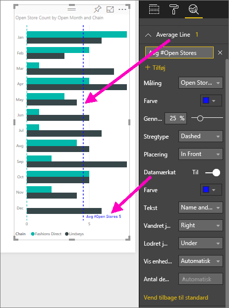

# Opret dynamiske referencelinjer til visualiseringer i Power BI-tjenesten

Med ruden **Analytics** i **Power BI-tjenesten** kan du tilføje dynamiske *referencelinjer* for visuelle effekter og angive fokus for vigtige tendenser eller indsigt.

> [!NOTE]
> Ruden **Analytics** vises kun, når du vælger en visuel effekt på rapportlærredet.
> 
> 

## Brug ruden Analytics
Med ruden **Analytics** kan du oprette følgende typer dynamiske referencelinjer (ikke alle linjer er tilgængelige for alle typer visuelle effekter):

* Konstantlinje for X-akse
* Konstantlinje for Y-akse
* Minimumlinje
* Maksimumlinje
* Gennemsnitslinje
* Medianlinje
* Fraktillinje

Få vist de tilgængelige dynamiske referencelinjer for en visuel effekt ved at følge disse trin:

1. Vælg eller opret en visuel effekt, og vælg derefter ikonet **Analytics**  i ruden **Visuelle effekter**.

2. Vælg pil ned til den linjetype, du vil oprette, for at åbne dens indstillinger. I dette tilfælde vælger vi **Gennemsnitslinje**.
   
   

3. Du opretter en ny linje ved at vælge **+ Tilføj** og beslutte dig for, hvilken måling der skal bruges til at oprette linjen.  Rullelisten **Måling** udfyldes automatisk med tilgængelige data fra den valgte visualisering. Nu skal du bruge **Open store count**.

5. Du har en række forskellige indstillinger for linjen, f.eks. farve, gennemsigtighed, typografi og position (i forhold til den visuelle effekts dataelementer). Hvis du vil navngive linjen, kan du give den en titel og derefter flytte skyderen **Datanavn** til **Til**.  I dette tilfælde kalder vi linjen *Avg # Open Stores* og tilpasser nogle af de andre indstillinger, som vist nedenfor.
   
   

1. Bemærk tallet, der vises ved siden af elementet **Gennemsnitslinje** i ruden **Analytics**. Det fortæller dig, hvor mange dynamiske linjer, du på nuværende tidspunkt har på dine visuelle effekter og af hvilken type. Hvis vi føjer en **Konstantlinje** som et måltal for butikker på 9, kan du se, at ruden **Analytics** viser, at vi nu også anvender en **Konstantlinje** som referencelinje for den visuelle effekt.
   
   
   

Der er mange typer interessant viden, du kan fremhæve ved at oprette dynamiske referencelinjer med ruden **Analytics**.

## Overvejelser og fejlfinding

Hvis der ikke kan anvendes dynamiske linjer for den valgte visuelle effekt (i dette tilfælde den visuelle effekt **Kort**), får du vist følgende, når du vælger ruden **Analytics**.
   

Muligheden for at bruge dynamiske referencelinjer er baseret på typen af visuel effekt, der bruges. Følgende liste viser, hvilke dynamiske linjer der i øjeblikket er tilgængelig for de visuelle effekter:

Fuld brug af dynamiske linjer er tilgængelig på følgende visuelle effekter:

* Områdediagram
* Kurvediagram
* Punktdiagram
* Grupperet søjlediagram
* Grupperet liggende søjlediagram

Følgende visuelle effekter kan kun bruge en *konstantlinje* fra ruden **Analytics**:

* Stablet område
* Stablet liggende søjle
* Stablet søjle
* 100 % stablet liggende søjle
* 100 % stablet søjle

For følgende visuelle effekter er en *tendenslinje* i øjeblikket den eneste mulighed:

* Ikke-stablet linje
* Grupperet søjlediagram

Slutteligt kan ikke-kartesianske visuelle effekter i øjeblikket ikke anvende dynamiske linjer fra ruden **Analytics**, f.eks.:

* Matrix
* Cirkeldiagram
* Krans
* Tabel

## Næste trin
[Ruden Analytics i Power BI Desktop](desktop-analytics-pane.md)

Har du flere spørgsmål? [Prøv at spørge Power BI-community'et](http://community.powerbi.com/)

