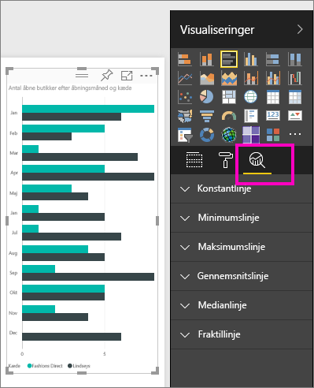
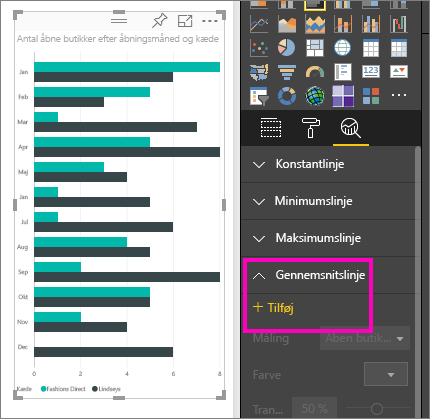
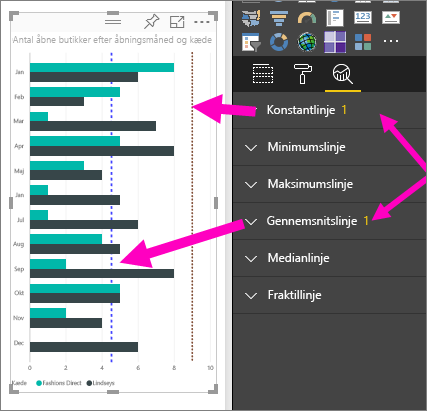
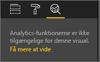

# Ruden Analytics i Power BI-tjenesten
Med ruden **Analytics** i **Power BI-tjenesten** kan du tilføje dynamiske *referencelinjer* for visuelle effekter og angive fokus for vigtige tendenser eller indsigt.

> [!NOTE]
> Ruden **Analytics** vises kun, når du vælger en visuel effekt på rapportlærredet.
> 
> 

## Sådan bruges ruden Analytics
Med ruden **Analytics** kan du oprette følgende typer dynamiske referencelinjer (ikke alle linjer er tilgængelige for alle typer visuelle effekter):

* Kontantlinje for X-akse
* Kontantlinje for Y-akse
* Minimumlinje
* Maksimumlinje
* Gennemsnitslinje
* Medianlinje
* Fraktillinje

Følgende afsnit viser, hvordan du kan bruge ruden **Analytics** og dynamiske referencelinjer i dine visuelle effekter.

Få vist de tilgængelige dynamiske referencelinjer for en visuel effekt ved at følge disse trin:

1. Vælg eller opret en visuel effekt, og vælg derefter ikonet **Analytics**  i ruden **Visuelle effekter**.
2. Vælg pil ned til den linjetype, du vil oprette, for at åbne dens indstillinger. I dette tilfælde vælger vi **Gennemsnitslinje**.
   
   
3. Vælg **+ Tilføj** for at oprette en ny linje. Du kan derefter angive et navn på linjen ved at dobbeltklikke på tekstfeltet og derefter skrive navnet.
   
   Du har alle mulige forskellige indstillinger for linjen. Du kan f.eks. vælge dens *farve*, *gennemsigtighed*, *typografi* og *position* (forhold til den visuelle effekts dataelementer), og om du vil medtage etiketten. Og som det vigtigste kan du vælge, hvilken **Måling** i den visuelle effekt, du ønsker, at linjen skal være baseret på, ved at vælge rullemenuen **Måling**, som automatisk er udfyldt med dataelementer fra den visuelle effekt. I dette tilfælde vælger vi *Open store count* som målingen, mærker den *Avg # Open Stores* og tilpasser nogle af de andre indstillinger, som vist nedenfor.
   
   
4. Hvis du vil have vist et datanavn, skal du slå skyderen **Data label** til. Når du gør dette, får du mange yderligere indstillinger for dit datanavn.
5. Bemærk tallet, der vises ved siden af elementet **Gennemsnitslinje** i ruden **Analytics**. Det fortæller dig, hvor mange dynamiske linjer, du på nuværende tidspunkt har på dine visuelle effekter og af hvilken type. Hvis vi føjer en **Konstantlinje** som et måltal for butikker på 9, kan du se, at ruden **Analytics** viser, at vi nu også anvender en **Konstantlinje** som referencelinje for den visuelle effekt.
   
   
   
   Hvis der ikke kan anvendes dynamiske linjer for den valgte visuelle effekt (i dette tilfælde den visuelle effekt **Kort**), får du vist følgende, når du vælger ruden **Analytics**.
   
   

Der er mange typer interessant viden, du kan fremhæve ved at oprette dynamiske referencelinjer med ruden **Analytics**.

Vi planlægger flere funktioner og egenskaber, herunder at udvide, hvilke visuelle effekter, der kan have anvendt dynamiske referencelinjer, så vend tilbage ofte for at se nyheder.

## Begrænsninger
Muligheden for at bruge dynamiske referencelinjer er baseret på typen af visuel effekt, der bruges. Følgende liste viser, hvilke dynamiske linjer der i øjeblikket er tilgængelig for de visuelle effekter:

Fuld brug af dynamiske linjer er tilgængelig på følgende visuelle effekter:

* Områdediagram
* Kurvediagram
* Punktdiagram
* Grupperet søjlediagram
* Grupperet liggende søjlediagram

Følgende visuelle effekter kan kun bruge en *konstantlinje* fra ruden **Analytics**:

* Stablet område
* Stablet liggende søjle
* Stablet søjle
* 100 % stablet liggende søjle
* 100 % stablet søjle

For følgende visuelle effekter er en *tendenslinje* i øjeblikket den eneste mulighed:

* Ikke-stablet linje
* Grupperet søjlediagram

Slutteligt kan ikke-kartesianske visuelle effekter i øjeblikket ikke anvende dynamiske linjer fra ruden **Analytics**, f.eks.:

* Matrix
* Cirkeldiagram
* Krans
* Tabel

## Næste trin
[Ruden Analytics i Power BI Desktop](desktop-analytics-pane.md)

Har du flere spørgsmål? [Prøv Power BI-community'et](http://community.powerbi.com/)

