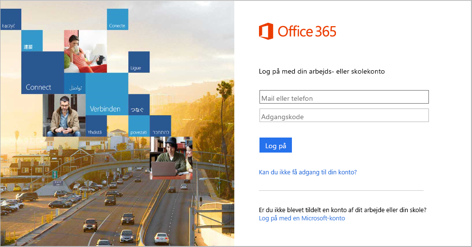

# Opret forbindelse til Azure Audit Logs med Power BI
Du kan analysere og visualisere de oplysninger, der er gemt i overvågningsloggene, med Azure Audit Logs-indholdspakken. Power BI henter dataene, opretter et brugsklart dashboard og genererer rapporter ud fra de pågældende data.

[Opret forbindelse til Azure Audit Logs-indholdspakken](https://app.powerbi.com/getdata/services/azure-audit-logs), eller få yderligere oplysninger om [Azure Audit Logs-integration](https://powerbi.microsoft.com/integrations/azure-audit-logs) med Power BI.

## Sådan opretter du forbindelse
1. Vælg **Hent data** nederst i venstre navigationsrude.  
   
    
2. I feltet **Tjenester** skal du vælge **Hent**.  
   
     
3. Vælg **Azure Audit Logs** > **Hent**.  
   
   
4. Når du bliver bedt om det, skal du angive dit **Azure abonnements-id**. Få detaljer om, hvordan du finder dit [abonnements-id](#FindingParams), nedenfor.   
   
    
5. Til **Godkendelsesmetode** skal du vælge **oAuth2** \>**Log på**.
   
    
6. Angiv dine legitimationsoplysninger til din konto for at afslutte logonprocessen.
   
    
7. Power BI henter dine Azure Audit Log-data og opretter et brugsklart dashboard samt rapport. 
   
    

**Hvad nu?**

* Prøv [at stille et spørgsmål i feltet Spørgsmål og svar](power-bi-q-and-a.md) øverst i dashboard'et
* [Rediger felterne](service-dashboard-edit-tile.md) i dashboard'et.
* [Vælg et felt](service-dashboard-tiles.md) for at åbne den underliggende rapport.
* Dit datasæt vil være planlagt til daglig opdatering. Du kan dog ændre tidsplanen for opdatering eller forsøge at opdatere efter behov ved hjælp af **Opdater nu**

## Systemkrav
Azure Audit Logs-indholdspakken kræver adgang til overvågningsloggene i Azure-portalen. Du kan få flere oplysninger [her](https://azure.microsoft.com/en-us/documentation/articles/insights-debugging-with-events/).

## Søgning efter parametre
Der er to måder til nemt at finde sit abonnements-id.

1. Fra https://portal.azure.com -&gt; Gennemse -&gt; Abonnementer -&gt; Abonnements-id
2. Fra https://manage.windowsazure.com -&gt; Indstillinger -&gt; Abonnements-id

Abonnements-id'et er et langt sæt tal og tegn, der ligner eksemplet i trin \#4 ovenfor. 

## Fejlfinding
Hvis du ser en fejl i legitimationsoplysningerne eller en fejl, når du forsøger at opdatere på grund af ugyldige legitimationsoplysninger, kan du prøve at slette alle forekomster af Azure Audit Logs-indholdspakken og genoprette forbindelsen.

## Næste trin
[Kom i gang med Power BI](service-get-started.md)  
[Power BI – Grundlæggende begreber](service-basic-concepts.md)  

