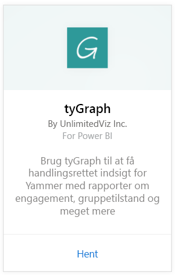
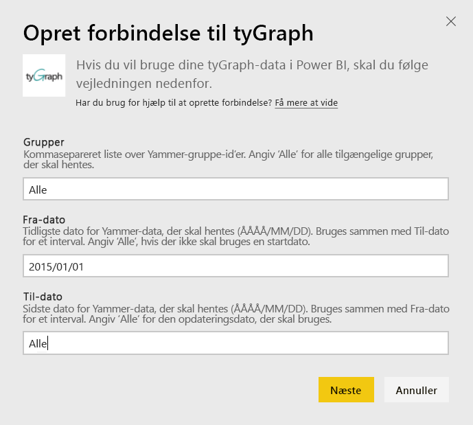
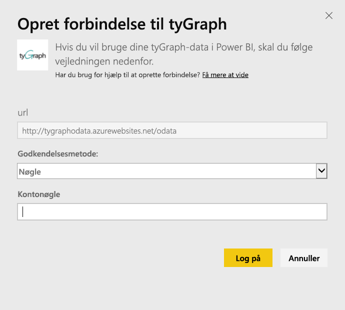

# Opret forbindelse til tyGraph med Power BI
Visualiser og udforsk dine tyGraph-data i Power BI med Power BI-indholdspakken. Start med at oprette forbindelse til din tyGraph-konto, og indlæs dashboardet, rapporter og datasæt. Indholdet omfatter indsigt, f.eks. Measure of Active Engagement (MAE-score) og de største bidragsydere. Tilpas det yderligere for at fremhæve de oplysninger, som betyder mest for dig.  Dataene opdateres automatisk i overensstemmelse med en tidsplan, du har angivet.

Opret forbindelse til [tyGraph til Power BI](https://app.powerbi.com/getdata/services/tygraph).

## Sådan opretter du forbindelse
1. Vælg **Hent data** nederst i venstre navigationsrude.
   
   
2. Vælg **Hent** i feltet **Tjenester**.
   
   
3. Vælg **tyGraph** \> **Hent**.
   
   
4. Angiv de grupper og det tidsinterval, du vil oprette forbindelse til. Ellers skal du angive "Alle" for at hente alle dataene. Bemærk, at det datoformat, der forventes, er (ÅÅÅÅ/MM/DD). Se detaljer om, hvordan du [finder parametrene](#FindingParams), nedenfor.
   
   
5. Angiv din tyGraph-nøgle for at oprette forbindelse. Få flere oplysninger om, hvordan du finder denne værdi, nedenfor.
   
    **Hvis du er en Yammer-bekræftet administrator**  
    Din API-nøgle sendes til dig i en mail, når din tyGraph-konto er oprettet. Hvis du ikke længere kan finde din nøgle, kan du anmode om en ny nøgle ved at sende en mail til support@unlimitedviz.com. Hvis du endnu ikke har en tyGraph-konto, kan du starte en prøveperiode på [http://www.tygraph.com/](http://www.tygraph.com/). 
   
    **Hvis du ikke er en Yammer-bekræftet administrator**
   
    tyGraph-indholdspakken kræver en tyGraph-konto, der er oprettet af en Yammer-bekræftet administrator. Når du har oprettet supplerende nøgler, kan de udstedes til brugere i den samme organisation. Hvis din bekræftede administrator endnu ikke har oprettet en tyGraph-konto, kan du kontakte vedkommende for at få det gjort. Hvis vedkommende har gjort det, kan du anmode om en nøgle ved at sende en mail til <mailto:support@unlimitedviz.com>.
   
    
6. Efter en vellykket godkendelse starter importprocessen automatisk. Når processen er færdig, vises et nyt dashboard samt rapport og model i navigationsruden. Vælg dashboardet for at få vist de importerede data.
   
    

**Hvad nu?**

* Prøv [at stille et spørgsmål i feltet Spørgsmål og svar](power-bi-q-and-a.md) øverst i dashboard'et
* [Rediger felterne](service-dashboard-edit-tile.md) i dashboard'et.
* [Vælg et felt](service-dashboard-tiles.md) for at åbne den underliggende rapport.
* Dit datasæt vil være planlagt til daglig opdatering. Du kan dog ændre tidsplanen for opdatering eller forsøge at opdatere efter behov ved at bruge **Opdater nu**

## Søg efter parametre
Du kan hente data for alle de grupper, du har adgang til, eller du kan vælge at angive et undersæt. Du kan også oprette et undersæt af data efter dato. Du kan oprette flere tyGraph-dashboards, hvis du vil overvåge bestemte sæt grupper og/eller datoer. Der er oplysninger om disse parametre nedenfor.

**Grupper**

tyGraph-API'en kan filtrere data efter bestemte gruppe-id'er. Disse er angivet til indholdspakken på en kommasepareret liste. 

    Example: 2427647,946595,1154464

Du kan identificere gruppe-id'et for en bestemt gruppe i Yammer ved at navigere til feed'et for gruppen og undersøge URL-adressen.

I eksemplet ovenfor er Yammer-gruppe-id'et 4054844

**Fra dato**

Fra-datoen gør det muligt for dig at begrænse den tidligste værdi for de data, der returneres. Kun data, der er oprettet på eller efter denne dato, kan indlæses i indholdspakken. Formatet for fra-datoen er ÅÅÅÅ/MM/DD. 

    Example: 2013/10/29

I eksemplet ovenfor vil alle data fra på eller efter 29. oktober 2013 blive indlæst i indholdspakken. 

**Til dato** Med til-datoen kan du begrænse den seneste værdi for de data, der returneres. Det kan bruges sammen med fra-datoen til at indlæse data fra en række datoer. Kun data, der er oprettet på eller før denne dato, kan indlæses i indholdspakken. Formatet for til-datoen er ÅÅÅÅ/MM/DD. 

    Example: 2014/10/20

I eksemplet ovenfor vil alle data fra på eller før 20. oktober 2014 blive indlæst i indholdspakken. 

## Næste trin
[Kom i gang med Power BI](service-get-started.md)

[Hent data i Power BI](service-get-data.md)

