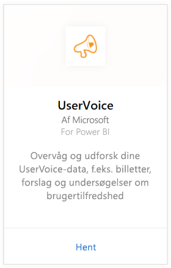
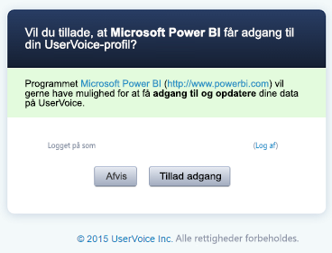

# Opret forbindelse til UserVoice med Power BI
Det er nemt at spore og udforske dine UserVoice-data med Power BI og UserVoice-indholdspakken. Power BI henter dine data, herunder anmodninger, forslag og tilfredshedsvurderinger, og opretter derefter et færdigt dashboard og rapporter ud fra de pågældende data.

Opret forbindelse til [UserVoice-indholdspakken](https://app.powerbi.com/getdata/services/uservoice) til Power BI.

>[!NOTE]
>Det er nødvendigt med en administratorkonto for at oprette forbindelse til Power BI-indholdspakken. Indholdspakken benytter også UserVoice-API'en og bidrager til forbruget op til UserVoice-begrænsningerne. Flere detaljer nedenfor.

## Sådan opretter du forbindelse
1. Vælg **Hent data** nederst i venstre navigationsrude.
   
   
2. Vælg **Hent** i feltet **Tjenester**.
   
    
3. Vælg **UserVoice**, og vælg derefter **Hent**.
   
   
4. Når du bliver spurgt, skal du angive din URL-adresse til UserVoice. URL-adressen skal følge dette mønster nøjagtigt `https://fabrikam.uservoice.com`, hvor "fabrikam" erstattes med navnet på dit produkt eller din tjeneste.
   
   >[!NOTE]
   >Der er ingen efterstillet skråstreg til sidst, og forbindelsen er i http**s**.
   
   
5. Når du bliver spurgt, skal du angive dine legitimationsoplysninger til UserVoice og følge UserVoice-godkendelsesprocessen. Hvis du allerede er logget på UserVoice i din browser, bliver du muligvis ikke spurgt om legitimationsoplysninger. Giv Power BI-programmet adgang til dine data ved at klikke på "Tillad adgang".
   
   >[!NOTE]
   >Du skal bruge administratorlegitimationsoplysninger til din UserVoice-konto.
   
   
6. Power BI henter dine UserVoice-data og opretter et brugsklart dashboard og en rapport for dig. Power BI henter følgende data: alle dine forslag, alle dine åbne anmodninger, alle anmodninger, der er oprettet inden for de seneste 30 dage, herunder dem, der er lukket, og alle brugertilfredshedsvurderinger.
   
   

**Hvad nu?**

* Prøv [at stille et spørgsmål i feltet Spørgsmål og svar](consumer/end-user-q-and-a.md) øverst i dashboard'et
* [Rediger felterne](service-dashboard-edit-tile.md) i dashboard'et.
* [Vælg et felt](consumer/end-user-tiles.md) for at åbne den underliggende rapport.
* Selvom dit datasæt opdateres dagligt, kan du ændre tidsplanen for opdatering eller prøve at opdatere det efter behov ved hjælp af **Opdater nu**

## Fejlfinding
**"Parametrene blev ikke valideret. Kontrollér, at alle parametrene er gyldige".**

Hvis du får vist denne fejl, når du har skrevet din URL-adresse til UserVoice. Kontrollér, at følgende betingelser er opfyldt:

* URL-adressen følger nøjagtigt mønsteret `https://fabrikam.uservoice.com`, hvor "fabrikam" er erstattet med det korrekte præfiks for URL-adressen for UserVoice.
* Kontrollér, at alle bogstaver er små bogstaver.
* Kontrollér, at URL-adressen er i 'http**s**'-format.
* Kontrollér, at der ikke er nogen efterstillet skråstreg i slutningen af URL-adressen.

**"Det lykkedes ikke at logge på"**

Hvis du får fejlmeddelelsen "Det lykkedes ikke at logge på" eller "Der kunne ikke logges på", når du bruger dine UserVoice-legitimationsoplysninger til at logge på, skyldes det, at den konto, du bruger, ikke har tilladelse til at hente UserVoice-data fra din konto. Kontrollér, at det er en administratorkonto, og prøv igen.

"**Ups. Noget gik galt**"

Hvis du får vist denne fejlmeddelelse, mens dataene indlæses, skal du kontrollere, at din UserVoice-konto ikke har overskredet sin månedlige kvote for API-forbrug. Hvis alt ser fint ud, skal du prøve at oprette forbindelse igen. Hvis problemet fortsætter, skal du kontakte Power BI-support på [https://community.powerbi.com](https://community.powerbi.com/).

**Andet**  

UserVoice-indholdspakken til Power BI bruger UserVoices API'er til at hente dine data. Sørg for at overvåge dit API-forbrug, så du ikke overskrider din grænse. Hvis du har en stor mængde data i din UserVoice-konto, kan du for at minimere påvirkningen på dit API-forbrug ændre hyppigheden for opdatering fra den nuværende standardindstilling, som er én gang dagligt, til kun at opdatere på hverdage eller hver anden dag, afhængigt af dine behov. Et andet forslag er at få én administrator til at oprette indholdspakken og dele den med resten af teamet i stedet for, at hver eneste administrator i organisationen skal oprette sin egen, hvilket bidrager til unødvendig belastning på API'erne

## Næste trin
[Kom i gang med Power BI](service-get-started.md)

[Hent data i Power BI](service-get-data.md)

