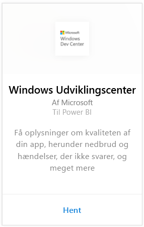
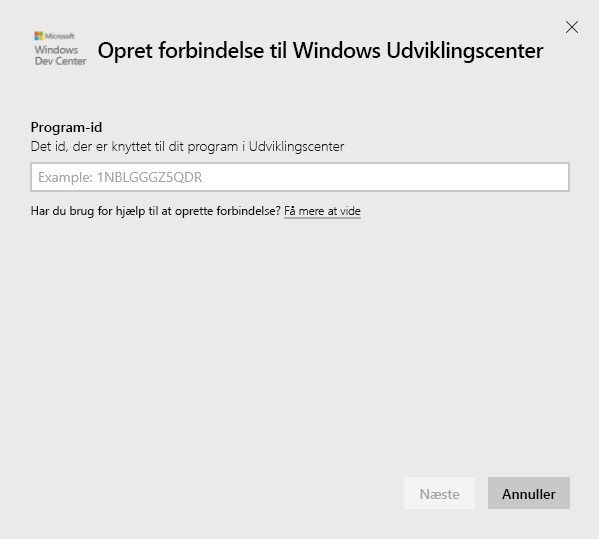
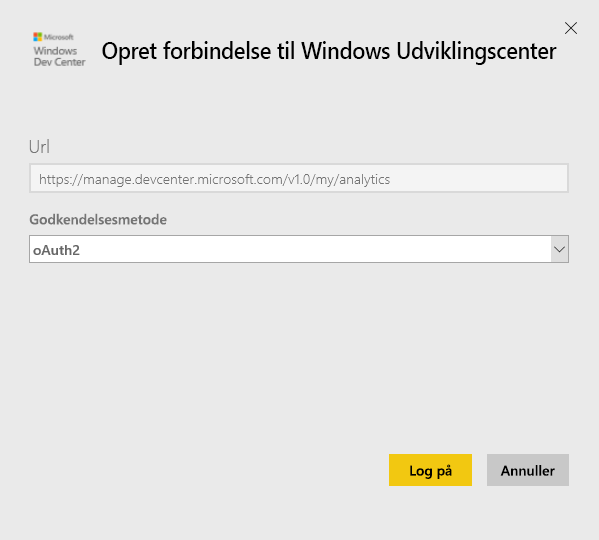
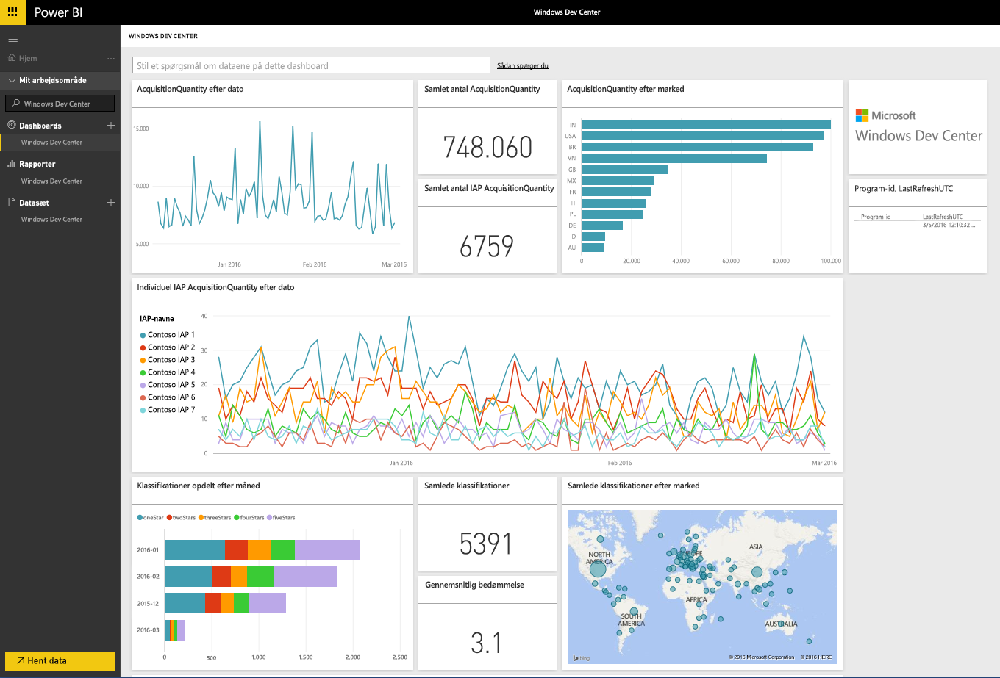
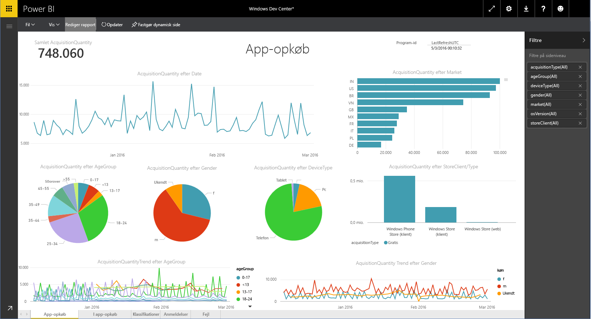

# Opret forbindelse til Windows Udviklingscenter med Power BI
Udforsk og overvåg dine app-analysedata fra Windows Udviklingscenter i Power BI med Power BI-indholdspakken. Dataene opdateres automatisk én gang dagligt.

Opret forbindelse til [Windows Udviklingscenter-indholdspakken](https://app.powerbi.com/getdata/services/devcenter) til Power BI.

## Sådan opretter du forbindelse
1. Vælg **Hent data** nederst i venstre navigationsrude.
   
   
2. I feltet **Tjenester** skal du vælge **Hent**.
   
   
3. Vælg **Windows Udviklingscenter** \>  **Hent**.
   
   
4. Angiv program-id'et for en app, du ejer, og klik på Næste. Se oplysninger om, hvordan du [finder de pågældende parametre](#FindingParams), nedenfor.
   
   
5. Som **Godkendelsesmetode** skal du vælge **oAuth2**\>**Log på**. Angiv dine Azure Active Directory-legitimationsoplysninger, der er knyttet til din Windows Udviklinglingscenter-konto, når du bliver spurgt (få flere oplysninger under [Systemkrav](#Requirements)).
   
    
   
    
6. Efter godkendelsen startes importprocessen automatisk. Når processen er fuldført, vises et nyt dashboard samt en ny rapport og model i navigationsruden. Vælg dashboardet for at se dine importerede data, og vælg et felt for at navigere til de underliggende rapporter.
   
    
   
    

**Hvad nu?**

* Prøv [at stille et spørgsmål i feltet Spørgsmål og svar](power-bi-q-and-a.md) øverst i dashboard'et
* [Rediger felterne](service-dashboard-edit-tile.md) i dashboard'et.
* [Vælg et felt](service-dashboard-tiles.md) for at åbne den underliggende rapport.
* Dit datasæt vil være planlagt til daglig opdatering. Du kan dog ændre tidsplanen for opdatering eller forsøge at opdatere efter behov ved hjælp af **Opdater nu**

## Følgende er inkluderet
Udviklingscenter Power BI-indholdspakken indeholder analysedata for din app og IAP-køb, klassifikationer, anmeldelser og appens tilstand. Data er begrænset til de sidste tre måneder. og er et fleksibelt vindue, så de inkluderede datoer bliver opdateret, når datasættet opdateres.

## Systemkrav
Denne indholdspakke kræver mindst én app, der er publiceret i Windows Store og en Windows Udviklingscenter-konto (se flere oplysninger [her](https://msdn.microsoft.com/windows/uwp/publish/manage-account-users)).

## Søg efter parametre
Du kan finde program-id'et for en app ved at gå til app-identitetssiden under App-administration.

Program-id'et findes i slutningen af din URL-adresse til Windows 10 Store, https://www.microsoft.com/store/apps/ **{programid}**

## Næste trin
[Kom i gang med Power BI](service-get-started.md)

[Hent data i Power BI](service-get-data.md)

