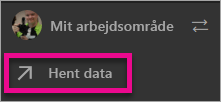
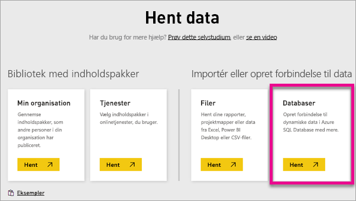
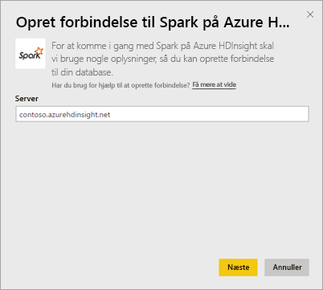
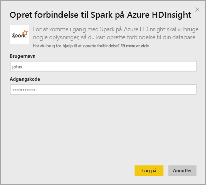
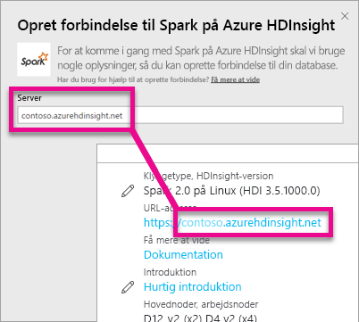

# Spark on HDInsight med DirectQuery
Med Spark on Azure HDInsight med DirectQuery kan du oprette dynamiske rapporter, der er baseret på data og målinger, du allerede har i din Spark-klynge. Med DirectQuery sendes forespørgsler tilbage til din Azure HDInsight Spark-klynge, mens du udforsker dataene i rapportvisning. Denne oplevelse foreslås for brugere, der kender de enheder, de opretter forbindelse til.

> [!WARNING]
> Automatisk feltopdatering er blevet deaktiveret for dashboardfelter, der er bygget på Spark-baserede datasæt. Du kan vælge **Opdater dashboardfelter** for at opdatere manuelt. Rapporter påvirkes ikke og bør forblive opdateret. 
> 
> 

Du kan bruge følgende trin til at oprette forbindelse til din Spark på Azure HDInsight-datakilde ved hjælp af DirectQuery i Power BI-tjenesten.

> [!Important]
> Vi har forbedret vores netværksmuligheder til Spark.  For at få den bedste oplevelse og oprette forbindelse til din Spark-datakilde kan du bruge Power BI Desktop.  Når du har bygget din model og rapport, kan du udgive den på Power BI-tjenesten.  Den direkte forbindelse til Spark i Power BI-tjenesten frarådes nu.
>

1. Vælg **Hent data** nederst i venstre navigationsrude.
   
     
2. Vælg **Databases & More** (Databaser og mere).
   
     
3. Vælg connectoren **Spark på HDInsight**, og vælg **Opret forbindelse**.
   
     
4. Angiv navnet på den **server**, du vil oprette forbindelse til, samt dit **brugernavn** og din **adgangskode**. Serveren er altid i formatet \<klyngenavn\>. azurehdinsight.net. Du kan se flere oplysninger om, hvordan du finder disse værdier, nedenfor.
   
     
   
     
5. Når du har oprettet forbindelse, kan du se et nyt datasæt med navnet "SparkDataset". Du kan også få adgang til datasættet via det pladsholderfelt, der er oprettet.
   
     
6. Når du foretager detailudledning af datasættet, kan du udforske alle tabeller og kolonner i databasen. Hvis du markerer en kolonne, sendes en forespørgsel tilbage til datakilden, og det visuelle element oprettes dynamisk. Disse visuelle elementer kan gemmes i en ny rapport og fastgøres tilbage i dit dashboard.

## Find dine Spark på HDInsight-parametre
Serveren er altid i formatet \<klyngenavn\>.azurehdinsight.net og kan ses på Azure-portalen.

Brugernavnet og adgangskoden findes også på Azure-portalen.

## Begrænsninger
Disse begrænsninger og noter kan ændres, når vi fortsætter med at forbedre oplevelserne. Du kan finde yderligere dokumentation i [Brug BI-værktøjer med Apache Spark til Azure HDInsight](https://azure.microsoft.com/documentation/articles/hdinsight-apache-spark-use-bi-tools/)

* Power BI-tjenesten understøtter kun en konfiguration med Spark 2.0 og HDInsight 3.5.
* Enhver handling, f.eks. markering af en kolonne eller tilføjelse af et filter, sender en forespørgsel tilbage til databasen – så før du vælger meget store felter, bør du overveje at vælge en passende visualiseringstype.
* Spørgsmål og svar er ikke tilgængelig for DirectQuery-datasæt.
* Skemaændringer hentes ikke automatisk.
* Power BI understøtter 16.000 kolonner **på tværs af alle tabeller** inden for et datasæt. Power BI omfatter desuden en intern kolonne med rækkenummer pr. tabel. Det betyder, at hvis du har 100 tabeller i datasættet, vil det tilgængelige antal kolonner være 15.900. Afhængigt af mængden af data, du arbejder med fra din Spark-datakilde, kan du støde på denne begrænsning.

## Fejlfinding
Hvis du har problemer med at udføre forespørgsler mod klyngen, skal du kontrollere, at appen stadig kører og om nødvendigt genstarte den.

Du kan også tildele flere ressourcer på Azure-portalen under **Configuration** > **Scale Cluster** (Konfiguration/Skalér klynge):

## Næste trin
[Kom i gang: Opret Apache Spark-klyngen på HDInsight Linux, og kør interaktive forespørgsler ved hjælp af Spark SQL](https://azure.microsoft.com/documentation/articles/hdinsight-apache-spark-jupyter-spark-sql)  
[Hvad er Power BI?](power-bi-overview.md)  
[Hent data til Power BI](service-get-data.md)  
Har du flere spørgsmål? [Prøv at spørge Power BI-community'et](http://community.powerbi.com/)

