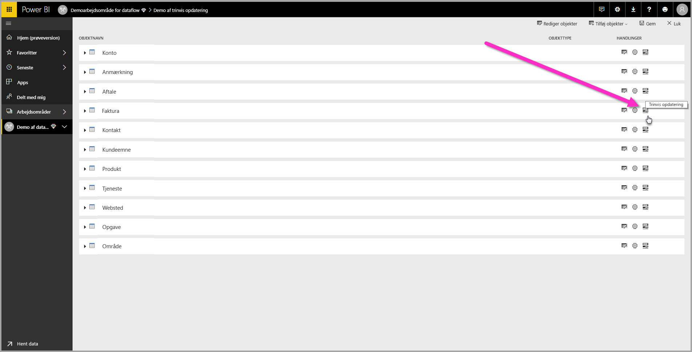
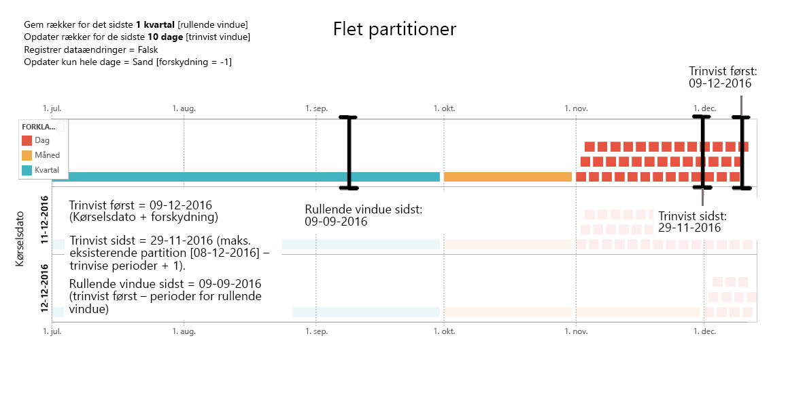
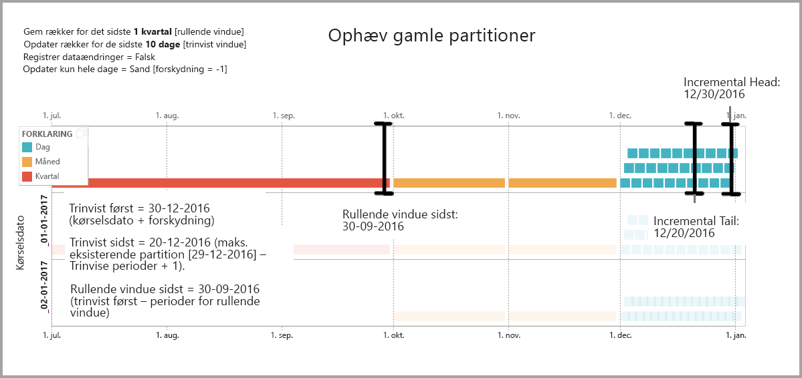
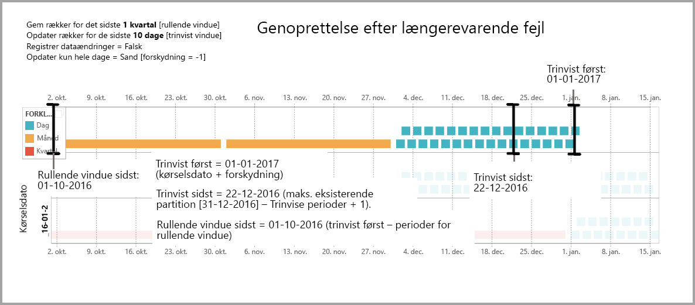

# Brug af trinvis opdatering med Power BI-dataflow

Med dataflow kan du overføre store mængder data til Power BI for at oprette betagende rapporter og analyser. I nogle tilfælde er det dog ikke praktisk at opdatere et helt sæt kildedata ved hver opdatering. Et godt alternativ til det er **trinvis opdatering**, som giver følgende fordele for dataflow:

* **Opdateringen sker hurtigere** – Det er kun ændrede data, der skal opdateres. Opdater f.eks. kun de sidste 5 dage i et dataflow for 10 år.
* **Opdateringen er mere pålidelig** – Det er f.eks. ikke nødvendigt at vedligeholde langtidskørende forbindelser til ustabile kildesystemer.
* **Forbrug af ressourcer reduceres** – Hvis der skal opdateres færre data, reduceres det overordnede forbrug af hukommelsen og andre ressourcer.

Brug af trinvis opdatering for Power BI-dataflow kræver, at det arbejdsområde, hvor dataflowet findes, er i en [Premium-kapacitet](../admin/service-premium-what-is.md), hvor det kan køres, og at den datakilde, der overføres til dataflowet, har et felt af typen *datetime*, som trinvis opdatering kan filtrere efter. 

## Konfiguration af trinvis opdatering for dataflow

Et dataflow kan indeholde mange objekter. Trinvis opdatering kan konfigureres på objektniveau, så ét dataflow kan indeholde både fuldt opdaterede objekter og trinvist opdaterede objekter.

Du konfigurerer et trinvist opdateret objekt ved at starte med at konfigurere objektet, som du ville gøre med et hvilket som helst andet objekt. Du kan få mere at vide om konfiguration af dataflow under [Selvbetjent dataforberedelse i Power BI](service-dataflows-overview.md).

Når dataflowet er oprettet og gemt, skal du vælge ikonet for **trinvis opdatering** i objektvisningen, som vist på følgende billede:

Når du klikker på ikonet, vises vinduet **Indstillinger for trinvis opdatering**. Når du skifter trinvis opdatering til positionen **Til**, kan du konfigurere trinvis opdatering.

På følgende liste kan du se en forklaring af indstillingerne i vinduet **Indstillinger for trinvis opdatering**. 

1. **Trinvis opdatering til/fra** – Brug skyderen til at slå politikken for trinvis opdatering til/fra for objektet.
2. **Rulleliste til filtrering af felt** – Vælg forespørgselsfeltet, som objektet skal filtreres efter trinvist. Dette felt indeholder kun felter af typen *datetime*. Du kan ikke bruge trinvis opdatering, hvis dit objekt ikke indeholder et felt af typen *datetime*.
3. **Gem rækker fra seneste** – Følgende eksempel hjælper med at forklare de næste par indstillinger.

    I dette eksempel defineres en opdateringspolitik, der angiver, at der skal gemmes data for 5 år i alt, og at der skal udføres en trinvis opdatering af data for 10 dage. Hvis objektet opdateres dagligt, udføres følgende for hver opdateringshandling:

    * Tilføj en ny dags data.
    * Opdater ti dage op til dags dato.
    * Fjern kalenderår, der er ældre end fem år fra den aktuelle dato. Hvis dags dato f.eks. er 1. januar 2019, fjernes året 2013.

    Det kan tage et stykke tid at importere data for 5 år under den første opdatering af dataflowet, men efterfølgende opdateringer vil sandsynligvis blive udført på en brøkdel af tiden for den første opdatering.

4. **Registrer dataændringer** – Trinvis opdatering af 10 dage er meget mere effektiv end en fuld opdatering af 5 år, men vi kan muligvis gøre det endnu bedre. Hvis du markerer afkrydsningsfeltet **Registrer dataændringer**, kan du vælge en kolonne for dato/klokkeslæt for at identificere og kun opdatere de dage, hvor dataene er blevet ændret. Det er en forudsætning, at der findes en sådan kolonne i kildesystemet, der typisk bruges til overvågning. Maksimumværdien for denne kolonne evalueres for hver af perioderne i det trinvise interval. Hvis dataene ikke er blevet ændret siden den sidste opdatering, er det ikke nødvendigt at opdatere perioden. I eksemplet kan dette yderligere reducere antallet af dage for den trinvise opdatering fra 10 til måske 2 dage.

> [!TIP]
> I det aktuelle design kræves det, at kolonnen til registrering af dataændringer bevares og cachelagres i hukommelsen. Du kan evt. overveje en af følgende metoder for at reducere kardinalitet og hukommelsesforbrug:
>
>    * Bevar kun den maksimale værdi for denne kolonne på tidspunktet for opdateringen, måske ved hjælp af en funktion i Power-forespørgsel.
>    * Reducer præcisionen til et niveau, der er acceptabelt i forhold til dine krav om opdateringshyppighed.

5. **Opdater kun samlede perioder** – Forestil dig, at opdateringen er planlagt til at køre kl. 4:00 hver morgen. Hvis der vises data i kildesystemet i løbet af disse første fire timer på den pågældende dag, ønsker du måske ikke at gøre rede for dem. Det er ikke praktisk eller fornuftigt at gøre rede for nogle forretningsmæssige målepunkter baseret på delvise dage, f.eks. tønder pr. dag i olie- og gasindustrien.

    Et andet eksempel, hvor det kun er relevant at opdatere hele perioder, er opdatering af data fra et finansielt system. Forestil dig et finansielt system, hvor data for den foregående måned godkendes den 12. kalenderdag i måneden. Du kan indstille det trinvise interval til 1 måned og planlægge, at opdateringen skal køre den 12. dag i måneden. Med denne indstilling markeret vil data fra januar (den seneste hele månedsperiode) blive opdateret d. 12. februar.

> [!NOTE]
> Ved trinvis opdatering for dataflow angives datoer i henhold til følgende logik: Hvis der er planlagt en opdatering, bruger trinvis opdatering for dataflow den tidszone, der er defineret i opdateringspolitikken. Hvis der ikke er planlagt nogen opdatering, bruger trinvis opdatering tiden fra den maskine, der kører opdateringen.

## Forespørgslen for trinvis opdatering

Når trinvis opdatering er konfigureret, ændrer dataflowet automatisk din forespørgsel til at inkludere filtrering efter dato. Du kan redigere den automatisk genererede forespørgsel ved hjælp af **Avanceret Power-forespørgselseditor** for at finjustere eller tilpasse opdateringen. Læs mere om trinvis opdatering, og hvordan det fungerer i følgende afsnit.

## Trinvis opdatering og linkede objekter i forhold til beregnede objekter

For *linkede* objekter opdateres kildeobjektet ved trinvis opdatering. Da linkede objekter blot peger på det oprindelige objekt, har trinvis opdatering ingen indvirkning på det linkede objekt. Når kildeobjektet opdateres i henhold til den definerede opdateringspolitik, bør alle linkede objekter antage, at dataene i kilden er opdateret.

*Beregnede* objekter er baseret på forespørgsler, der kører på et datalager, som kan være et andet dataflow. Derfor fungerer beregnede objekter på samme måde som linkede objekter.

Da beregnede objekter og linkede objekter fungerer på samme måde, er kravene og konfigurationstrinnene de samme for begge. En forskel er, at trinvis opdatering i nogle konfigurationer ikke kan køre på en optimal måde for beregnede objekter på grund af den måde, som partitioner bygges på. 

## Skift mellem trinvis og fuld opdatering

Dataflow understøtter skift af opdateringspolitik mellem trinvis og fuld opdatering. Når der skiftes enten den ene vej eller den anden (fuld til trinvis eller trinvis til fuld opdatering), påvirker skiftet dataflowet efter den næste opdatering.

Når du flytter et dataflow fra en fuld opdatering til trinvis, opdaterer den nye opdateringslogik det dataflow, der er knyttet til opdateringsvinduet og intervallet, som defineret i indstillingerne for trinvis opdatering.

Når du flytter et dataflow fra trinvis til fuld opdatering, overskrives alle data, der er akkumuleret i trinvis opdatering, af den politik, der er defineret for fuld opdatering. Du skal godkende denne handling.

## Trinvis opdatering af dataflow og datasæt

Trinvis opdatering af dataflow og trinvis opdatering af datasæt er designet til at arbejde samtidigt. Det er acceptabelt, og det understøttes, at have et objekt, der opdateres trinvist, i et dataflow, men som indlæses helt i et datasæt, eller at have et objekt, der indlæses helt i et dataflow, men som indlæses trinvist i et datasæt. 

Begge tilgange kører i henhold til dine angivne definitioner i indstillingerne for opdatering.
Du kan læse mere om trinvis opdatering i [Trinvis opdatering i Power BI Premium](../admin/service-premium-incremental-refresh.md).

## Understøttelse af tidszone i trinvis opdatering

Trinvis opdatering af dataflow er afhængig af det tidspunkt, hvor den køres. Filtrering af forespørgslen er afhængig af den dag, hvor den køres.

For at imødekomme disse afhængigheder og for at sikre ensartede data implementerer trinvis opdatering for dataflow følgende heuristik for scenarier af typen *Opdater nu*:

* I de tilfælde, hvor trinvis opdatering er defineret i systemet, bruger trinvis opdatering indstillingerne for tidszone fra opdateringsplanen. Dette sikrer, at tidszonen altid svarer til den, der er defineret for systemet, uanset hvilken tidszone den personen, der udfører opdateringen, befinder sig i.

* Hvis der ikke er defineret nogen opdatering, bruger dataflow den angivne tidszone på den computer, som brugeren, der opdaterer, anvender.

Trinvis opdatering kan også aktiveres ved hjælp af API'er. I dette tilfælde kan API-kaldet indeholde en indstilling for tidszone, der bruges i opdateringen. Brug af API'er kan være nyttig i forbindelse med test og validering.

## Oplysninger om implementering af trinvis opdatering

Dataflow bruger partitionering til trinvis opdatering. Når XMLA-slutpunkter til Power BI Premium er tilgængelige, bliver partitionerne synlige. Trinvis opdatering i dataflow bevarer det mindste antal partitioner, der kræves for at opfylde kravene i opdateringspolitikken. Gamle partitioner, der ligger uden for intervallet, ophæves, så der bevares et rullende vindue. Partitioner flettes opportunistisk, hvilket reducerer det samlede antal partitioner der kræves. Dette forbedrer komprimering og kan i nogle tilfælde forbedre ydeevnen af forespørgslen.

Eksemplerne i dette afsnit deler følgende opdateringspolitik:

* Gem rækker for det sidste 1. kvartal
* Opdater rækker for de sidste 10 dage
* Registrer dataændringer = Falsk
* Opdater kun hele dage = Sand

### Flet partitioner

I dette eksempel flettes partitioner for dage automatisk til månedsniveauet, når de ligger uden for intervallet for trinvis opdatering. Partitioner i intervallet for trinvis opdatering skal vedligeholdes med daglig kornethed for at sikre, at det kun er de pågældende dage, der opdateres.
Opdateringshandlingen med *Kørselsdato 11/12/2016* fletter dagene i november, fordi de ligger uden for intervallet for trinvis opdatering.

### Ophæv gamle partitioner

Gamle partitioner, der ligger uden for det samlede interval, fjernes. Opdateringshandlingen med *Kørselsdato 2/1/2017* ophæver partitionen for Q3 2016, fordi det ligger uden for det samlede interval.

### Genoprettelse efter længerevarende fejl

Dette eksempel er en simulering af, hvordan systemet genoprettes problemfrit efter en længerevarende fejl. Lad os sige, at opdateringen ikke kører korrekt, fordi legitimationsoplysningerne for datakilden er udløbet, og problemet tager 13 dage at løse. Intervallet for trinvis opdatering er kun 10 dage.

Den næste succesfulde opdateringshandling med *Kørselsdato 15/1/2017* skal udfylde de manglende 13 dage og opdatere dem. Den skal desuden opdatere de forrige 9 dage, da de ikke blev opdateret med den normale tidsplan. Med andre ord er intervallet for trinvis opdatering øget fra 10 til 22 dage.

Under den næste opdateringshandling med *Kørselsdato 16/1/2017* flettes dagene i december og månederne i 4. kvartal 2016.

## Næste trin

I denne artikel beskrives trinvis opdatering for dataflow. Her er nogle flere artikler, der kan være nyttige.

* [Selvbetjent dataforberedelse med dataflow](service-dataflows-overview.md)
* [Opret og brug dataflow i Power BI](service-dataflows-create-use.md)
* [Brug af dataflow med datakilder i det lokale miljø](service-dataflows-on-premises-gateways.md)
* [Udviklerressourcer til Power BI-dataflow](service-dataflows-developer-resources.md)

Du kan finde flere oplysninger om Power-forespørgsel og planlagt opdatering i disse artikler:
* [Oversigt over forespørgsler i Power BI Desktop](desktop-query-overview.md)
* [Konfiguration af planlagt opdatering](../connect-data/refresh-scheduled-refresh.md)

Du kan finde flere oplysninger om Common Data Model i denne oversigtsartikel:
* [Common Data Model – oversigt](https://docs.microsoft.com/powerapps/common-data-model/overview)
