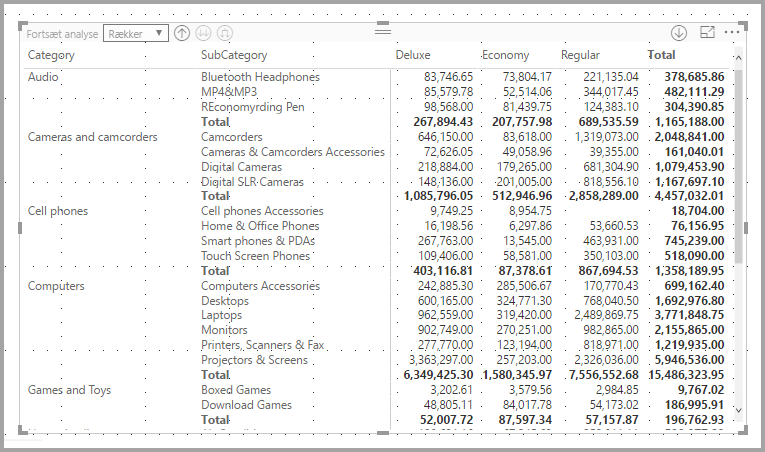
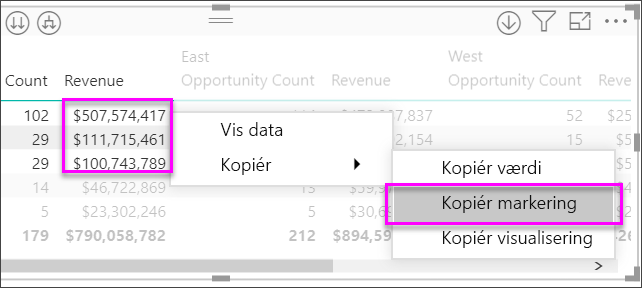

# Brug matrixvisualiseringen i Power BI
Når du bruger visualen **Matrix**, kan du oprette matrixvisuals (også kaldet *tabeller*) i rapporter i **Power BI Desktop** og **Power BI-tjenesten** og få tværgående fremhævning af elementer i matrixen med andre visuals. Derudover kan du vælge rækker, kolonner og endda individuelle celler og tværgående fremhævning. Enkelte celler og markeringer med flere celler kan kopieres og indsættes i andre programmer. Endelig kan du udnytte pladsen i layoutet bedre, fordi matrixvisualisering understøtter et trinvist layout.

Der er mange funktioner knyttet til matrixen, og vi vil gennemgå dem i følgende afsnit i denne artikel.

## Rapporttemaer
Både matrix- og tabelvisuals afspejler formatering (herunder farver) fra det anvendte **rapporttema**. Det er måske ikke de farver, du forventer til din matrixvisualisering, og du kan ændre dem i konfigurationen **Rapporttema**. Se [**Brug rapporttemaer i Power BI Desktop**](../desktop-report-themes.md), hvor du kan finde flere oplysninger om temaer.

## Sådan beregner Power BI totaler

Før du begynder at læse om, hvordan du bruger **Matrix**-visualiseringen, er det vigtigt at forstå, hvordan Power BI beregner værdierne for total og subtotal i tabeller og matrixer. I rækker med total og subtotal evalueres målingen henover alle rækker i de underliggende data – det er *ikke* kun en simpel addition af værdierne i de synlige og viste rækker. Det betyder, at du kan ende med at have en anden værdi i rækken Total, end hvad du regnede med. 

Se følgende **Matrix**-visualiseringer. 

I dette eksempel vises *Beløb* for hver sælger/dato-kombination i hver række i **Matrix**-visualiseringen længst til højre. Men da en sælger vises for flere datoer, kan tallene forekomme mere end én gang. Den nøjagtige total fra de underliggende data og en simpel addition af de synlige værdier kan derfor ikke sidestilles. Dette er et almindeligt mønster, når den værdi, du regner på, er på den "ene" side i en en til mange-relation.

Når du arbejder med totaler og subtotaler, skal du huske på, at disse værdier er baseret på de underliggende data og ikke kun på de synlige værdier. 

<!-- use Nov blog post video

## Expanding and collapsing row headers
There are two ways you can expand row headers. The first is through the right-click menu. You’ll see options to expand the specific row header you clicked on, the entire level or everything down to the very last level of the hierarchy. You have similar options for collapsing row headers as well.

You can also add +/- buttons to the row headers through the formatting pane under the row headers card. By default, the icons will match the formatting of the row header, but you can customize the icons’ color and size separately if you want. 
Once the icons are turned on, they work similarly to the icons from PivotTables in Excel.

The expansion state of the matrix will save with your report. It can be pinned to dashboards as well, but consumers will need to open up the report to change the state. Conditional formatting will only apply to the inner most visible level of the hierarchy. Note that this expand/collapse experience is not currently supported when connecting to AS servers older than 2016 or MD servers.

Watch the following video to learn more about expand/collapse in the matrix:

-->
## Brug detailudledning til matrixvisualiseringen
Med **Matrix**-visualiseringen kan du foretage en mængde interessante aktiviteter til detailudledning, der ikke var tilgængelige før. Du kan f.eks. foretage detailudledning ved hjælp af rækker, kolonner og endda til individuelle afsnit og celler. Lad os se på, hvordan hver enkelt af disse fungerer.

### Detailudledning på rækkeoverskrifter
Når du i ruden **Visualiseringer** føjer flere felter til sektionen **Rækker** i området **Felter**, aktiverer du detailudledning på rækkerne i matrixvisualiseringen. Dette minder om oprettelse af et hierarki, hvor du derefter kan foretage detailudledning (og så sikkerhedskopiering) via hierarkiet og analysere dataene på hvert niveau.

I det følgende billede indeholder sektionen **Rækker** *Kategori* og *Underkategori* og opretter en gruppering (eller et hierarki) i rækkerne, som vi kan foretage detailudledning af.

Når der er oprettet gruppering for visualiseringen i sektionen **Rækker**, viser selve visualiseringen *detailudledningen* og *udvider* ikonerne i øverste venstre hjørne i visualiseringen.

Som det er tilfældet med funktionsmåden til detailudledning og udvidelse i andre visualiseringer kan vi ved at vælge disse knapper bruge detailudledning (eller sikkerhedskopiering) gennem hierarkiet. I dette tilfælde kan vi foretage detailudledning fra *Kategori* til *Underkategori* som vist på følgende billede, hvor ikonet for vis detaljer for ét niveau (fork) er valgt.

Ud over at bruge disse ikoner kan du højreklikke på en af rækkeoverskrifterne og foretage detailudledning ved at foretage et valg i den menu, der vises.

Bemærk, at der er nogle indstillinger i den viste menu, der udløser forskellige resultater:

Valg af **Foretag detailudledning** udvider matrixen for *det pågældende* rækkeniveau og *udelader* alle andre rækkeoverskrifter bortset fra den rækkeoverskrift, der blev højreklikket på. I det følgende billede blev der højreklikket på *Computers*, og der blev valgt **Foretag detailudledning**. Bemærk, at andre rækker på øverste niveau ikke længere vises i matrixen. Funktionen til detailudledning er nyttig, og den er specielt god, når vi kommer til afsnittet om **tværgående fremhævning**.

Du kan også klikke på ikonet for **færre detaljer** for at komme tilbage til den forrige visning af øverste niveau. Hvis du derefter vælger **Vis næste niveau** i genvejsmenuen, får du vist en alfabetiske liste over alle elementer på næste niveau (i dette tilfælde feltet *Underkategori*) uden den hierarkiske kategorisering på højere niveau.

Når du klikker på ikonet for **færre detaljer** i øverste venstre hjørne for at få matrixen til at vise alle kategorier på øverste niveau og derefter højreklikker igen og vælger **Udvid til næste niveau**, får du vist følgende visualisering.

Du kan også bruge menupunkterne **Include** (Medtag) og **Exclude** (Udelad) til at bevare (eller hhv. fjerne) den række, der blev højreklikket på (og evt. underkategorier) fra matrixen.

### Detailudledning på kolonneoverskrifter
Du kan også foretage detailudledning på **kolonner**, hvilket minder meget om detailudledning på rækker. I det følgende billede kan du se, at der er to felter i feltområdet **Kolonner**, hvilket opretter et hierarki, der minder om det, der blev brugt til rækkerne tidligere i denne artikel. I feltområdet **Kolonner** har vi *Klasse* og *Farve*.

Når vi i **matrixvisualiseringen** højreklikker på en kolonne, får vi mulighed for at foretage detailudledning. I det følgende billede skal du højreklikke på *Deluxe* og vælge **Foretag detailudledning**.

Når du vælger **Foretag detailudledning**, vises næste niveau i kolonnehierarkiet for *Deluxe*, hvilket i dette tilfælde er *Farve*.

Resten af punkterne i genvejsmenuen fungerer i kolonner på samme måde, som de gør i rækker (se forrige afsnit, **Detailudledning på rækkeoverskrifter**). Du kan vælge **Vis næste niveau**, **Udvid til næste niveau** og **Include** (Medtag) eller **Exclude** (Udelad) på samme måde, som du kan med rækker.

> [!NOTE]
> Ikonerne for detailudledning og færre detaljer øverst til venstre i matrixvisualiseringen gælder kun for rækker. Hvis du vil foretage detailudledning for kolonner, skal du bruge genvejsmenuen.
> 
> 

## Trinvist layout med matrixvisualisering
**Matrix**-visualiseringen indrykker automatisk underkategorier i et hierarki under hvert overordnet element, hvilket kaldes et **trinvist layout**.

I den *oprindelige* version af matrixvisualiseringen blev underkategorier vist i en helt anden kolonne, der optager meget mere plads i visualiseringen. Billedet herunder viser tabellen i den oprindelige **matrixvisualisering**. Bemærk, at underkategorierne er i en separat kolonne.

På det følgende billede kan du se en rigtig **matrix**-visualisering med **trinvist layout**. Bemærk, at kategorien *Computers* har underkategorier (Computers Accessories (Computertilbehør), Desktops (Stationære computere), Laptops (Bærbare computere), Monitors (Skærme) og osv.) let indrykket, hvilket visuelt giver et meget renere og mere komprimeret indtryk.

Du kan nemt justere indstillingerne for det trinvise layout. Når visualiseringen **Matrix** er valgt i sektionen **Format** (malerrulleikonet) i ruden **Visualiseringer**, kan du udvide sektionen **Rækkeoverskrifter**. Du har to muligheder: Til/fra-knappen til **trinvist layout** (som slår det til eller fra) og **indrykningen af det trinvise layout** (angiver mængden af indrykning i pixel).

Hvis du deaktiverer **det trinvise layout**, vises underkategorier i en anden kolonne og ikke indrykket under den overordnede kategori.

## Subtotaler med matrixvisualiseringer
Du kan slå subtotaler til eller fra i matrixvisualiseringer både for rækker og kolonner. I det følgende billede kan du se, at rækkesubtotaler er slået **til**.

I sektionen **Format** i ruden **Visualiseringer** kan du udvide kortet **Subtotaler** og sætte skyderen **Rækkesubtotaler**  til **Fra**. Når du gør det, vises subtotaler ikke.

Den samme proces gælder for kolonnesubtotaler.

## Tværgående fremhævning med matrixvisualiseringer
Med **matrix**-visualiseringen kan du vælge alle elementer i matrixen som basis for tværgående fremhævning. Når du markerer en kolonne i en **Matrix**, fremhæves kolonnen, og det samme gør andre visuelle elementer på rapportsiden. Denne form for tværgående fremhævning har været en almindelig funktion i andre visualiseringer og markeringer af datapunkter, og nu kan **matrixvisualiseringen** få del i den.

Derudover fungerer Ctrl+klik også for tværgående fremhævning. I eksemplet herunder er en samling underkategorier f.eks. markeret i **Matrix**-visualiseringen. Bemærk, hvordan elementer, der ikke er valgt i visualiseringen, er nedtonet, og hvordan de andre visualiseringer på siden afspejler de valg, der er foretaget i **Matrix**-visualiseringen.

## Kopiering af værdier fra Power BI til brug i andre programmer

Din matrix eller tabel kan have indhold, som du ønsker at bruge i andre programmer, f.eks. Dynamics CRM, Excel og endda andre Power BI-rapporter. Ved at højreklikke i Power BI kan du kopiere en enkelt celle eller en markering med flere celler til udklipsholder og indsætte det i det andet program.

* Hvis du vil kopiere værdien af en enkelt celle, skal du markere cellen, højreklikke og vælge **Kopiér værdi**. Med den ikke-formaterede celleværdi i din udklipsholder kan du nu indsætte det i et andet program.

    

* Hvis du vil kopiere mere end en enkelt celle, skal du vælge et celleområde eller bruge Ctrl til at markere en eller flere celler. Kopien inkluderer kolonne- og rækkeoverskrifterne.

    

## Skygge og skrifttypefarver med matrixvisualiseringer
Når du bruger **matrix**-visualiseringen kan du anvende **betinget formatering** (farver og skygge) til baggrunden af celler i matrixen, og du kan anvende betinget formatering til selve teksten og værdierne.

Hvis du vil anvende betinget formatering, kan du gøre et af følgende, når en matrixvisualisering er valgt:

* Højreklik på feltet i ruden **Felter**, og vælg **Betinget formatering** i menuen.
  
  
* Du kan også udvide kortet **Betinget formatering** i ruden **Format** og indstille skyderen til **Til** for enten **Baggrundsfarveskalaer** eller **Skriftfarveskalaer**. Når du aktiverer en af indstillingerne, vises et link til *avancerede kontrolelementer*, så du kan tilpasse farver og værdier for farveformateringen.
  
  

Begge fremgangsmåde giver samme resultat. Hvis du vælger *Avancerede kontrolelementer* vises følgende dialogboks, hvor du kan foretage justeringer:

## Næste trin

[Punkt- og boblediagrammer i Power BI](power-bi-visualization-scatter.md)

[Visualiseringstyper i Power BI](power-bi-visualization-types-for-reports-and-q-and-a.md)