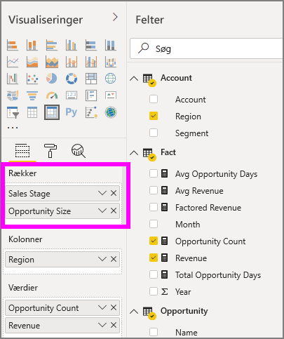
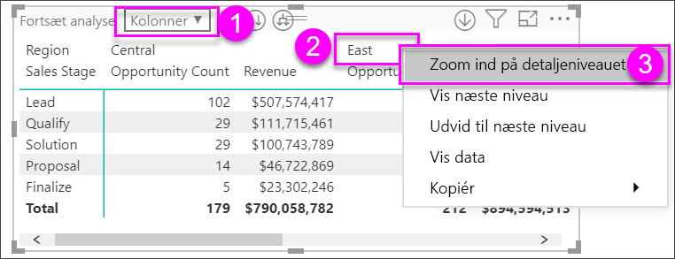
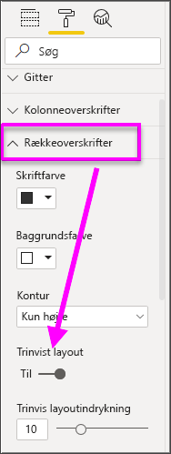
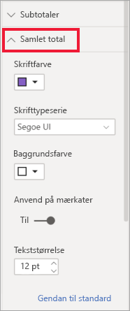
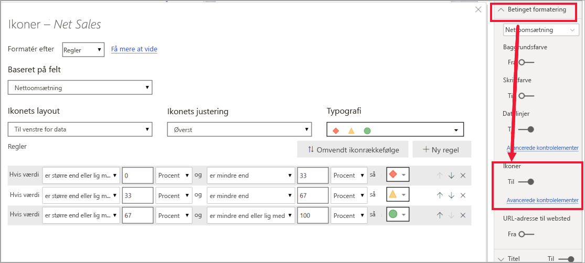
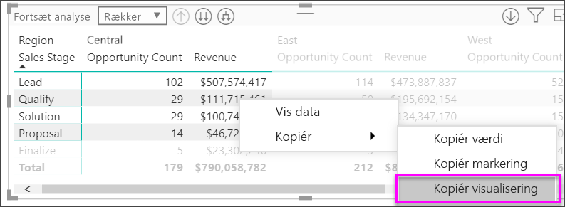
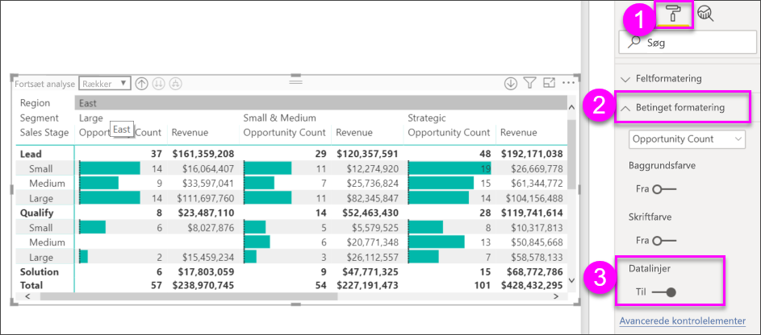
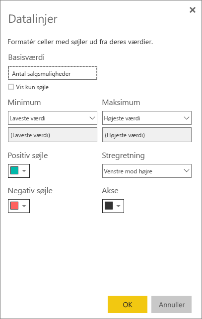

# Opret matrixvisualiseringer i Power BI

[!INCLUDE[consumer-appliesto-nyyn](../includes/consumer-appliesto-nyyn.md)]

[!INCLUDE [power-bi-visuals-desktop-banner](../includes/power-bi-visuals-desktop-banner.md)]

Matrixvisualiseringen ligner følgende tabel.  En tabel understøtter to dimensioner, og dataene er flade, hvilket vil sige, at dublerede værdier vises og samles ikke. En matrix gør det lettere at få vist data på tværs af flere dimensioner på en meningsfuld måde – det understøtter et trinvist layout. Matricen samler automatisk dataene og gør det muligt at foretage detailudledning. 

Du kan oprette matrixvisualiseringer i rapporter i **Power BI Desktop** og krydsfremhæve elementer i matrixen med andre visualiseringer på den pågældende rapportside. Du kan f.eks. vælge rækker, kolonner og endda individuelle celler og tværgående fremhævning. Og enkelte celler og markeringer med flere celler kan kopieres og indsættes i andre programmer. 

Der er mange funktioner knyttet til matrixen, og vi vil gennemgå dem i følgende afsnit i denne artikel.

> [!NOTE]
> Når du deler din rapport med en Power BI-kollega, kræves det, at I begge har individuelle Power BI Pro-licenser, eller at rapporten er gemt i en Premium-kapacitet.

## Sådan beregner Power BI totaler

Før du begynder at læse om, hvordan du bruger matrixvisualiseringen, er det vigtigt at forstå, hvordan Power BI beregner værdierne for total og subtotal i tabeller og matrixer. I rækker med total og subtotal evaluerer Power BI målingen hen over alle rækker i de underliggende data – det er ikke kun en simpel addition af værdierne i de synlige og viste rækker. Det betyder, at du kan ende med at have en anden værdi i rækken Total, end hvad du regnede med.

Se følgende matrixvisualiseringer. 

I dette eksempel vises *Amount* for alle kombinationer af sælger/dato i hver række i matrixvisualiseringen længst til højre. Men da en sælger vises for flere datoer, kan tallene forekomme mere end én gang. Den nøjagtige total fra de underliggende data og en simpel addition af de synlige værdier kan derfor ikke sidestilles. Dette er et almindeligt mønster, når den værdi, du regner på, er på den "ene" side i en en til mange-relation.

Når du ser på totaler og subtotaler, skal du huske, at disse værdier er baseret på de underliggende data. De er ikke udelukkende baseret på de synlige værdier.

## Udvidelse og skjulning af rækkeoverskrifter
Du kan udvide rækkeoverskrifter på to måder. Den første er gennem genvejsmenuen. Du kan se indstillinger for udvidelse af den specifikke rækkeoverskrift, du har valgt, hele niveauet eller alt ned til det sidste niveau i hierarkiet. Du har lignende muligheder for at skjule rækkeoverskrifter.

Du kan også føje +/--knapper til rækkeoverskrifterne via formateringsruden under kortet **Rækkeoverskrifter**. Som standard svarer ikonerne svare til rækkeoverskriftens formatering, men du kan tilpasse ikoners farver og størrelser separat, hvis du vil.

Når ikonerne er slået til, fungerer de på samme måde som med pivottabelikoner i Excel.

Matrixens udvidelsestilstand gemmes sammen med rapporten. En matrix kan fastgøres til et dashboard, der er udvidet eller skjult. Når det pågældende dashboardfelt er valgt, og rapporten åbnes, kan udvidelses tilstanden stadig ændres i rapporten. 

> [!NOTE]
> Hvis du bygger en rapport oven på en multidimensionel Analysis Services-model, er der nogle særlige overvejelser, når du skal udvide/skjule, hvis modellen bruger funktionen Standardmedlem. Du kan få flere oplysninger under [Arbejde med flerdimensionelle modeller i Power BI](../connect-data/desktop-default-member-multidimensional-models.md)

## Brug detailudledning til matrixvisualiseringen
Med matrixvisualiseringen kan du foretage en mængde interessante aktiviteter for detailudledning, der ikke var tilgængelige før. Du kan f.eks. foretage detailudledning ved hjælp af rækker, kolonner og endda til individuelle afsnit og celler. Lad os se på, hvordan hver enkelt af disse fungerer.

### Detailudledning på rækkeoverskrifter

Når du føjer flere felter til sektionen **Rækker** i området **Felter** i ruden Visualiseringer, aktiverer du detailudledning på rækkerne i matrixvisualiseringen. Dette minder om oprettelse af et hierarki, hvor du derefter kan foretage detailudledning (og så sikkerhedskopiering) via hierarkiet og analysere dataene på hvert niveau.

I det følgende billede indeholder sektionen **Rækker** *Sales stage* og *Opportunity size* og opretter en gruppering (eller et hierarki) i rækkerne, som vi kan foretage detailudledning af.

Når der er oprettet gruppering for visualiseringen i sektionen **Rækker**, viser selve visualiseringen *detailudledningen* og *udvider* ikonerne i øverste venstre hjørne i visualiseringen.

Som det er tilfældet med funktionsmåden til detailudledning og udvidelse i andre visualiseringer kan vi ved at vælge disse knapper bruge detailudledning (eller sikkerhedskopiering) gennem hierarkiet. I dette tilfælde kan vi foretage detailudledning fra *Sales stage* til *Opportunity size* som vist på følgende billede, hvor ikonet for detailudledning ét niveau ned (fork) er valgt.

Ud over at bruge disse ikoner kan du vælge en af rækkeoverskrifterne og foretage detailudledning ved at foretage et valg i den menu, der vises.

Bemærk, at der er nogle indstillinger i den viste menu, der udløser forskellige resultater:

Hvis du vælger **Foretag detailudledning**, udvides matricen for *det pågældende* rækkeniveau, og alle andre rækkeoverskrifter *udelades* bortset fra den rækkeoverskrift, der blev valgt. På følgende billede er **Forslag** > **Detailudledning** valgt. Bemærk, at andre rækker på øverste niveau ikke længere vises i matrixen. Funktionen til detailudledning er nyttig, og den er specielt god, når vi kommer til afsnittet om krydsfremhævning.

Vælg ikonet **Færre detaljer** for at komme tilbage til den forrige visning af øverste niveau. Hvis du derefter vælger **Forslag** > **Vis næste niveau**, får du vist en liste i stigende rækkefølge over alle elementer på næste niveau (i dette tilfælde feltet *Opportunity size*) uden den hierarkiske kategorisering på højere niveau.

Vælg ikonet **Færre detaljer** i øverste venstre hjørne for at få matricen til at vise alle kategorier på øverste niveau, og vælg derefter **Forslag** > **Udvid til næste niveau** for at se alle værdierne for begge niveauer i hierarkiet – *Sales stage* og *Opportunity size*.

Du kan også bruge menupunktet **Udvid** til at styre visningen yderligere.  Vælg f.eks. **Forslag** > **Udvid** > **Markering**. Power BI viser én totalrække for hver enkelt *Sales stage* og alle indstillinger for *Opportunity size* for *Forslag*.

### Detailudledning på kolonneoverskrifter
Du kan også foretage detailudledning for kolonner, hvilket minder meget om detailudledning for rækker. I det følgende billede er der to felter i feltområdet **Kolonner**, hvilket opretter et hierarki, der minder om det, der blev brugt til rækkerne tidligere i denne artikel. I feltområdet **Kolonner** har vi *Område* og *Segment*. Så snart det andet felt blev føjet til **Kolonner**, blev der vist en ny rullemenu i visualiseringen. Den viser i øjeblikket **Rækker**.

Hvis du vil foretage detailudledning for kolonner, skal du vælge **Kolonner** i menuen *Fortsæt analyse*, der findes i øverste venstre hjørne af matricen. Vælg området *East*, og vælg **Detailudledning**.

Når du vælger **Detailudledning**, vises næste niveau i kolonnehierarkiet for *Område > East*, hvilket i dette tilfælde er *Opportunity count*. Det andet område er skjult.

Resten af punkterne i menuen fungerer i kolonner på samme måde, som de gør i rækker (se forrige afsnit, **Detailudledning på rækkeoverskrifter**). Du kan vælge **Vis næste niveau** og **Udvid til næste niveau** med kolonner, som du kan med rækker.

> [!NOTE]
> Ikonerne for detailudledning og færre detaljer øverst til venstre i matrixvisualiseringen gælder kun for rækker. Hvis du vil foretage detailudledning for kolonner, skal du bruge genvejsmenuen.

## Trinvist layout med matrixvisualisering

Matrixvisualiseringen indrykker automatisk underkategorier i et hierarki under hvert overordnet element, hvilket kaldes et trinvist layout.

I den oprindelige version af matrixvisualiseringen blev underkategorier vist i en helt anden kolonne, der optager meget mere plads i visualiseringen. Billedet herunder viser tabellen i den oprindelige matrixvisualisering. Bemærk, at underkategorierne er i en separat kolonne.

På det følgende billede kan du se en matrixvisualisering med trinvist layout. Bemærk, at kategorien *Computers* har underkategorier (Computers Accessories (Computertilbehør), Desktops (Stationære computere), Laptops (Bærbare computere), Monitors (Skærme) og osv.) let indrykket, hvilket visuelt giver et meget renere og mere komprimeret indtryk.

Du kan nemt justere indstillingerne for det trinvise layout. Når matrixvisualiseringen er valgt i sektionen **Format** (malerrulleikonet) i ruden **Visualiseringer**, kan du udvide sektionen med rækkeoverskrifter. Du har to muligheder: Til/fra-knappen til trinvist layout (som slår det til eller fra) og indrykning i forbindelse med det trinvise layout (angiver mængden af indrykning i pixel).

Hvis du slår trinvist layout fra, viser Power BI underkategorierne i en anden kolonne og ikke indrykket under den overordnede kategori.

## Subtotaler og totaler med matrixvisualiseringer

Du kan slå subtotaler til eller fra i matrixvisualiseringer både for rækker og kolonner. På følgende billede kan du se, at rækkesubtotaler er angivet til **Til** og til at blive vist nederst.

Når du slår **Subtotaler** til og tilføjer en mærkat, tilføjes en række og samme mærkat for totalværdien i Power BI. Hvis du vil formatere totalen, skal du vælge indstillingen Formatér for **Total**. 

Hvis du vil slå subtotaler og total fra, skal du i afsnittet Formatér i ruden Visualiseringer vise kortet **Subtotaler**. Slå skyderen for Subtotaler for rækker **Fra**. Når du gør det, vises subtotaler ikke.

Den samme proces gælder for kolonnesubtotaler.

## Tilføj betingede ikoner
Føj visualiseringsstikord til din tabel eller matrix med *betingede ikoner*. 

I afsnittet Formatér i ruden Visualiseringer skal du vise kortet **Betinget formatering**. Slå skyderen for **Ikoner** **Til**, og vælg **Avancerede kontrolelementer**.

Juster betingelserne, ikonerne og farverne for matrixen, og vælg **OK**. I dette eksempel brugte vi et rødt flag til lave værdier, en lilla cirkel for høje værdier og en gul trekant for alt indimellem. 

## Tværgående fremhævning med matrixvisualiseringer

Med matrixvisualiseringen kan du vælge alle elementer i matrixen som udgangspunkt for krydsfremhævning. Når du markerer en kolonne i en matrix, fremhæves kolonnen i Power BI, og det samme gør andre visualiseringer på rapportsiden. Denne form for krydsfremhævning har været en almindelig funktion i andre visualiseringer og markeringer af datapunkter, og nu tilbydes den samme funktion i matrixvisualiseringen.

Derudover fungerer Ctrl+klik også for tværgående fremhævning. På følgende billede er der f.eks. markeret en samling underkategorier i matrixvisualiseringen. Bemærk, hvordan elementer, der ikke er markeret i visualiseringen, er nedtonet, og hvordan de andre visualiseringer på siden afspejler de markeringer, der er foretaget i matrixvisualiseringen.

## Kopiering af værdier fra Power BI til brug i andre programmer

Din matrix eller tabel kan have indhold, som du gerne vil bruge i andre programmer: Dynamics CRM, Excel og andre Power BI-rapporter. Ved at højreklikke i Power BI kan du kopiere en enkelt celle eller en markering med flere celler til udklipsholder. Derefter kan du indsætte det i andet program.

* Hvis du vil kopiere værdien af en enkelt celle, skal du markere cellen, højreklikke og vælge **Kopiér værdi**. Med den ikke-formaterede celleværdi i din udklipsholder kan du nu indsætte det i et andet program.

    

* Hvis du vil kopiere mere end en enkelt celle, skal du vælge et celleområde eller bruge Ctrl til at markere en eller flere celler. 

    

* Kopien inkluderer kolonne- og rækkeoverskrifterne.

    

* Hvis du vil oprette en kopi af selve visualiseringen, der kun indeholder de markerede celler, skal du markere en eller flere celler ved hjælp af CTRL + højreklik og vælge **Kopiér visualisering**

    

* Kopien vil være en anden matrixvisualisering, men den vil kun indeholde de kopierede data.

    

## Angivelse af en matrixværdi som en brugerdefineret URL-adresse

Hvis du har en kolonne eller måling, der indeholder webadresser, kan du bruge betinget formatering til at anvende disse URL-adresser til felter som aktive links. Du kan finde denne indstilling under kortet **Betinget formatering** kortet i formateringsruden.

Slå **URL-adresse til websted** til, og vælg et felt, der skal bruges som URL-adressen for kolonnen. Når værdierne i det pågældende felt (kolonne) er anvendt, bliver de til aktive links. Peg på linket for at få det vist, og vælg det for at gå til den pågældende side. 

Se [Betinget tabelformatering](../create-reports/desktop-conditional-table-formatting.md) for at få flere oplysninger

## Skygge og skrifttypefarver med matrixvisualiseringer
Når du bruger matrixvisualiseringen, kan du anvende betinget formatering (farver, skygge og datalinjer) i cellernes baggrund i matrixen, og du kan anvende betinget formatering på selve teksten og værdierne.

Hvis du vil anvende betinget formatering, skal du vælge matrixvisualiseringen og åbne ruden **Formatér**. Udvid kortet **Betinget formatering**, og indstil skyderen til **Til** for **Baggrundsfarve** eller **Skriftfarve** eller **Datalinjer**. Når du aktiverer en af indstillingerne, vises et link til *avancerede kontrolelementer*, så du kan tilpasse farver og værdier for farveformateringen.
  
  

Vælg *Avancerede kontrolelementer* for at få vist en dialogboks, hvor du kan foretage justeringer. I dette eksempel vises dialogboksen for **datalinjer**.

## Overvejelser og fejlfinding

* Hvis tekstdataene i cellerne eller overskrifterne i matrixen indeholder nye linjetegn, ignoreres disse tegn, medmindre du slår indstillingen Tekstombrydning til på elementets tilknyttede formateringsrudekort. 

## Næste trin

[Power Apps-visualisering til Power BI](power-bi-visualization-powerapp.md)

[Visualiseringstyper i Power BI](power-bi-visualization-types-for-reports-and-q-and-a.md)

