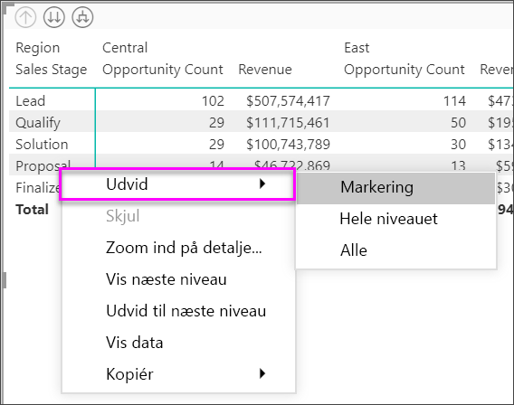
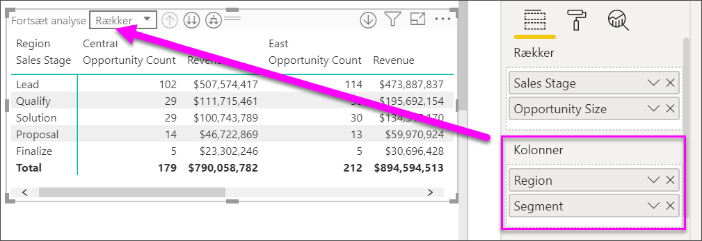
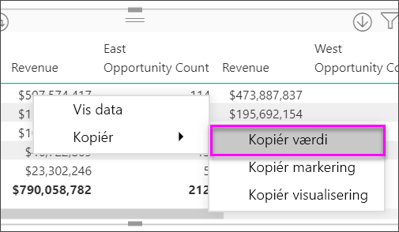

# Brug matrixvisualiseringen i Power BI
Den **matrix** visual svarer til en **tabel**.  En tabel, der understøtter 2 dimensioner og dataene er flade, betydning dublerede værdier vises og ikke aggregeres. En matrix gør det lettere at få vist data på tværs af flere dimensioner korrekt – og det understøtter et trinvist layout. Matrixen aggregerer data og gør det muligt for analysér ned automatisk. 

Du kan oprette matrixvisualiseringer i **Power BI Desktop** og **Power BI-tjenesten** rapporter og tværgående fremhævning af elementer i matrixen med andre visuelle elementer på denne rapportside. F.eks, kan du vælge rækker, kolonner og endda individuelle celler og tværgående fremhævning. Individuelle celler og flere markeringer i cellen kan også, kopieres og indsættes i andre programmer. 

Der er mange funktioner knyttet til matrixen, og vi vil gennemgå dem i følgende afsnit i denne artikel.

## Sådan beregner Power BI totaler

Før du begynder at læse om, hvordan du bruger **Matrix**-visualiseringen, er det vigtigt at forstå, hvordan Power BI beregner værdierne for total og subtotal i tabeller og matrixer. I rækker med total og subtotal evalueres målingen henover alle rækker i de underliggende data – det er *ikke* kun en simpel addition af værdierne i de synlige og viste rækker. Det betyder, at du kan ende med at have en anden værdi i rækken Total, end hvad du regnede med. 

Se nærmere på følgende visuelle effekter matrix. 

I dette eksempel viser hver række i matrixvisualiseringen længst til højre på *beløb* for hver sælger/dato-kombination. Men da en sælger vises for flere datoer, kan tallene forekomme mere end én gang. Den nøjagtige total fra de underliggende data og en simpel addition af de synlige værdier kan derfor ikke sidestilles. Dette er et almindeligt mønster, når den værdi, du regner på, er på den "ene" side i en en til mange-relation.

Når du arbejder med totaler og subtotaler, skal du huske på, at disse værdier er baseret på de underliggende data og ikke kun på de synlige værdier. 

<!-- use Nov blog post video

## Expanding and collapsing row headers
There are two ways you can expand row headers. The first is through the right-click menu. You’ll see options to expand the specific row header you clicked on, the entire level or everything down to the very last level of the hierarchy. You have similar options for collapsing row headers as well.

You can also add +/- buttons to the row headers through the formatting pane under the row headers card. By default, the icons will match the formatting of the row header, but you can customize the icons’ color and size separately if you want. 
Once the icons are turned on, they work similarly to the icons from PivotTables in Excel.

The expansion state of the matrix will save with your report. It can be pinned to dashboards as well, but consumers will need to open up the report to change the state. Conditional formatting will only apply to the inner most visible level of the hierarchy. Note that this expand/collapse experience is not currently supported when connecting to AS servers older than 2016 or MD servers.

Watch the following video to learn more about expand/collapse in the matrix:

-->
## Ved hjælp af detailudledning til matrixvisualiseringen
Du kan gøre alle mulige forskellige interessante detailudledning aktiviteter, der ikke var tilgængelig før til matrixvisualiseringen. Du kan f.eks. foretage detailudledning ved hjælp af rækker, kolonner og endda til individuelle afsnit og celler. Lad os se på, hvordan hver enkelt af disse fungerer.

### Detailudledning på rækkeoverskrifter
Når du i ruden **Visualiseringer** føjer flere felter til sektionen **Rækker** i området **Felter**, aktiverer du detailudledning på rækkerne i matrixvisualiseringen. Dette minder om oprettelse af et hierarki, hvor du derefter kan foretage detailudledning (og så sikkerhedskopiering) via hierarkiet og analysere dataene på hvert niveau.

På følgende billede den **rækker** afsnit indeholder *salgsfase* og *salgsmulighedsstørrelse*, opretter en gruppering (eller et hierarki) i rækkerne, som vi kan gennemgå.

Når der er oprettet gruppering for visualiseringen i sektionen **Rækker**, viser selve visualiseringen *detailudledningen* og *udvider* ikonerne i øverste venstre hjørne i visualiseringen.

Som det er tilfældet med funktionsmåden til detailudledning og udvidelse i andre visualiseringer kan vi ved at vælge disse knapper bruge detailudledning (eller sikkerhedskopiering) gennem hierarkiet. I dette tilfælde kan vi foretage detailudledning fra *salgsfase* til *salgsmulighedsstørrelse*, som vist på følgende billede, hvor detailudledningen ikon for ét niveau (fork) er valgt.

Ud over at bruge disse ikoner, kan du vælge en af rækkeoverskrifterne og detailudledning ved at vælge i menuen, der vises.

Bemærk, at der er nogle indstillinger i den viste menu, der udløser forskellige resultater:

Hvis du vælger **detailudledning** udvider matrixen for *,* rækkeniveau og *undtagen* alle andre rækkeoverskrifter bortset fra den rækkeoverskrift, der blev valgt. På følgende billede, **forslag** > **detailudledning** blev valgt. Bemærk, at andre rækker på øverste niveau ikke længere vises i matrixen. Funktionen til detailudledning er nyttig, og den er specielt god, når vi kommer til afsnittet om **tværgående fremhævning**.

Vælg den **detaljeudledning** ikon for at vende tilbage til den forrige visning af øverste niveau. Hvis du derefter vælge **forslag** > **Vis næste niveau**, får du en stigende liste over alle elementer på næste niveau (i dette tilfælde den *salgsmulighedsstørrelse* felt), uden den hierarkiske kategorisering.

Vælg den **detaljeudledning** ikonet i øverste venstre hjørne for at få matrixen til at vise alle kategorier på øverste niveau, derefter vælge **forslag** > **Udvid til næste niveau**til se alle værdierne for begge niveauer af hierarkiet - *salgsfase* og *salgsmulighedsstørrelse*.

Du kan også bruge den **Udvid** menupunkt for at styre visningen yderligere.  Vælg f.eks. **forslag** > **Udvid** > **valg**. Powerbi viser én samlet række for hver *salgsfase* og alle de *salgsmulighedsstørrelse* indstillinger for *forslag*.

### Detailudledning på kolonneoverskrifter
I lighed med mulighed for at analysere ned på rækker, du kan også bruge detailudledning på **kolonner**. På følgende billede, der er to felter i den **kolonner** , hvilket opretter et hierarki, der minder om det, vi har brugt til rækkerne tidligere i denne artikel. I den **kolonner** vi har *område* og *Segment*. Så snart det andet felt blev føjet til **kolonner**, en ny rullemenu, der vises på det visuelle element, den i øjeblikket viser **rækker**.

Hvis du vil detailudledning for kolonner, skal du vælge **kolonner** fra den *analysér på* menu, der findes i øverste venstre hjørne af matrixen. Vælg den *Øst* område, og vælg **detailudledning**.

Når du vælger **detailudledning**, det næste niveau i kolonnehierarkiet for *område > østlige* skærme, som i dette tilfælde er *antal salgsmuligheder*. Andre området vises, men er nedtonet.

Resten af i genvejsmenuen fungerer i kolonner på samme måde, som de gør i rækker (se forrige afsnit, **detailudledning på rækkeoverskrifter**). Du kan **Vis næste niveau** og **Udvid til næste niveau** med kolonner, der er lige som du kan med rækker.

> [!NOTE]
> Ikonerne for detailudledning og færre detaljer øverst til venstre i matrixvisualiseringen gælder kun for rækker. Hvis du vil foretage detailudledning for kolonner, skal du bruge genvejsmenuen.
> 
> 

## Trinvist layout med matrixvisualisering
**Matrix**-visualiseringen indrykker automatisk underkategorier i et hierarki under hvert overordnet element, hvilket kaldes et **trinvist layout**.

I den *oprindelige* version af matrixvisualiseringen blev underkategorier vist i en helt anden kolonne, der optager meget mere plads i visualiseringen. Billedet herunder viser tabellen i den oprindelige **matrixvisualisering**. Bemærk, at underkategorierne er i en separat kolonne.

På det følgende billede kan du se en rigtig **matrix**-visualisering med **trinvist layout**. Bemærk, at kategorien *Computers* har underkategorier (Computers Accessories (Computertilbehør), Desktops (Stationære computere), Laptops (Bærbare computere), Monitors (Skærme) og osv.) let indrykket, hvilket visuelt giver et meget renere og mere komprimeret indtryk.

Du kan nemt justere indstillingerne for det trinvise layout. Når visualiseringen **Matrix** er valgt i sektionen **Format** (malerrulleikonet) i ruden **Visualiseringer**, kan du udvide sektionen **Rækkeoverskrifter**. Du har to muligheder: Til/fra-knappen til **trinvist layout** (som slår det til eller fra) og **indrykningen af det trinvise layout** (angiver mængden af indrykning i pixel).

Hvis du deaktiverer **det trinvise layout**, vises underkategorier i en anden kolonne og ikke indrykket under den overordnede kategori.

## Subtotaler med matrixvisualiseringer
Du kan slå subtotaler til eller fra i matrixvisualiseringer både for rækker og kolonner. I det følgende billede kan du se, at rækkesubtotaler er slået **til**.

I sektionen **Format** i ruden **Visualiseringer** kan du udvide kortet **Subtotaler** og sætte skyderen **Rækkesubtotaler**  til **Fra**. Når du gør det, vises subtotaler ikke.

Den samme proces gælder for kolonnesubtotaler.

## Tværgående fremhævning med matrixvisualiseringer
Med **matrix**-visualiseringen kan du vælge alle elementer i matrixen som basis for tværgående fremhævning. Når du markerer en kolonne i en **Matrix**, fremhæves kolonnen, og det samme gør andre visuelle elementer på rapportsiden. Denne form for tværgående fremhævning har været en almindelig funktion i andre visualiseringer og markeringer af datapunkter, og nu kan **matrixvisualiseringen** få del i den.

Derudover fungerer Ctrl+klik også for tværgående fremhævning. I eksemplet herunder er en samling underkategorier f.eks. markeret i **Matrix**-visualiseringen. Bemærk, hvordan elementer, der ikke er valgt i visualiseringen, er nedtonet, og hvordan de andre visualiseringer på siden afspejler de valg, der er foretaget i **Matrix**-visualiseringen.

## Kopiering af værdier fra Power BI til brug i andre programmer

Din matrix eller tabel kan have indhold, som du ønsker at bruge i andre programmer, f.eks. Dynamics CRM, Excel og endda andre Power BI-rapporter. Ved at højreklikke i Power BI kan du kopiere en enkelt celle eller en markering med flere celler til udklipsholder og indsætte det i det andet program.

* Hvis du vil kopiere værdien af en enkelt celle, skal du markere cellen, højreklikke og vælge **Kopiér værdi**. Med den ikke-formaterede celleværdi i din udklipsholder kan du nu indsætte det i et andet program.

    

* Hvis du vil kopiere mere end en enkelt celle, skal du vælge et celleområde eller bruge Ctrl til at markere en eller flere celler. Kopien inkluderer kolonne- og rækkeoverskrifterne.

    

## Skygge og skrifttypefarver med matrixvisualiseringer
Med matrixvisualisering, kan du anvende **betinget formatering** (farver og søjler skygge og data) i baggrunden af celler i matrixen, og du kan anvende betinget formatering til tekst og værdier sig selv.

Hvis du vil anvende betinget formatering, skal du vælge matrixen visual og Åbn den **Format** rude. Udvid den **betinget formatering** kort og **baggrundsfarve**, **skriftfarve**, eller **datalinjer**, slå skyderen til **På**. Slå en af disse indstillinger vises et link for *avancerede kontrolelementer*, så du tilpasse farver og værdier for den farve, formatering.
  
  

Vælg *avancerede kontrolelementer* til at få vist en dialogboks, hvor du kan foretage justeringer. Dette eksempel viser dialogboksen for **datalinjer**.

## Næste trin

[Punkt- og boblediagrammer i Power BI](power-bi-visualization-scatter.md)

[Visualiseringstyper i Power BI](power-bi-visualization-types-for-reports-and-q-and-a.md)