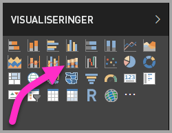
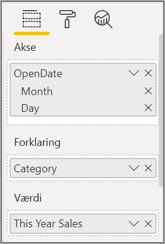
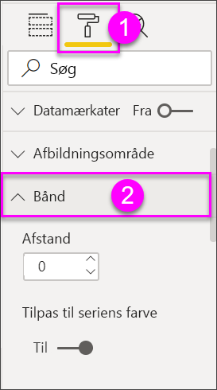
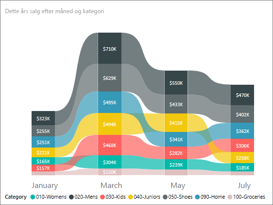

# Brug bånddiagrammer i Power BI
Du kan bruge bånddiagrammer til at visualisere data og hurtigt finde ud af, hvilken kategori af data der har den højeste placering (største værdi). Bånddiagrammer er effektive til at vise ændringer af placeringer, hvor den højeste placering (værdi) altid vises øverst for hver tidsperiode. 

## Opret et bånddiagram
Hvis du vil følge med, skal du åbne [rapporten over et eksempel på analyse af detailhandel](../sample-retail-analysis.md). 

1. Du opretter et bånddiagram ved at vælge **bånddiagram** på panelet **Visualiseringer**.

    

    Med bånddiagrammer tilknyttes en kategori af data for den visualiserede tidsperiode ved hjælp af bånd, hvilket gør det muligt at se, hvordan en bestemt kategori placeres over hele diagrammets x-akse (normalt tidslinjen).

2. Vælg felter for **Akse**, **Forklaring** og **Værdi**.  I dette eksempel har vi valgt: **Dato**, **Kategori** og **Dette års salg**.  

    

    Da datasættet kun indeholder data for ét år, har vi fjernet feltet **År** fra brønden **Akse**. 

3. I bånddiagrammet kan du se placeringen for hver anden måned. Bemærk, hvordan placering ændres over tid.  Kategorien Hjem flytter f.eks. fra tredje til fjerde og tilbage til tredje igen. Kategorien Juniorer flytter fra tredje til femte i juli. 

    

## Formatér et bånddiagram
Når du opretter et bånddiagram, er der formateringsindstillinger tilgængelige under afsnittet **Format** i ruden **Visualiseringer**. Formateringsindstillingerne for bånddiagrammer ligner indstillingerne for et stablet søjlediagram, men byder på yderligere formateringsindstillinger, som er specifikke for båndene.

Ved hjælp af disse formateringsindstillinger for bånddiagrammer kan du foretage følgende justeringer.

* **Afstand** gør det muligt at justere, hvor meget plads der vises mellem båndene. Tallet er procentdelen af kolonnens maksimumhøjde.
* **Match seriens farve** gør det muligt at matche farven på båndene med seriens farve. Når den er slået **fra**, er båndene grå.
* **Gennemsigtighed** angiver, hvor gennemsigtige båndene er. Standardværdien er angivet til 30.
* **Kant** gør det muligt at placere en mørk kant øverst og nederst på båndene. Kanter er som standard slået fra.

Da bånddiagrammet ikke har mærkater for y-aksen, kan det være en god idé at tilføje datamærkater. I ruden Formatering skal du vælge **Datamærkater**. 

Angiv formateringsindstillingerne for dine datamærkater.  I dette eksempel har vi sat tekstfarven til hvid, decimalpladserne til nul og visningsenheder til tusinde. 

## Næste trin

[Punktdiagrammer og boblediagrammer i Power BI](power-bi-visualization-scatter.md)

[Visualiseringstyper i Power BI](power-bi-visualization-types-for-reports-and-q-and-a.md)