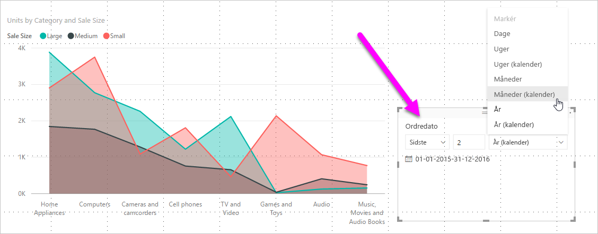
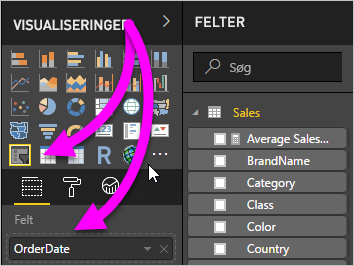
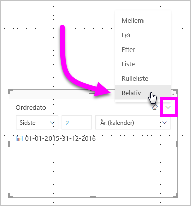
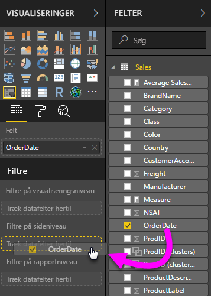
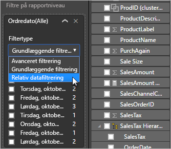
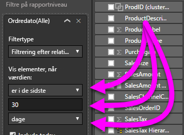

# Oprettelse af et udsnit eller et filter for relativ dato i Power BI

[!INCLUDE[consumer-appliesto-nyyn](../includes/consumer-appliesto-nyyn.md)]

Med det **relative datoudsnit** eller det **relative datofilter** kan du anvende tidsbaserede filtre på en hvilken som helst datokolonne i datamodellen. Du kan f.eks. bruge det **relative datoudsnit** til kun at vise salgsdata, der er oprettet i løbet af de sidste 30 dage (eller måned eller kalendermåneder osv.). Når du opdaterer dataene, anvender den relative tidsperiode automatisk den relevante relative datobegrænsning.

Hvis du vil dele din rapport med en Power BI-kollega, kræves det, at I begge har individuelle Power BI Pro-licenser, eller at rapporten er gemt i en Premium-kapacitet.

## Opret udsnittet for det relative datoområde

Du kan bruge det relative datoudsnit på samme måde som alle andre udsnit. Opret en visualisering med et **udsnit** til din rapport, og vælg derefter en datoværdi for værdien **Felt**. På følgende billede har vi markeret feltet *Ordredato*.

Vælg udsnitsværktøjet på lærredet og derefter karaten i øverste højre hjørne af udsnitsvisualiseringen. Hvis visualiseringen indeholder data for datoer, vises indstillingen **Relativ** i menuen.

For det relative datoudsnit skal du vælge *Relativ*.

Du kan derefter vælge indstillingerne.

Du har følgende valgmuligheder for den første indstilling i det *relative datoudsnit*:

* Sidste

* Næste

* Denne

Den anden (midterste) indstilling i det *relative datoudsnit* gør det muligt at indtaste et tal for at definere det relative datoområde.

Den tredje indstilling giver dig mulighed for at vælge datomålingen. Du har følgende valgmuligheder:

* Dage

* Uger

* Uger (kalender)

* Måneder

* Måneder (kalender)

* År

* År (kalender)

Hvis du vælger **Måneder** på listen og angiver *2* i den midterste indstilling, sker følgende:

* Hvis dags dato er 20. juli,

* vises der data for de to foregående måneder i de data i visualiseringer, der er begrænset af udsnittet,

* fra og med d. 21. maj og frem til og med d. 20. juli (dags dato)

Hvis du til sammenligning har valgt *Måneder (kalender)* , viser de begrænsede visualiseringer data fra 1. maj til 30. juni (de to sidste hele kalendermåneder).

## Opret filteret for det relative datoområde

Du kan også oprette et relativt datoområdefilter for din rapportside eller hele rapporten. Det kan du gøre ved at trække datofeltet til oversigten **Filtre på sideniveau** eller **Filtre på rapportniveau** i ruden **Felt**:

Når det er placeret der, kan du ændre det relative datoområde. Dette minder om den metode, du bruger til at tilpasse det **relative datoudsnit**. Vælg **Filtrering af relativ dato** på rullelisten **Filtertype**.

Når du har valgt **Filtrering af relativ dato**, kan du se tre sektioner, der skal ændres, herunder et numerisk felt i midten, ligesom i udsnitsværktøjet.

## Begrænsninger og overvejelser

Følgende begrænsninger og overvejelser, der aktuelt gælder for det **relative datoområdeudsnit** og -filter.

* Datamodeller i **Power BI** indeholder ikke oplysninger om tidszone. Modeller kan gemme tider, men der er ingen angivelse af den tidszone, de er i.

* Udsnittet og filteret er altid baseret på tidspunktet i UTC-tid. Hvis du konfigurerer et filter i en rapport og sender det til en kollega i en anden tidszone, ser I begge de samme data. Medmindre I befinder jer i UTC-tidszonen, skal I begge tage højde for den tidsforskydning, der gælder for jer.

* Du kan konvertere data, der er hentet i en lokal tidszone, til UTC-tid ved hjælp af **forespørgselseditoren**.

## Næste trin

- [Brug et udsnit og et filter for relativ dato i Power BI](desktop-slicer-filter-date-range.md)
- [Udsnitsværktøjer i Power BI](power-bi-visualization-slicers.md)
