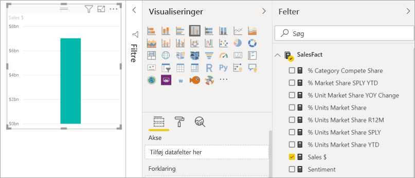
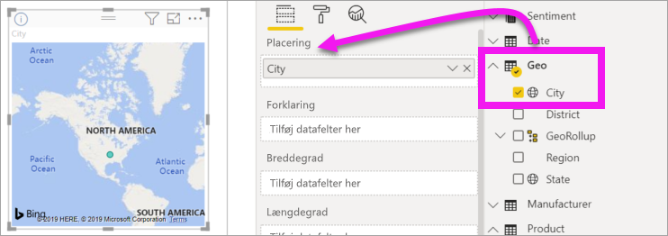
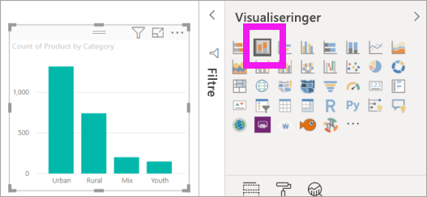
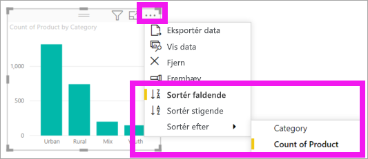

# Føj visualiseringer til en Power BI-rapport (del 1)

[!INCLUDE [power-bi-visuals-desktop-banner](../includes/power-bi-visuals-desktop-banner.md)]

I denne artikel får du en hurtig introduktion til at oprette en visualisering i en rapport. Det gælder for både Power BI-tjenesten og Power BI Desktop. Hvis det drejer sig om mere avanceret indhold, kan du [se del 2](power-bi-report-add-visualizations-ii.md) i denne serie. Se Amanda demonstrere nogle få metoder til at oprette, redigere og formatere visualiseringer på et rapportcanvas. Prøv det derefter selv ved hjælp af [Sales and Marketing-eksemplet](../sample-datasets.md) for at oprette din egen rapport.

<iframe width="560" height="315" src="https://www.youtube.com/embed/IkJda4O7oGs" frameborder="0" allowfullscreen></iframe>

## Forudsætninger

I dette selvstudium bruges [PBIX-filen til Salg og marketing](https://download.microsoft.com/download/9/7/6/9767913A-29DB-40CF-8944-9AC2BC940C53/Sales%20and%20Marketing%20Sample%20PBIX.pbix).

1. Vælg **Fil** > **Åbn** på menulinjen i øverste venstre afsnit af Power BI Desktop
   
2. Find din kopi af **PBIX-filen med eksemplet til Salg og marketing**

1. Åbn **PBIX-filen med eksemplet til Salg og marketing** i rapportvisning .

1. Markér  for at tilføje en ny side.

## Tilføj visualiseringer i rapporten

1. Opret en visualisering ved at vælge et felt i ruden **Felter**.

    Start med et numerisk felt som **Sales** > **TotalSales**. Power BI opretter et søjlediagram med en enkelt kolonne.

    

    Eller du kan starte med et kategorifelt, f.eks **Name** eller **Product**. Power BI opretter en tabel og føjer dette felt til området **Values**.

    

    Du kan også starte med et geografisk felt, f.eks. **Geo** > **City**. Power BI og Bing Maps opretter en kortvisualisering.

    

## Skift visualiseringstype

 Opret en visualisering, og ret derefter typen. 
 
 1. Vælg **Product** > **Category** og derefter **Product** > **Count of Product** for at tilføje dem begge i området **Values**.

    

1. Ret visualiseringen til et søjlediagram ved at vælge ikonet **Stablet søjlediagram**.

   

1. Hvis du vil ændre den måde, visualiseringen sorteres på, skal du vælge **Flere handlinger** (...).  Brug sorteringsindstillingerne til at ændre sorteringsrækkefølgen (stigende eller faldende), og rediger den kolonne, der bruges til at sortere (**Sorteret efter**).

   
  
## Næste trin

 Fortsæt til:

* [Del 2: Føj visualiseringer til en rapport i Power BI](power-bi-report-add-visualizations-ii.md)

* [Interagere med visualiseringerne](../consumer/end-user-reading-view.md) i rapporten.

