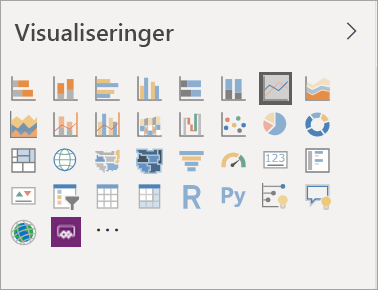
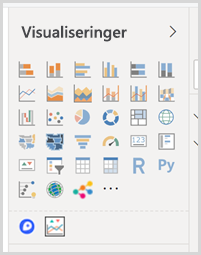

# Visualiseringer i Power BI-rapporter

Visualiseringer (kaldes også visuals) viser indsigt fra dine data. En rapport i Power BI har muligvis en enkelt side med én visual, eller den kan have sider fulde af visuals. I Power BI-tjenesten kan visualiseringer [fastgøres fra rapporter til dashboards](../service-dashboard-pin-tile-from-report.md).

Det er vigtigt at skelne mellem rapporternes *designere* og *forbrugere*.  Hvis du er den person, der opretter eller redigerer rapporten, er du designer.  Designere har tilladelse til at redigere rapporten og dens underliggende datasæt. Det betyder, at du i Power BI Desktop kan åbne datasættet i Datavisning og oprette visuals i Rapportvisning. Det betyder, at du i Power BI-tjenesten kan åbne datasættet eller rapporten i rapporteditoren i [Redigeringsvisning](../consumer/end-user-reading-view.md). Hvis en rapport eller et dashboard er blevet [delt med dig](../consumer/end-user-shared-with-me.md), så er du rapportens *forbruger*. Du kan få vist og interagere med rapporten og dens visualiseringer, men du kan ikke foretage lige så mange ændringer, som en *designer* kan.

Der er mange forskellige typer visualiseringer, der er tilgængelige direkte fra ruden Visualiseringer i Power BI.

Du har endnu flere valg, hvis du besøger [webstedet for Microsoft AppSource-community'et](https://appsource.microsoft.com), hvor du kan finde og [downloade](https://appsource.microsoft.com/marketplace/apps?page=1&product=power-bi-visuals) [brugerdefinerede visualiseringer](../developer/visuals/custom-visual-develop-tutorial.md), som leveres af Microsoft og community'et.

<iframe width="560" height="315" src="https://www.youtube.com/embed/SYk_gWrtKvM?list=PL1N57mwBHtN0JFoKSR0n-tBkUJHeMP2cP" frameborder="0" allowfullscreen></iframe>

Hvis du ikke har erfaring med Power BI, eller hvis du har brug for at opfriske din viden, kan du bruge linkene nedenfor til at lære det grundlæggende om Power BI-visualiseringer.  Alternativt kan du bruge indholdsfortegnelsen (til venstre for denne artikel) til at finde flere praktiske oplysninger.

## Tilføj en visualisering i Power BI

[Opret visualiseringer](power-bi-report-add-visualizations-i.md) på siderne i dine rapporter. Gennemse [listen over visualiseringer og vores selvstudier om visualiseringer.](power-bi-visualization-types-for-reports-and-q-and-a.md) 

## Upload en brugerdefineret visualisering, og brug den i Power BI

Tilføj en brugerdefineret visualisering, som du selv har oprettet, eller som du har fundet på [webstedet for Microsoft AppSource-community'et](https://appsource.microsoft.com/marketplace/apps?product=power-bi-visuals). Er du i det kreative hjørne? Dyk ned i kildekoden, og brug vores [udviklerværktøjer](../developer/visuals/custom-visual-develop-tutorial.md) til at oprette en ny visualiseringstype, og [del den med community'et](../developer/office-store.md). Hvis du vil have mere at vide om udvikling af brugerdefinerede visualiseringer, kan du se [Udvikling af en brugerdefineret visualisering i Power BI](../developer/visuals/custom-visual-develop-tutorial.md).

## Tilpas din visualiseringsrude (prøveversion)

Hvis du finder ud at, at du bruger den samme brugerdefinerede visualisering på tværs af mange rapporter, kan du fastgøre den brugerdefinerede visualisering på din visualiseringsrude. Hvis du vil fastgøre visualiseringen, skal du højreklikke på visualiseringen for at fastgøre den til ruden.

Når en visualisering er blevet fastgjort, flyttes den til liveudgaven sammen med de indbyggede visualiseringer. Denne visualisering er nu knyttet til den konto, du er logget på. Det betyder, at alle nye rapporter, du skaber, automatisk vil have denne visualisering inkluderet, forudsat at du er logget på. Dette gør det meget nemt at standardisere en bestemt visualisering, uden at du behøver at tilføje den i hver enkelt rapport.

Mens denne funktion er tilgængelig som prøveversion, kan du kun se dine fastgjorte visualiseringer i Power BI Desktop. Desuden skal du være logget på, for at denne funktion er tilgængelig.

## Ret visualiseringstypen

Prøv at [vælge en anden type visualisering](power-bi-report-change-visualization-type.md) for at se, hvilken der fungerer bedst med dine data.

## Fastgør visualiseringen

Når du har fået tilpasset visualiseringen til det, du har brug for i Power BI-tjenesten, kan du [fastgøre den på et dashboard](../service-dashboard-pin-tile-from-report.md) som et felt. Hvis du ændrer visualiseringen, der bruges i rapporten, når du har fastgjort den, så ændres feltet på dashboardet ikke – et kurvediagram forbliver et kurvediagram, selvom du har ændret det til et kransediagram i rapporten.

## Begrænsninger og overvejelser
- Afhængigt af datakilden og antallet af felter (målinger eller kolonner) kan indlæsningen af en visualisering muligvis gå langsomt.  Det anbefales at begrænse visualiseringer til 10-20 felter i alt – både af hensyn til læsbarheden og ydeevnen. 

- Den øvre grænse for visualiseringer er 100 felter (målinger eller kolonner). Hvis din visualisering ikke kan indlæses, kan du prøve at reducere antallet af felter.   

## Næste trin

* [Visualiseringstyper i Power BI](power-bi-visualization-types-for-reports-and-q-and-a.md)
* [Brugerdefinerede visualiseringer](../developer/power-bi-custom-visuals.md)
