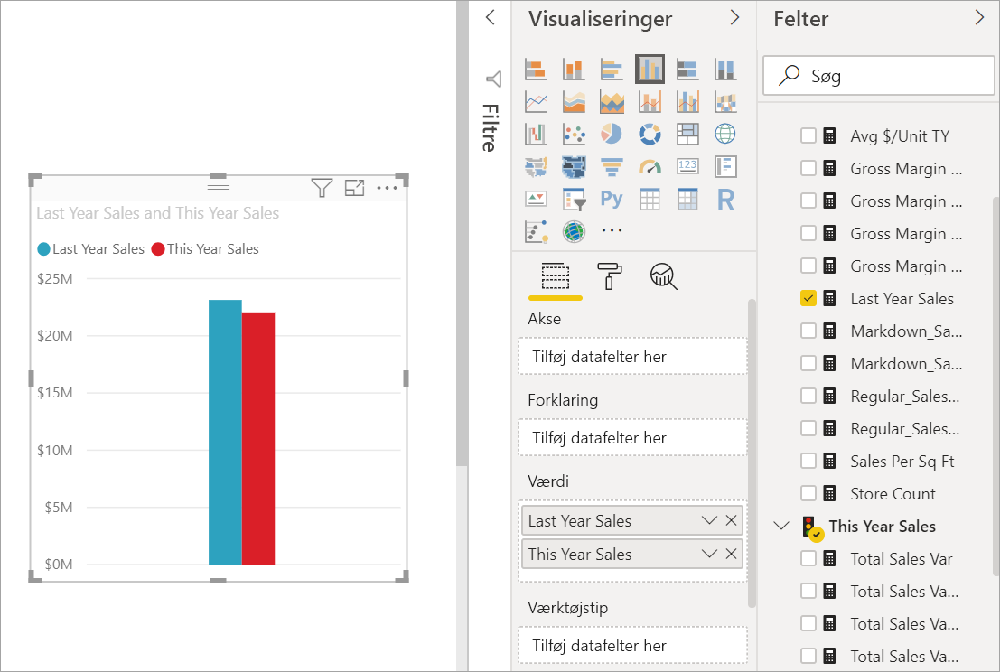
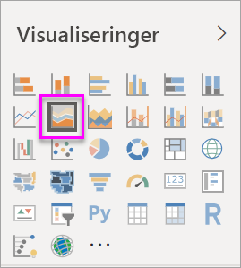
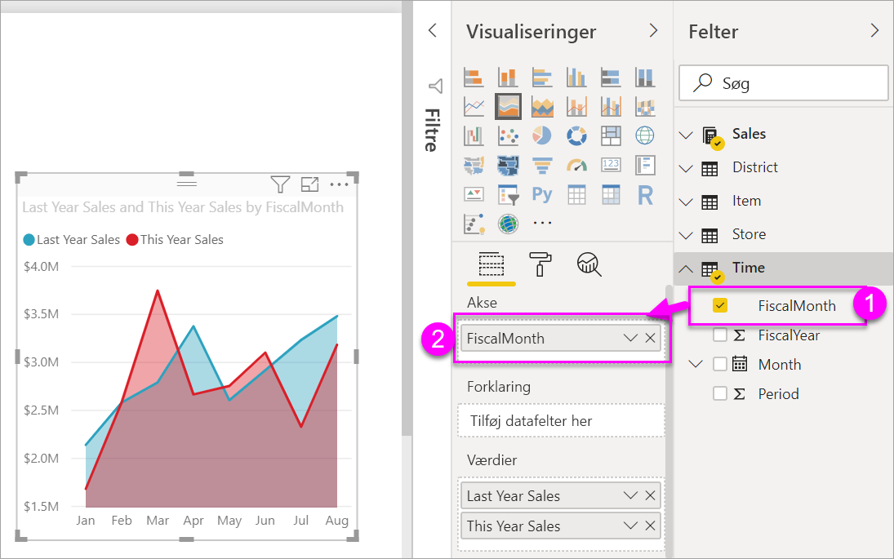

# Basisområdediagram

[!INCLUDE [power-bi-visuals-desktop-banner](../includes/power-bi-visuals-desktop-banner.md)]

Basisområdediagrammet (også kendt som lagdelt områdediagram) er baseret på kurvediagrammet. Området mellem akse og kurve er udfyldt med farver for at angive mængde. 

Områdediagrammer fremhæver omfanget af ændringer over tid og kan bruges til at fremhæve den samlede værdi på tværs af en udvikling. Data, som repræsenterer indtjening over tid, kan f.eks. afbildes i et områdediagram for at fremhæve den samlede indtjening.

## Brugsscenarier for et områdediagram
Basisområdediagrammer er et godt valg:

* Når du vil se og sammenligne mængdeudviklingen på tværs af tidsperioder. 
* Når du har enkelte perioder, der repræsenterer et sæt, som kan tælles fysisk.

### Forudsætninger
I dette selvstudium bruges [PBIX-filen med eksemplet Detailhandelsanalyse](http://download.microsoft.com/download/9/6/D/96DDC2FF-2568-491D-AAFA-AFDD6F763AE3/Retail%20Analysis%20Sample%20PBIX.pbix).

1. Vælg **Fil** > **Åbn** i øverste venstre afsnit af menulinjen
   
2. Find din kopi af **PBIX-filen med eksemplet Detailhandelsanalyse**

1. Åbn **PBIX-filen med eksemplet Detailhandelsanalyse** i rapportvisning .

1. Markér  for at tilføje en ny side.

## Opret et basisområdediagram
 

1. Hvis du følger disse trin, kan du oprette et områdediagram, der viser dette års salg og sidste års salg pr. måned.
   
   a. I ruden Felter skal du vælge **Salg \> Sidste års salg** og **Dette års salg > Værdi**.

   

   b.  Konvertér diagrammet til et grundlæggende områdediagram ved at vælge ikonet Områdediagram i ruden Visualiseringer.

   
   
   c.  Vælg **Time \> FiscalMonth** for at føje elementet til beholderen **Akse**.   
   
   
   d.  Hvis du vil vise diagrammet pr. måned, skal du vælge ellipsemenuen (øverst til højre i visualiseringen) og vælge **Sortér efter måned**. Hvis du vil ændre sorteringsrækkefølgen, skal du vælge ellipsen igen og vælge enten **Sortér stigende** eller **Sortér faldende**.

## Fremhævning og krydsfiltrering
Du kan få mere at vide om brug af ruden Filters under [Føj et filter til en rapport](../power-bi-report-add-filter.md).

For at fremhæve et bestemt område i diagrammet skal du markere dette område eller dets øverste kant.  Hvis der er andre visualiseringer på samme side, vil den i modsætning til andre visualiseringstyper ikke krydsfiltrere med de andre visualiseringer på rapportsiden, når et grundlæggende område markeres. Områdediagrammer kan dog krydsfiltreres af andre visualiseringer på rapportsiden. 

1. Prøv det selv ved at vælge dit områdediagram og kopiere det til rapportsiden **New Store Analysis** (Ctrl + C og Ctrl + V).
2. Vælg det ene af de nedtonede områder i områdediagrammet og derefter det andet nedtonede område. Bemærk, at det ikke påvirker de øvrige visualiseringer på siden.
1. Vælg herefter et element. Læg mærke til, hvordan det påvirker områdediagrammet – det bliver krydsfiltreret.

     

Hvis du vil vide mere, kan du se [Visuelle interaktioner i rapporter](../service-reports-visual-interactions.md)

## Overvejelser og fejlfinding   
* [Gør rapporten tilgængelig for personer med handicap](../desktop-accessibility.md)
* Basisområdediagrammer er ikke velegnede til sammenligning af værdier på grund af blokeringer på de lagdelte områder. Der bruges gennemsigtighed i Power BI til at angive overlapning af områder. Det virker dog bedst, hvis der kun er to eller tre forskellige områder. Hvis du vil sammenligne en udvikling med mere end tre mål, kan du prøve at bruge kurvediagrammer. Hvis du vil sammenligne en mængde med mere end tre mål, kan du prøve at bruge træstrukturdiagrammer.

## Næste trin
[Rapporter i Power BI](power-bi-visualization-card.md)  

