# <a name="best-design-practices-for-reports-and-visuals"></a>Bedste praksis for design af rapporter og visuals

Denne artikel indeholder de bedste fremgangsmåder til design af rapporter i Power BI. Den gennemgår de designprincipper, du kan anvende for dine rapporter samt de sider og visualiseringer, der udgør rapporten. Meget af denne bedste praksis gælder også for dashboarddesign.

> [!NOTE]
> De anbefalinger, der gives i denne artikel, er retningslinjer, du kan anvende, når og hvor det giver mening. For hvert af de principper, vi beskriver nedenfor, er der som regel gyldige grunde til at "bryde reglen".

Vi håber, at du kan bruge denne artikel som udgangspunkt, og du vil anvende det, du lærer, på dine egne rapporter og visualiseringer, samt at du vil fortsætte samtalen på [Microsoft Power BI Community](http://community.powerbi.com/). BI-rapportdesign og brug af visualiseringer er et varmt emne i øjeblikket. Der er mange meningsdannere, bloggere og websteder, der går i dybden med BI-rapportdesign. Vi har nævnt nogle stykker i slutningen af artiklen.

> *Vi bliver overvældet med oplysninger – ikke fordi der er for mange, men fordi vi ikke ved, hvordan vi skal holde styr på dem.*
-- Stephen Few

## <a name="a-look-at-the-landscape-and-terminology"></a>Kast et blik på landskabet og terminologien

En rapport kan have en eller flere rapportsider i Power BI. Alle siderne tilsammen kaldes rapporten. Rapportens grundlæggende elementer er visuals (også kaldet visualiseringer), enkeltstående billeder og tekstfelter. Det er et utal af formateringsmuligheder – fra de enkelte datapunkter over elementerne i rapporten til selve rapportsiden.

Vi starter med planlægningen af rapporten og fortsætter med grundlæggende principper for rapportdesign. Derefter drøfter vi principper for design af visuals og slutter af med en diskussion af bedste praksisser for de enkelte typer af visuals.

Du kan finde dybdegående vejledning og instruktioner til oprettelse og brug af Power BI-rapporter i [Få mere at vide om Power BI](https://powerbi.microsoft.com/learning/).

## <a name="before-you-build-your-first-visualization-focus-on-requirements"></a>Før du opretter din første visualisering, skal du fokusere på kravene

Oprettelsen af en rapport begynder, før du opretter din første visual. En god rapport kræver nemlig planlægning. Vær klar over, hvilke data du har at arbejde med, og skriv kravene til rapporten ned. Stil dig selv disse spørgsmål:

* Hvad har virksomheden brug for?

* Hvordan skal læserne anvende disse data?

* Hvem skal bruge disse data?

* Hvilke beslutninger vil læseren gerne være i stand til at træffe på baggrund af denne rapport?

Svaret på disse spørgsmål driver dit design. Alle rapporter fortæller en historie. Sørg for, at historien stemmer overens med de forretningsmæssige behov. Det kan være fristende at tilføje visuals, der viser dramatisk indsigt, men hvis denne indsigt ikke stemmer overens med de forretningsmæssige behov, så er rapporten ikke nyttig. Faktisk kan disse visuals ende med at være distraherende for brugerne. Måske finder du ud af, at du ikke kan indsamle oplysninger for at træffe beslutningen ud fra disse data. Kan du bruge denne rapport til at måle det, du har brug for at måle?

Du kan benytte rapporter til at overvåge, afdække, spore, forudsige, måle, administrere, teste og meget mere. Eksempelvis kunne de forretningsmæssige behov være en salgsrapport, der måler resultater. Du kan så oprette en rapport, der ser på det aktuelle salg, sammenligne det med tidligere salg, sammenligne med konkurrenter og medtage nogle KPI'er, der udløser beskeder. Måske lan læseren dykke ned i salgstallene for at undersøge store aftaler eller problemer med forsyningskæden, der kan have indflydelse på salget. En anden detailudledning er at se salg efter butik, område, produkt, sæson og meget mere.

Vær klar over, hvem kunderne til rapporten er. Design en rapport, det benytter velkendt terminologi og leverer data med et detalje- og kompleksitetsniveau, som passer til kundernes vidensniveau. Har du mere end én type kunde? Behovene varierer fra kunde til kunde. Design separate rapportsider, der er baseret på ekspertise. Husk at navngive hver side tydeligt, så kunderne selv kan finde de relevante sider. En anden mulighed er at bruge udsnitsværktøjer, så kunderne selv kan skræddersy siden til dem selv. Involver kunden i planlægningsfasen for at undgå at komme til at lave det, du tror, kunden har brug for. Hvis du laver den fejl, kan du godt forberede dig på at starte forfra.

Når du har identificeret de forretningsmæssige behov samt de kunder og de målepunkter, du vil medtage, er det næste trin at vælge de rette visuals til at fortælle historien. Find ud af, hvordan du kan præsentere disse visuals på den mest virkningsfulde måde. Lad os starte med nogle grundlæggende principper for rapportdesign.

## <a name="principles-of-report-design"></a>Principper for rapportdesign

En rapportside har begrænset plads, og en af de sværeste ting er at finde plads til alle de ønskede elementer – og at sørge for, at disse oplysninger er nemme at forstå. Desuden må du ikke undervurdere værdien af en rapport, der er flot rent visuelt. Det er vigtigt at finde balancen mellem en rapport, der er flot og én, der er nyttig.

Lad os kaste et blik på layout, tydelighed og æstetik.

### <a name="layout-of-the-report-canvas"></a>Layoutet af rapportens lærred

Rapportens lærred har en begrænset mængde plads. Hvis du ikke kan få plads til alle elementerne på en enkelt rapportside, kan du opdele rapporten i flere sider. Du kan tilpasse en rapportside til en bestemt målgruppe (f.eks, HR, IT, salg og ledelsen). Hvis du vil, kan du skræddersy den til et bestemt forretningsrelateret spørgsmål:

* "Hvordan påvirker fejl vores nedetid?"

* "Hvordan påvirker vores marketingkampagne synspunkter?"

Det kan være bedre at benytte en progressiv historie. Måske er den første side en oversigt eller en fængende "krog", på den anden side fortsættes datahistorien, på den tredje side går du mere i dybden med historien osv. Hvis hele din rapport kan være på en enkelt side, er det også fint. Hvis den ikke kan være der, kan du oprette separate rapportsider, der på logisk vis grupperer indholdet. Glem ikke at give siderne meningsfulde og nyttige navne.

Tænk på det som at indrette et kunstmuseum. Du ville ikke hænge 50 kunstværker i et lille lokale, fylde det med stole og male hver væg i forskellige farver. Som kurator ville du kun vælge de kunstværker, der har et fælles tema. Du ville anbringe dem rundt i lokalet med god plads, så de besøgende har plads til at bevæge sig og reflektere over det, de ser. Du ville måske endda placere informative kort, der beskriver det, de ser. Der er en grund til, at de fleste moderne kunstmuseer har neutrale vægge.

I denne artikel starter vi med et eksempel på en rapport, der kræver en masse arbejde. I takt med at vi anvender vores bedste praksisser og designprincipper, bliver vores rapport bedre.


**Figur 1: Denne grimme rapportside kræver meget arbejde**

Ovenstående eksempel har mange pladsrelaterede (layoutmæssige) designproblemer, som vi diskuterer nedenfor:

* Justering, orden og brug af nærhed

* Dårlig brug af plads og sortering

* Rod

### <a name="alignment-order-and-proximity"></a>Justering, orden og nærhed

Layoutet for dine rapportelementer påvirker læserens forståelse og guider læseren gennem rapportsiden. Måden hvorpå du anbringer og positionerer elementer, fortæller en historie. Historien kunne være "start her, og se derefter her" eller "disse tre elementer er relateret til hinanden".

* I mange kulturer scanner folk fra venstre mod højre og oppefra og ned. Placer det vigtigste element i øverste venstre hjørne af rapporten. Organiser resten af visualiseringerne på en måde, der fører til en logisk navigation og forståelse af oplysningerne.

* Anbring elementer, der kræver, at læseren træffer et valg, til venstre for de visualiseringer, valget påvirker: f.eks. udsnit.

* Anbring elementer, der er relaterede, tæt på hinanden. Nærhed antyder elementernes relation.

* En anden måde at udtrykke en relation på er at tilføje en kant eller en farvebaggrund omkring relaterede elementer. Omvendt kan du tilføje en delelinje for at skelne mellem forskellige afsnit af en rapport.

* Brug blanktegn til visuelt at adskille sektioner på rapportsiden.

* Udfyld rapportsiden. Hvis der er for mange områder med blanktegn, kan du gøre dine visualiseringer større eller gøre lærredet mindre.

* Vær bevidst om størrelsen af dine rapportelementer. Lad ikke den tilgængelige plads bestemme størrelsen på en visualisering.

* Gør vigtige elementer større end de øvrige, eller tilføj en visualisering som f.eks en pil for at tiltrække opmærksomhed.

* Juster elementerne på rapportsiden enten symmetrisk eller bevidst asymmetrisk.

Lad os se nærmere på justering.

#### <a name="alignment"></a>Justering

Justering betyder ikke, at de forskellige komponenter skal have den samme størrelse. Det betyder ikke, at du skal have det samme antal komponenter på hver række i rapporten. Det betyder bare, at der er en struktur på siden, der hjælper med navigation og læsning.

Vi kan se i vores opdaterede rapport, at vi har justeret rapportens komponenter langs venstre og højre kant. Vi har også justeret hver række i rapporten vandret og lodret. Vores udsnitsværktøjer er til venstre for de visuals, de påvirker.


**Figur 2: Vores grimme rapporteksempel forbedret med redigeringer i layoutet**

Power BI indeholder værktøjer, der hjælper dig med at justere dine visuals. I Power BI Desktop kan du, når flere visuals er markeret, bruge indstillingen **Juster** eller **Distribuer** på båndfanen **Visuals** for at matche placeringen af visuals.

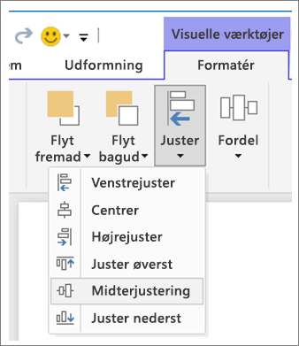

**Figur 3a: værktøjer til justering af visuals i Power BI Desktop**


**Figur 3b: værktøjer til justering af visuals i Power BI-tjenesten**

I Power BI-tjenesten og Power BI Desktop har du også nøjagtig kontrol over størrelsen og placeringen af visuals. Du kan finde dette kontrolelement på fanen **Generelt** i ruden **Format** for alle visuals:

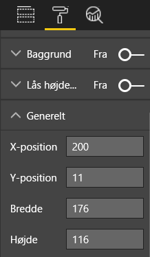

**Figur 4: Angiv den nøjagtige placering af din visual**

På vores eksempelrapportside (Figur 2) justerer Power BI de to kort og en stor kant på **x-positionen** ved 200.

#### <a name="fit-to-the-space"></a>Tilpas til pladsen

Få mest muligt ud af den plads, du har. Hvis du ved, hvordan folk vil få vist og vise rapporten, skal du have det i tankerne, når du designer. Reducer tom plads for at udfylde lærredet. Gør alt, hvad du kan for at fjerne behovet for rullepaneler på de enkelte visuals. Udfyld pladsen uden at få din visual til at se indeklemt ud.

##### <a name="adjust-the-page-size"></a>Tilpas størrelsen på siden

Når du reducerer sidestørrelsen, blive de enkelte elementer større i forhold til siden som helhed. Ryd markeringen af visuals på siden, og brug fanen **Sidestørrelse** i ruden **Format**.

Her er en rapportside med sidestørrelsen **4:3** og derefter **16:9**. Bemærk, hvordan layoutet passer meget bedre til 16:9. Der er endda plads nok til at fjerne rullepanelet fra den anden visual.

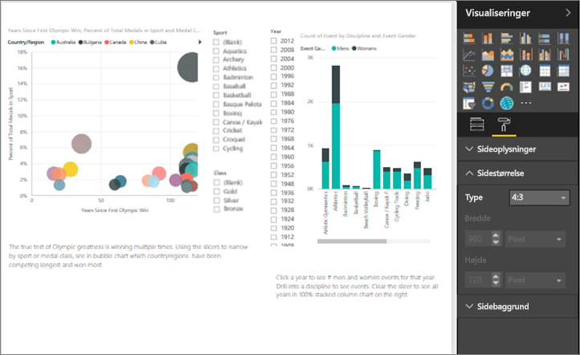

**Figur 5a: Rapporten med sidestørrelse 4:3**

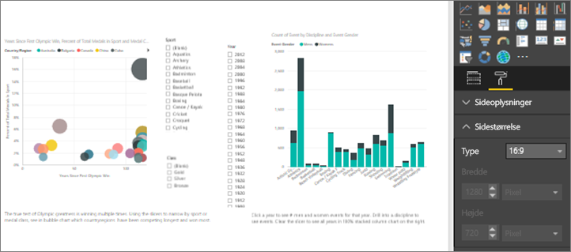

**Figur 5b: rapporten med sidestørrelse 16:9**

Får brugerne vist rapporten i størrelsen 4:3, 16:9 eller et andet højde-bredde-forhold? På små skærme eller store skærme? Får de vist rapporten på alle mulige skærmforhold og -størrelser? Hav dette i tankerne, når du designer.

Vores eksempelrapportside ser lidt indeklemt ud. Uden at der er markeret nogen visual:

1. Vælg  for at åbne ruden **Format**.

1. Udvid **Sidestørrelse**.

1. Vælg **Brugerdefineret** for **Type**.

1. Skift **højde** til **900**.

    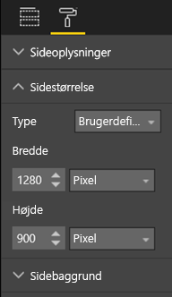

**Figur 6: Forøg sidehøjde**

#### <a name="reduce-clutter"></a>Reducer rod

En rodet rapportside vil være svær at forstå med et hurtigt øjekast og kan virke så overvældende, at læserne ikke engang forsøger. Fjern alle unødvendige elementer i rapporten. Udlad at tilføje funktioner, der ikke bidrager til forståelsen eller navigationen. Din rapportside skal udtrykke oplysningerne så klart, hurtigt og sammenhængende som muligt.

Edward Tufte kalder det for "data-ink ratio" (data til blæk-forhold) i sin bog *The Visual Display of Quantitative Information*. Grundlæggende drejer det sig om at fjerne alle elementer, der ikke er vigtige.

Det rod, du fjerner, øger mængden af blanktegn på rapportsiden. Det vil give dig mere plads til at anvende de bedste fremgangsmåder fra afsnittet [Justering, orden og nærhed](#alignment-order-and-proximity).

Vores eksempel ser allerede bedre ud. Vi har fjernet en masse rod og tilføjet figurer for at gruppere elementer sammen. Baggrundsbilledet er væk, den unødvendige pilefigur og tekstfeltet er væk, vi har flyttet én visual til en anden side i rapporten osv. Vi har også forlænget sidestørrelsen for at øge mængden af blanktegn.


**Figur 7: Vores grimme rapporteksempel uden rod**

### <a name="tell-a-story-at-a-glance"></a>Fortæl en historie ved første øjekast

Den overordnede test bør være, at nogen uden forudgående kendskab hurtigt skal kunne forstå rapporten uden nogen forklaring fra nogen. Læserne kan hurtigt se, hvad siden drejer sig om, samt budskabet i hvert diagram eller hver tabel.

Når læserne ser på din rapport, skal deres øjne fokusere på det element, du vil have dem til at se på først. Deres øjne vil derefter fortsætte fra venstre mod højre og oppefra og ned. Du kan lave om på dette ved at tilføje visuelle effekter som navne på tekstfelter, figurer, kanter, størrelse og farve.

#### <a name="text-boxes"></a>Tekstfelter

Nogle gange er titlerne på visualiseringerne ikke nok til at fortæller historien. Tilføj tekstfelter for at kommunikere med de personer, der ser dine rapporter. Du kan bruge tekstfelter til at beskrive rapportsiden, en gruppering af visuals eller beskrive en enkelt visual. De kan forklare resultaterne eller på bedre vis definere en visual, komponenter i en visual eller relationer mellem visuals. Du kan bruge tekstfelter til at tiltrække opmærksomhed baseret på forskellige kriterier, der defineres i tekstfeltet.

Vælg **Tekstfelt** i den øverste menulinje i Power BI-tjenesten. (I Power BI Desktop skal du vælge **Tekstfelt** i området **Indsæt** på båndet).


**Figur 8: Tilføj et tekstfelt i Power BI-tjenesten**

Indtast tekst i det tomme felt. Brug derefter kontrolelementerne til at angive skrifttype, størrelse, justering og meget mere. Brug håndtag til at tilpasse størrelsen på feltet.


**Figur 9: Formatér tekstfeltet**

Men lad være med at overdrive. For meget tekst på en rapport fjerner opmærksomheden fra visualiseringerne. Hvis din rapportside kræver en hel masse tekst for at gøre den forståelig, skal du starte forfra. Kan du vælge en anden visual, der i sig selv kan fortælle en bedre historie? Kan du ændre din visuals oprindelige titel for at gøre den mere forståelig?

#### <a name="text"></a>Tekst

Opret en vejledning til teksttypografi, og anvend den på alle sider i rapporten. Vælg kun nogle få skrifttyper, tekststørrelser og farver. Anvend denne typografi til tekstelementerne. Den gælder også for de skrifttypevalg, du foretager i dine visualiseringer. Se afsnittet [Titler og navne, som er en del af visualiseringerne](#titles-and-labels-that-are-part-of-the-visualizations). Angiv regler for, hvornår du skal bruge fed, kursiv, større skriftstørrelse, bestemte farver og meget mere. Prøv at undgå kun at bruge store bogstaver eller understregning.

#### <a name="shapes"></a>Figurer

Figurer kan også bidrage til navigationen og forståelsen. Brug figurer til at gruppere relaterede oplysninger sammen og fremhæve vigtige data, og brug pile til at styre læserens øjne. Figurer hjælper læserne med forstå, hvor de skal starte, og hvordan de skal tolke din rapport. Når vi taler om design, kaldes det ofte for *kontrast*.

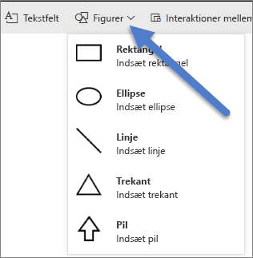

**Figur 10a: figurer i Power BI-tjenesten**

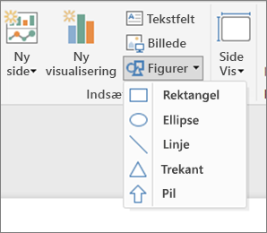

**Figur 10b: Figurer i Power BI Desktop**

Hvordan ser vores eksempelside ud nu? I Figur 11 vises en renere, mindre rodet side med en konsekvent brug af tekstflader, skrifttyper og farver. Vores titel i øverste venstre hjørne fortæller os, hvad siden drejer sig om.


**Figur 11: Vores rapporteksempel med retningslinjer for tekst anvendt og titel tilføjet**

I vores eksempel har vi tilføjet en sidetitel i det øverste venstre hjørne, som er det første sted, læserne kigger. Skriftstørrelsen er 28, og skrifttypen er Segoe Bold, så den skiller sig ud fra resten af siden. Vores teksttypografi kræver ingen baggrunde, sorte titler, forklaringer og navne. Vi har anvendt typografien på alle visuals på siden, hvor det er muligt (kombinationsdiagrammets akser og mærkater kan ikke redigeres). Desuden blev disse elementer konfigureret i henhold til typografiens specifikationer:

* Kort: **Kategorietiket** angivet til **Fra**, **titel** er slået **Til**, 12 punkt, sort og centreret.

* Titler på visuals: Hvis de slået **Til**, skal de indstilles til 12 punkt og venstrejusterede.

* Udsnitsværktøjer: **Header** er slået **Fra**, **Titel** er slået **Til**. Lad **Elementer** > **Tekst** være grå og 10 punkt.

* Punktdiagrammer og søjlediagrammer: sort skrifttype for x- og y-akserne og x- og y-aksetitlerne, hvis de bruges.

#### <a name="color"></a>Farve

Brug farve for ensartethed. Vi taler mere om farve i [Principper for design af visuals](#principles-of-visual-design) nedenfor. Her skal vi tale om vigtigheden af at være velovervejet i dit valg af farve. Det er vigtigt, at farven ikke distraherer dine læseres mulighed for hurtigt at forstå din rapport. For mange strålende farver bombarderer sanserne. Dette afsnit handler mere om, hvad man ikke skal gøre med farver.

#### <a name="backgrounds"></a>Baggrunde

Når du angiver baggrunde til rapportsider, skal du vælge farver, som ikke overskygger rapporten, passer dårligt sammen med andre farver på siden eller generelt bare gør ondt i øjnene. Vær bevidst om, at nogle farver har en indbygget betydning. I USA tolkes rød i en rapport f.eks. som "dårligt".

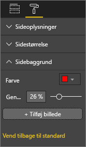

**Figur 12: Angiv rapportens baggrund**

Du er ikke ved at lave et kunstværk, men en funktionel rapport. Vælg en farve, der øger elementernes læselighed og får dem til at træde frem i rapporten. En undersøgelse af brugen af farve og visualiseringer på websider viste, at jo større kontrasterne mellem farver er, desto hurtigere er forståelseshastigheden. Du kan læse mere om dette emne i disse to whitepapers:

* [The effect of text and background color on visual search of Web pages](https://www.sciencedirect.com/science/article/pii/S0141938202000410)

* [Determining Users’ Perception of Web Page Visual Complexity and Aesthetic Characteristics](https://www.researchgate.net/publication/301362579_Determining_Users'_Perception_of_Web_Page_Visual_Complexity_and_Aesthetic_Characteristics)

Vi har anvendt nogle af disse bedste fremgangsmåder for farvevalg i vores eksempelrapport (Figur 20 og 21). Det mest bemærkelsesværdige er, at vi har ændret baggrundsfarven til sort. Gul blev for lyst og var anstrengende for øjnene. Og i diagrammet **Count of athlete name by year and medal class** gik den gule del af søjlerne i et med den gule baggrund. Ved hjælp af en sort (eller hvid) baggrund får vi maksimal kontrast, og vores visuals bliver vores fokuspunkt.

Her er de ekstra ting, vi har gjort for at forbedre eksempelrapporten:

#### <a name="page-title"></a>Sidetitel

Da vi ændrede baggrunden til sort, forsvandt vores titel, fordi tekstfelt kun tillader sort skrifttype. Dette problem kan løses ved at tilføje en tekstfelttitel i stedet for:

1. Markér tekstfeltet, og slet teksten.

1. Vælg **Titel** på fanen **Visualiseringer**, og slå den **Til**.

1. Vælg pilen for at udvide indstillingerne for **Titel**.

1. Indtast **Sommer-OL** i feltet **Titeltekst**.

1. Vælg hvid i **Skriftfarve**.

    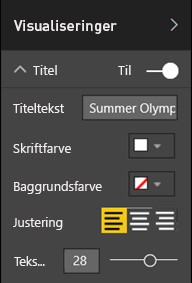

    **Figur 13: Tilføj en sidetitel**

#### <a name="cards"></a>Kort

For kortvisuals:

1. Vælg  for at åbne ruden **Format**.

1. Slå **Baggrund** **Til**.

1. Vælg hvid med en **gennemsigtighed** på **0 %** .

    

1. Slå derefter **Titel** **Til**.

1. Vælg hvid under **Skriftfarve**, og vælg sort under **Baggrundsfarve**.

    

#### <a name="slicers"></a>Udsnit

Indtil nu havde to udsnitsværktøjer forskellig formatering. Det giver ikke mening rent designmæssigt. For begge udsnitsværktøjer: 

1. Skift baggrundsfarve til Akvamarin.

    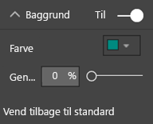

    **Figur 14: Skift udsnitsværktøjets baggrundsfarve**

    Akvamarin er et godt valg, fordi den er en del af sidens farvepalet – du kan se den i det udfyldte kort, træstrukturen og søjlediagrammet.

1. Tilføj en tynd hvid kant.

    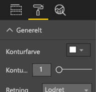

    **Figur 15: Føj en kant til udsnitsværktøjet**

1. Den grå skrifttype er svær at se op mod akvamarin, så du skal ændre farven for **Elementer** til hvid.

    

    **Figur 16: Skift skriftfarven for udsnitsværktøjet**

1. Til sidst skal du under **Titel** ændre **Skriftfarve** til hvid og tilføje sort som **Baggrundsfarve**.

    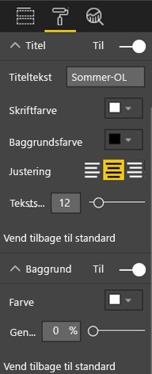

    **Figur 17: Formatér titel på udsnitsværktøj**

#### <a name="rectangle-shape"></a>Rektangulær figur

Rektanglet er også forsvundet i den sorte baggrund. Sådan løser du problemet:

1. Markér figuren.

1. Slå skyderen for **Baggrund** **Til** i ruden **Formatér figur**.

    

    **Figur 18: Formatér figuren**

#### <a name="column-charts-bubble-chart-filled-map-and-treemap"></a>Søjlediagrammer, boblediagram, udfyldt kort og træstruktur

Tilføj en hvid baggrund på de resterende visuals på rapportsiden. I ruden **Format**:

1. Udvid indstillingen **Baggrund**.

1. Angiv **Farve** til hvid.

1. Angiv **Gennemsigtighed** til 0.

    

    **Figur 19: Føj en hvid baggrund til de resterende visualiseringer**

Sådan ser rapporten ud, når du har omformateret den:


**Figur 20: Rapporteksempel med bedste praksisser for farver anvendt (sort baggrund)**


**Figur 21: Rapporteksempel med bedste praksisser for farver anvendt (hvid baggrund)**

### <a name="aesthetics"></a>Æstetik

Meget af det, vi forstår ved æstetik, er allerede blevet diskuteret ovenfor: justering, farve, skrifttypevalg og rod. Der er nogle få andre bedste fremgangsmåder for rapportdesign, som er værd at diskutere. De handler om rapportens generelle udseende.

Husk, at formålet med rapporten er at opfylde et forretningsmæssigt behov – ikke at rapporten skal flot. Men lidt flot bør den dog være, især når det drejer sig om førstehåndsindtryk. Markedsføringskonsulenten Tony Bodoh forklarer "Vores følelser vækkes, et halvt sekund før logikken kan nå at virke". Læserne vil først reagere på din rapportside ud fra deres følelser. Herefter tager de sig bedre tid til at gå i dybden. Hvis siden virker rodet, forvirrende, uprofessionel, så opdager læseren måske aldrig den stærke historie, den fortæller.

Blogger og brancheanalytiker hos TechTarget, Wayne Eckerson, har en glimrende analogi. At designe en rapport er som at indrette et værelse. Med tiden køber man en vase, en sofa, et bord og et maleri. Hver for sig kan du godt lide alle disse ting. Selvom hvert enkelt valg giver mening, passer alle tingene ikke sammen eller de konkurrerer om opmærksomheden.

Koncentrer dig om disse ting:

* At skabe et fælles tema eller udseende for rapporten, som anvendes på alle sider i rapporten.

* At bruge enkeltstående billeder og andre grafikelementer til at understøtte og ikke fjerne opmærksomheden fra den egentlige historie.

* At anvende alle de bedste fremgangsmåder, der er blevet omtalt i artiklen indtil nu.

## <a name="principles-of-visual-design"></a>Principper for design af visuals

Vi har set på principper for rapportdesign, og hvordan man organiserer rapportens elementer på en måde, som gør det nemt hurtigt at forstå rapporten. Nu skal vi se på designprincipper for visuals i sig selv. I det næste afsnit går vi i dybden med enkeltstående visuals og drøfter de bedste fremgangsmåder for nogle af de mere almindeligt anvendte typer.

Vi lader vores eksempelrapportside ligge i et stykke tid og ser på andre eksempler. Når vi har gennemgået principperne for design af visuals, vender vi tilbage til vores eksempelside og anvender det, vi har lært. Du får en trinvis vejledning til dette.

### <a name="planning--choose-the-right-visual"></a>Planlægning – vælg den rette visual

Ligesom det er vigtigt at planlægge din rapport, før du går i gang med oprettelsen, kræver hver enkelt visual også planlægning. Spørg dig selv "Hvilken historie forsøger jeg at fortælle med denne visual", og find derefter ud af, hvilken type visual der fortæller historien bedst. Du kan vise fremskridt gennem en salgscyklus i form af et liggende søjlediagram, men ville et vandfaldsdiagram eller et tragtformet diagram ikke fortælle det bedre? Læs det sidste afsnit i denne artikel [Visualtyper og de bedste fremgangsmåder](#visual-types-and-best-practices) for at få hjælp med denne proces. I artiklen beskrives de bedste fremgangsmåder for nogle af de mere almindelige typer visuals. Bliv ikke overrasket, hvis den første type visual, du vælger, ikke ender med at være det bedste valg. Prøv med mere end én type visual for at se, hvilken en der bedst leverer din pointe.

Forstå forskellen mellem kategoriske og kvantitative data, og forstå, hvilke visualtyper der fungerer bedst sammen med de forskellige datatyper. Kvantitative data kaldes ofte for målinger, og det er typisk numeriske data. Kategoriske data kaldes ofte for dimensioner og kan klassificeres. Dette går vi i dybden med i afsnittet [Vælg den rette måling](#choose-the-right-measure).

Modstå den fristelse, det er, at bruge smarte eller mere komplekse typer visuals bare for at få rapporten til at se mere imponerende ud. Du skal gå efter den mest enkle måde at formidle din historie på. Vandrette liggende søjlediagrammer og simple kurvediagrammer kan hurtigt formidle oplysninger. De er velkendte og praktiske, og de fleste læsere kan nemt fortolke dem. Det er også en fordel, at de fleste personer læser fra venstre mod højre og oppefra og nedad, og disse to diagramtyper kan derfor hurtigt skimmes og forstås.

Skal der rulles i din visual, for at den fortæller historien? Undgå behovet for rulning, hvis det er muligt. Prøv at anvende filtre og gøre brug af hierarkier/detailudledning. Hvis disse elementer ikke fjerner rullepanelet, bør du overveje at vælge en anden type visual. Hvis du ikke kan undgå rulning, kan læserne bedre acceptere vandret rulning end lodret rulning.

Selv når du vælger den absolut bedste visual for historien, kan du stadig have brug for hjælp til at fortælle historien. Det er her, navne, titler, menuer, farve og størrelse kommer ind i billedet. Vi diskuterer disse designelementer senere i afsnittet [Designelementer](#design-elements).

### <a name="choose-the-right-measure"></a>Vælg den rette måling

Fortæller din visual en overbevisende historie? Betyder det noget? Du skal ikke oprette visuals bare for at oprette visuals. Måske har du tænkt, at dataene ville fortælle en interessant historie, men det gør de ikke. Du skal ikke være bange for at starte forfra og prøve at finde en mere interessant historie. Måske er historien der, men den skal måles på en anden måde.

Det kan f.eks. være, at du vil måle dine salgschefers resultater. Hvilken måling ville du bruge til at gøre dette? Vil du bedst kunne måle det ved at kigge på det samlede salg, den samlede fortjeneste, vækst i løbet af det seneste år eller resultat i forhold til en målsætning? Sælgeren Sally har måske den største indtjening. Hvis du viser den samlede fortjeneste efter de enkelte sælgere i et liggende søjlediagram, ville vedkommende fremstå som en rockstjerne sammenlignet med de andre sælgere. Men hvis Sally har høje salgsomkostninger (rejseudgifter, leveringsomkostninger, produktionsomkostninger osv.), får vi ikke hele historien med ved kun at kigge på salget.

#### <a name="reflect-reality-dont-distort-reality"></a>Afspejl virkeligheden i stedet for at forvrænge den

Det er muligt at oprette en visual, der fordrejer sandheden. Der findes et websted, hvor dataentusiaster deler det, de mener, er dårlige visuals. Og det gennemgående tema i kommentarerne er skuffelse over den virksomhed, der har oprettet og distribueret den pågældende visual. En dårlig visual sender et budskab, man ikke kan stole på.

Så sørg for at oprette visuals, der ikke bevidst fordrejer virkeligheden, og som ikke er manipuleret til at fortælle den historie, du vil have dem til at fortælle. Her er et eksempel:


**Figur 22: Diagram, der fordrejer virkeligheden**

Det ser ud som om, der er stor forskel på de fire virksomheder, og at CorpB har meget større succes end de tre andre. Bemærk, at x-aksen ikke starter på nul, og at forskellen mellem virksomhederne sandsynligvis ligger inden for fejlmargenen. Her er de samme data med en x-akse, der starter ved nul.


**Figur 23: Realistisk diagram**

Læserne forventer og antager ofte, at x-aksen starter ved nul. Hvis du beslutter ikke at starte på nul, skal du gøre det på en måde, der ikke forvrænger resultaterne. Overvej at tilføje visuelle tips eller et tekstfelt for at påpege afvigelsen fra normen.

### <a name="design-elements"></a>Designelementer

Når du har valgt en type og en måling og oprettet en visual, er tiden kommet til at finjustere visningen for at opnå den største effekt. Dette afsnit omhandler følgende:

* Layout, mellemrum og størrelse

* Tekstelementer: navne, anmærkninger, menuer, titler

* Sortering

* Visuel interaktion

* Farve

#### <a name="tweaking-visuals-for-best-use-of-space"></a>Tilpasning af visuals for at udnytte pladsen optimalt

Hvis du forsøger at få plads til flere diagrammer i en rapport, kan det hjælpe med at få historien til at træde frem, hvis du maksimerer dit data til blæk-forhold. Som nævnt ovenfor har Edward Tufte opfundet udtrykket "data til blæk-forhold". Formålet er at fjerne så mange mærker fra et diagram som muligt, uden at det hæmmer læserens evne til at fortolke dataene.

I den første række diagrammer nedenfor er der overflødige aksenavne: **Jan 2014**, **Apr 2014** osv. I titlen gentages **efter dato**. Titlerne på hvert diagram kræver også dedikeret vandret plads på tværs af hvert diagram. Hvis du fjerner diagramtitlerne og aktiverer individuelle aksenavne, fjerner du noget blæk og udnytter den samlede mængde plads bedre. Vi kan fjerne aksenavnene på de øverste to diagrammer for yderligere at reducere blækmængden og bruge mere plads til data.

Hvis der er bestemte tidsperioder, du vil fremhæve, kan du tegne streger eller rektangler bag alle diagrammerne. På den måde hjælper du med at trække læserens blik op og ned for at lave sammenligninger.


**Figur 24: Før**


**Figur 25: Efter**

**Sådan slår du aksetitler til eller fra**

1. Markér den pågældende visual for at aktivere den.

1. Vælg  for at åbne ruden **Format**.

1. Udvid indstillingerne for **x-aksen** eller **y-aksen**.

1. Slå skyderen for **Titel** til eller fra.

    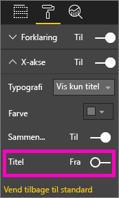

    **Figur 26: Slå aksetitler til eller fra**

##### <a name="to-turn-axis-labels-on-and-off"></a>Sådan slår du aksenavne til eller fra

1. Markér den pågældende visual for at aktivere den.

1. Vælg  for at åbne ruden **Format**.

1. Der er skydere ud for **X-aksen** og **Y-aksen**.

1. Træk i skyderen for at slå aksenavne til eller fra.

    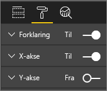

    **Figur 27: Slå aksenavne til eller fra**

    > [!TIP]
    > Et scenarie, hvor du måske vil slå y-aksenavne fra, kunne være, hvis du har haft **Datamærkater** slået til.

##### <a name="to-remove-visual-titles"></a>Sådan fjernes titler på visuals

1. Markér den pågældende visual for at aktivere den.

1. Vælg  for at åbne ruden **Format**.

1. Indstil skyderen for **Titel** til **Fra**.

    

    **Figur 28: Fjern titler fra visuals**

Overvej, hvordan dine læsere får vist rapporten. Sørg for, at dine visuals og teksten er stor nok og mørk nok til, at brugerne kan læse dem. Hvis du har en forholdsmæssig stor visual på siden, antager læserne muligvis, at den er det vigtigste. Sørg for nok plads mellem de enkelte visuals, så rapporten ikke virker rodet og forvirrende. Juster dine visuals, så du kan styre læserens øjne.

##### <a name="to-resize-a-visual"></a>Sådan tilpasser du størrelsen på en visual

1. Markér den pågældende visual for at aktivere den.

1. Træk i et af håndtagene for at justere størrelsen.

    

    **Figur 29: Tilpas størrelsen på en visual**

##### <a name="to-move-a-visual"></a>Sådan flytter du en visual

1. Markér den pågældende visual for at aktivere den.

1. Markér og hold museknappen nede på gribelinjen øverst i midten af din visual,

1. og træk den til den nye placering.

    

    **Figur 30: Flyt en visual**

#### <a name="titles-and-labels-that-are-part-of-the-visualizations"></a>Titler og navne, som er en del af visualiseringerne

Sørg for, at titler og navne kan læses og ikke kræver nogen forklaring. Tekst i titler og navne skal have en optimal størrelse med farver, som træder frem. Husker du vores vejledning til typografi (se [Tekst](#text) ovenfor)? Begræns antallet af farver og størrelser – for mange forskellige skriftstørrelser og farver får siden til at virke overfyldt og forvirrende. Overvej at bruge samme skriftfarve og -størrelse i titlerne på alle visualiseringer på en rapportside. Desuden skal du vælge den samme justering for alle titler på en rapportside.

**Ruden Format**

For hver af de formateringsjusteringer, der er anført nedenfor, skal du vælge  for at åbne ruden **Format**.

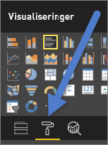

**Figur 31: Åbn ruden Format**

Vælg det visuelle element, der skal justeres, og sørg for, at det er slået **Til**. Eksempler på visualiseringer er: **X-aksen**, **y-aksen**, **titel**, **datamærkater** og **forklaring**. I eksemplet nedenfor vises elementet **Titel**.

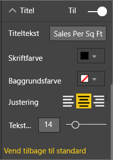

**Figur 32: Formatér en visualtitel**

##### <a name="set-the-text-size"></a>Angiv tekststørrelsen

Du kan justere tekststørrelsen for titler og datamærkater, men ikke for x- eller y-akserne eller forklaringer. I forbindelse med navnene kan du lege med **Visningsenheder** og antallet af **decimaler**. Før eller siden finder du det rette detaljeniveau til visning af oplysninger i din rapport.

##### <a name="set-the-text-alignment"></a>Angiv tekstjusteringen

Du kan vælge, at titlen skal justeres til venstre, højre eller i midten. Vælg en, og anvend den samme indstilling på alle visuals på siden.

##### <a name="set-the-text-position"></a>Angiv tekstplaceringen

Du kan justere placeringen af tekst for nogle y-akser og for forklaringen. Uanset hvad du vælger, skal du gøre det samme for de andre y-akser og andre forklaringer på siden.

##### <a name="set-the-title-and-label-length"></a>Angiv længde på titel og navn

Juster længden på titler, aksetitler, datamærkater og forklaringer. Hvis du vælger at vise nogle af disse elementer, kan du ved at justere længden (sammen med tekststørrelsen) sikre, at Power BI ikke afkorter værdierne:

* Indstillingen er **Titeltekst** for **Titel** og **Forklaring**. Angiv den faktiske titel, der vises på det visuelle element.

* Indstillingen er **Typografi** for **x-aksen** og **y-aksen**, og du foretager valgene på en rulleliste.

* For **Datamærkater** er indstillingerne **Vis** og **Decimal**. Brug rullelisten **Vis** til at vælge måleenheden: **millioner**, **tusinder**, **ingen** eller **automatisk** osv. Brug feltet **Decimal** til at fortælle Power BI, hvor mange decimaler der skal vises.

##### <a name="set-the-text-color"></a>Angiv tekstfarven

Du kan justere tekstfarven for titler, akser og datamærkater.

#### <a name="titles-and-labels-that-arent-part-of-the-visualizations"></a>Titler og navne, som ikke er en del af visualiseringerne

Tidligere i denne artikel diskuterede vi tilføjelse af tekstfelter på rapportsider. Nogle gange er titlerne på visualiseringerne ikke nok til at fortælle historien. Tilføj tekstfelter for at kommunikere yderligere oplysninger til rapportens læsere.

For at undgå at rapportsiden ser forvirrende eller overfyldt ud, skal du være konsekvent med din brug af tekstfelttypografier, størrelser, farver og justering. Hvis du vil foretage ændringer af teksten i et tekstfelt, skal du markere tekstfeltet for at få vist formateringsmenuen.


**Figur 33: Formatér den skrifttype, der bruges i et tekstfelt**

#### <a name="sorting"></a>Sortering

En virkelig enkel mulighed for at give hurtigere indsigt er at angive sortering af visuals. Hvis du f.eks. sorterer liggende søjlediagrammer i faldende eller stigende rækkefølge baseret på værdien i søjlerne, er det muligt hurtigt at vise oplysninger om betydelige stigninger uden at bruge mere plads.

Sådan sorteres et diagram:

1. Vælg ellipsen i diagrammets øverste højre hjørne

1. Vælg **Sortér**.

1. Vælg det felt, du vil sortere efter, samt retningen.

Du kan få mere at vide i [Rediger, hvordan en visual sorteres](../consumer/end-user-change-sort.md).

#### <a name="chart-interaction-and-interplay"></a>Diagraminteraktion og -samspil

En af de mest overbevisende funktioner i Power BI er muligheden for at redigere den måde, hvorpå diagrammer interagerer med hinanden. Som standard laves fremhævninger på tværs af diagrammer: Når du vælger et datapunkt, lyser de relaterede data fra andre diagrammer op, og de ikke-relaterede data nedtones. Du kan tilsidesætte denne funktionsmåde for at bruge et hvilket som helst diagram som et egentligt filter. På den måde sparer du plads på siden. I Power BI-tjenesten skal du vælge **Interaktioner mellem visualiseringer** på menulinjen for at foretage ændringen.

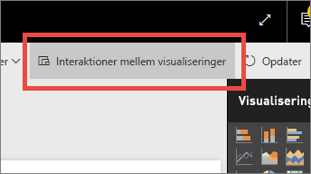

**Figur 34: Interaktioner mellem visualiseringer**

Derefter skal du for hver visual på siden overveje, om du vil have den pågældende visual til at filtrere, fremhæve eller gøre ingenting. Du kan ikke fremhæve alle visualiseringer. Kontrolelementet til fremhævning er ikke tilgængeligt for de visualiseringer, du ikke kan fremhæve. Du kan få mere at vide i [Interaktioner mellem visualiseringer i Power BI](../consumer/end-user-interactions.md).

> [!TIP]
> For de læsere, der ikke har forhåndskendskab til Power BI, vil denne mulighed for at klikke og interagere med rapporter måske ikke være umiddelbart indlysende. Tilføj tekstfelter for at hjælpe dem med at forstå, hvad de kan vælge for at få yderligere indsigt.

#### <a name="the-use-of-color-in-visuals"></a>Brugen af farver i visuals

Tidligere i denne artikel talte vi om betydningen af at have en plan for, hvordan du vil bruge farver på tværs af en rapport. I dette afsnit er der lidt overlapning, men vi beskæftiger os primært med, hvordan du bruger farve i enkeltstående visuals. De samme principper gælder: Brug farve til at binde rapporten sammen, fremhæve vigtige data og til at forbedre læserens forståelse af den pågældende visual. Brug af for mange forskellige farver kan virke forstyrrende. Det gør det vanskeligt for læseren at vide, hvor han eller hun skal kigge. Gå ikke på kompromis med forståelsen for skønhedens skyld. Tilføj kun farve, hvis det forbedrer forståelsen.

> [!TIP]
> Kend din målgruppe og eventuelle iboende farveregler. Eksempelvis betyder grøn normalt "godt" i USA, og rød betyder normalt "dårligt".

I de følgende afsnit gennemgår vi:

* Farven på data

* Farven på datamærkat

* Farven på kategoriske værdier

* Farven på numeriske værdier

##### <a name="use-colors-to-highlight-interesting-data"></a>Brug af farver til at fremhæve interessante data

Den mest enkle måde at bruge farve på er ved at ændre farven på et eller flere datapunkter for at tiltrække opmærksomhed. I dette eksempel ændres farven, når de olympiske lege skifter fra en cyklus på 4 år til en cyklus på 2 år med skiftevis sommer- og vinter-OL.


**Figur 35: Brug farve til at fortælle en historie**

Du kan ændre farverne på datapunkter på fanen **Datafarver** i ruden **Format**. Hvis du vil tilpasse hvert datapunkt enkeltvist, skal du sikre dig, at **Vis alt** er slået **Til**.

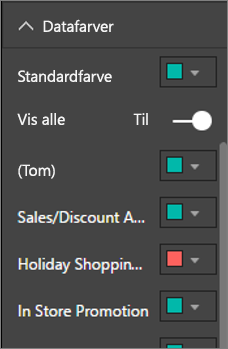

**Figur 36: Angiv farver for datapunkter**

> [!NOTE]
> Power BI anvender et standardtema på visuals i dine rapporter. Designerne vælger temafarver for at skabe variation og kontrast. Hvis du vil afvige fra paletten med standardtemaer, skal du vælge **Brugerdefineret farve**.
>
> 
>
> **Figur 37: Vælg en brugerdefineret farve**

I Power BI Desktop kan du endda fremhæve **udenforliggende værdier** eller en del af en linje ved hjælp af en anden serie:


**Figur 38: Brug af Power BI Desktop til at afbilde udenforliggende værdier**

Her findes værdier i serien **Outliers** (udenforliggende værdier) kun, hvor gennemsnitstemperaturen for august er faldet til under 60. Vi gjorde dette ved at oprette en DAX-beregnet kolonne ved hjælp af denne formel:

```
Outliers = if(Editions[Temp]<60, Editions[Temp], BLANK())
```

I vores eksempel er der tre udenforliggende værdier: **1952**, **1956** og **2000**.

##### <a name="colors-for-labels-and-titles"></a>Farver på navne og titler

Når du udforsker alle de tilgængelige formateringsindstillinger, kan du finde mange forskellige steder, hvor du kan føje farve til titler og forklaringer. Du kan f.eks. ændre farven på datamærkater og aksenavne. Du skal dog være forsigtig. Generelt er det at foretrække at bruge en enkelt farve til alle visualtitler. Som med de andre retningslinjer i denne artikel vil der altid være situationer og årsager til at bryde reglerne. Hvis du beslutter at bryde reglerne, skal du gøre det med god grund.

##### <a name="colors-for-categorical-values"></a>Farver på kategoriske værdier

Diagrammer med en serie har normalt en kategorisk værdi i forklaringen. Eksempelvis repræsenterer hver farve i forklaringen nedenfor en anden kategori for Land/område.


**Figur 39: Standardfarver anvendt**

Designerne vælger de standardfarver, som Power BI bruger, for at give en god kontrast mellem farver for kategoriske værdier, så de er nemme at skelne fra hinanden. Nogle gange ændrer folk disse farver, så de passer til virksomhedens temaer, men dette kan medføre problemer.


**Figur 40: Farve anvendt som nuancer af en enkelt farve**

Ved kun at bruge en enkelt nuance og forskellig farveintensitet giver denne visual en falsk opfattelse af en rangorden mellem kategorierne. Det antyder, at de mørkere bobler ligger højere eller lavere på en eller anden skala i forhold til de lyse nuancer. Bortset fra alfabetisk er der normalt ikke nogen iboende rækkefølge i denne type kategoriske værdi.

Hvis du vil ændre standardfarverne, skal du vælge  for at åbne ruden **Format** og vælge **Datafarver**.

##### <a name="colors-for-numerical-values"></a>Farver på numeriske værdier

For felter, der har en iboende rækkefølge og numerisk værdi, kan du også farvelægge datapunkter efter værdi. Farvelægning af datapunkter efter værdi kan være en hjælp for at vise spredningen af værdier på tværs af dataene og samtidig give mulighed for, at Power BI kan vise to variabler i et enkelt diagram. I følgende diagram er det tydeligt, at selvom Kina har det højeste antal medaljer, så har Japan og Thailand deltaget i flere olympiske lege.


**Figur 41: Farvelæg datapunkter ud fra værdien**

Sådan oprettes dette diagram:

1. Markér den pågældende visual for at aktivere den.

1. Vælg  for at åbne ruden **Format**.

1. Vælg **Datafarver** > indstillingen > **Betinget formatering**:

    

    **Figur 42: Vælg Betinget formatering**

1. Juster disse farver i dialogboksen **Standardfarve – *Datafarver*** .

    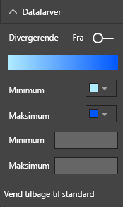

    **Figur 43: Juster de farver, der bruges til mætning**

Du kan også bruge farve til at fremhæve variansen omkring en central værdi. For eksempel kan positive værdier gøres grønne, og negative værdier kan gøres røde. Vær opmærksom på kulturelle forskelle, når du giver farver til positive eller negative værdier. Ikke alle kulturer bruger rød som noget dårligt og grøn som noget godt.


**Figur 44: Brug farver til at fremhæve variansen omkring en central værdi**

### <a name="principles-of-visual-design--applied-to-example-report-page"></a>Principper for design af visuals – anvendt på eksempelrapportsiden

Lad os nu tage de visuelle principper, vi diskuterede ovenfor, og anvende dem på vores eksempelrapport.


**Figur 45: Vores eksempelrapport (før)**


**Figur 46: Vores eksempelrapport (efter)**

#### <a name="what-did-we-do"></a>Hvad har vi gjort?

| Element | Beskrivelse |
| ---- | ----------- |
| Udsnit | Vi har fjernet blanktegn fra udsnitsværktøjerne ved at tilføje et sideniveaufilter og kun anvende **guld**, **sølv** og **bronze**. <br> Vi har ændret **Kontrolelementer til markering** til **Fra** for **Vælg én** og **Markér alle**. |
| Boble | Der er så mange elementer i forklaringen, at de ruller ud over skærmen. Vi har fjernet forklaringen og aktiveret **Kategorietiketter** i stedet for. Kunder kan holde musemarkøren over boblerne for at få vist detaljer.<br> Vi har afkortet titlen og fjernet "efter land/område", da det synes indlysende. <br> Vi har slået aksenavne **Til** for begge for at gøre det lettere at forstå diagrammet. |
| Kartogram | Vi har ændret **Datafarver** for at få det til at skille sig ud. <br> Vi har slået **Divergerende** til og angivet **Minimum** til pink og **Maksimum** til rød.
| Treemap | Vi har fjernet filteret, som var indstillet kun til USA. <br> Vi har angivet **Datamærkater** til én decimal. <br> Vores visual anvendte feltet **Klasse**, som ikke er særligt nyttigt, da det næsten altid vil være 33 % for de tre medaljer: guld, sølv og bronze. <br> Vi har valgt et andet mere interessant felt, **Køn**. Vi har ændret "Aquatics" (vandsport) til blå og "Athletics" (atletik) til grå af designhensyn.
| Øverste søjlediagram | Vi har afkortet titlen, fjernet datamærkater og slået titel på forklaring fra. <br> Vi har ændret ordrækkefølgen i titlen, så den stemmer overens med det nedenstående diagram.
| Nederste søjlediagram | Vi har sorteret stigende efter år, så det stemmer overens med det ovenstående diagram. <br> Vi har ændret farverne, så de stemmer overens med medaljeklassen. <br> Vi har ændret titlen. <br> Vi har deaktiveret forklaringen for at få mere plads til data. <br> Vi har slået datamærkater til. De vises ikke i rapporten, fordi det visuelle element er for lille til, at navnene er nemme at læse. De vises, når læseren åbner det visuelle element i **fokustilstand**. Få mere at vide om [Fokustilstand](../consumer/end-user-focus.md). <br> Vi har føjet **Antal discipliner (bestemte)** til **værktøjstip**. Når du nu holder markøren over en stablet søjle, fortæller værktøjstippene også, hvor mange discipliner personen har konkurreret i det pågældende år. |
| Interaktioner mellem visualiseringer | Vi har deaktiveret interaktioner for begge kort, da vi altid vil have dem vist for de samlede lege og sportsgrene. |

## <a name="visual-types-and-best-practices"></a>Typer af visuals og bedste praksis

Power BI indeholder mange typer visuals som standard. Hertil kan du tilføje de brugerdefinerede visuals, der er tilgængelige fra Microsoft og fra Power BI-community'et, hvorefter det samlede antal valgmuligheder for visuals vil være for omfattende at dokumentere her. Lad os se på nogle af de mest anvendte typer standardvisuals.

### <a name="line-charts"></a>Kurvediagrammer


Kurvediagrammer er en effektiv metode til at kigge på data over tid. Når man kigger på data i tabeller, identificerer ens øje ikke så hurtigt stigninger, fald, cyklusser og mønstre. Nedenstående eksempel viser tendenser i antallet af medaljer og antallet af deltagere, der vinder disse medaljer.


**Figur 47: Kurvediagrammer**

#### <a name="best-practices"></a>Bedste praksis

* Når folk ser på kurvediagrammer, er det første, de ser, kurvens form. Det betyder, at du skal have en x-akse, som giver kurven mening, f.eks. kategorier som tid eller fordeling. Hvis du lægger kategorifelter som produktet eller geografi på x-aksen, bliver kurvediagrammet ikke interessant. Kurvens form ville ikke give nogen meningsfulde oplysninger.

* Hvis du vælger at anbringe flere diagrammer over og under hinanden på denne måde for at gøre det nemmere at sammenligne på tværs af serier, skal du justere x-aksen. Brug filtre til at sikre, at det samme interval af værdier vises i Power BI. Hvis du ser på f.eks. datointervaller, skal du sikre, at de er de samme datointervaller. For eksempel 1896-2012 i begge diagrammer.

* Udnyt pladsen optimalt. Hvis det giver mening for dine data, skal du angive **start-** og **slutpunkterne** for y-aksen for at fjerne tom plads i toppen og bunden af diagrammet. Det hjælper det visuelle element med at fokusere på selve datapunkterne. Sådan angiver du **start-** og **slutpunkterne**:

  1. Markér den pågældende visual for at aktivere den.

  1. Vælg  for at åbne ruden **Format**.
  
  1. Udvid området for **Y-aksen**, og angiv **Start**- og **Slut**punkterne.
  
      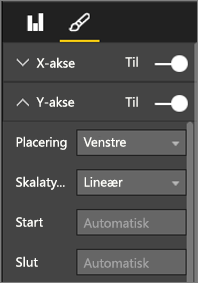
  
      **Figur 48: Angiv start- og slutpunkterne**

* En anden årsag til udtrykkeligt at angive **start-** og **slutpunkterne** er, hvis du sammenligner to eller flere diagrammer på den samme side ved hjælp af det samme y-aksefelt. Hvis du f.eks. ser på det akkumulerede antal discipliner, og Storbritannien har antal fra 1 til 70, og Australien har antal fra 1 til 12, så viser de to kurvediagrammer meget forskellige y-akser (Figur 49). Det gør det svært at sammenligne dem med et hurtigt blik. Indstil i stedet diagrammerne til at bruge det samme y-akseinterval (Figur 50).
  
  
  
  **Figur 49: kurvediagrammer med forskellige y-akser**
  
  
  
  **Figur 50: kurvediagrammer med matchende y-akser**

Du kan få flere oplysninger under:

* [Tilpas egenskaberne for x- og y-aksen](power-bi-visualization-customize-x-axis-and-y-axis.md)

* [Kurvediagrammer og uregelmæssige intervaller: et inkompatibelt partnerskab](http://www.perceptualedge.com/articles/visual_business_intelligence/line_graphs_and_irregular_intervals.pdf)

* [Datavisualisering 101: kurvediagrammer](http://www.columnfivemedia.com/data-visualization-101-line-charts)

### <a name="bar-and-column-charts"></a>Liggende søjlediagrammer og søjlediagrammer


Hvis kurvediagrammer er standarden for at se på data over tid, er liggende søjlediagrammer standarden for at se på en bestemt værdi på tværs af forskellige kategorier. Hvis du sorterer søjler ud fra antal, vil du straks kunne se de største værdier og fordelingen. Vandrette liggende søjlediagrammer fungerer godt sammen med lange navne.


**Figur 51: vandret liggende søjlediagram**

#### <a name="best-practices"></a>Bedste praksis

* Vis datamærkater for værdier. Det gør det lettere at identificere bestemte værdier. Sådan får du vist datamærkater: 

  1. Markér den pågældende visual for at aktivere den.

  1. Vælg  for at åbne ruden **Format**.
  
  1. Slå **Datamærkater** **Til**.

      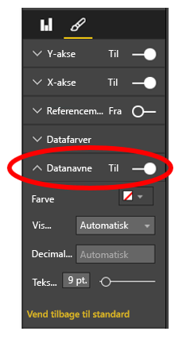

      **Figur 52: Slå datamærkater til**

* Det liggende søjlediagram er meget praktisk til at sammenligne én måling med mange på et bestemt tidspunkt. Mens kurvediagrammet viste os tendenser over tid, viser det liggende søjlediagram os tendensen for en enkelt kategori på et bestemt tidspunkt. Med et hurtigt blik kan vi se på vores liggende søjlediagram, at Spanien har en af verdens højeste arbejdsløshedsprocenter – 24,70 %.

* Når et helt søjlediagram eller et liggende søjlediagram ikke passer ind på den tildelte plads, tilføjer Power BI rullepaneler. Når det er muligt, og hvis det giver mening, kan du strukturere din visual og rapport for at vise hele diagrammet. På den måde får læseren en oversigt over hele fordelingen. Dette er desværre ikke muligt i vores eksempel på grund af det store antal lande verden over.

  Én måde at begrænse de medtagne værdier på er at bruge et filter. Du kan f.eks. tilføje et filter på **visualiseringsniveau**, der kun viser landet, hvis arbejdsløsheden er over 20 %.

* Du kan foretage en detailudledning (og omvendt) på søjlediagrammer og liggende søjlediagrammer. Dette er en glimrende metode til at få flere oplysninger ind i en visual på uden at optage mere plads. Nedenstående eksempel har et hierarki for Områder > Lande. Hvis du dobbeltklikker på en områdesøjle, vises en detailudledning af de lande, der udgør det pågældende område. Se flere oplysninger om analysetilstand i [Analysetilstand i en visualisering i Power BI](../consumer/end-user-drill.md).
  
  
  
  **Figur 53: Detailudledning**

Her finder du flere oplysninger om søjlediagrammer og liggende søjlediagrammer:

* [Datavisualisering 101: liggende søjlediagrammer](http://blog.newscred.com/article/data-visualization-101-bar-charts)

* [Datavisualiseringskatalog: Liggende søjlediagram](http://www.datavizcatalogue.com/methods/bar_chart.html#.VYV-hY3bLJw)

* [Datavisualiseringskatalog: Multisæt af liggende søjlediagram](http://www.datavizcatalogue.com/methods/multiset_barchart.html#.VYV_gI3bLJw)

### <a name="stacked-bar-and-column-charts"></a>Liggende søjlediagrammer og søjlediagrammer


Du kan tilføje endnu en dimension i dine søjlediagrammer og liggende søjlediagrammer ved at stable forskellige kategorier inden for søjlen. Nu gengiver diagrammet oplysninger om én overordnet tendens (baseret på højde og længde), men det viser også kategoriernes indflydelse på denne tendens. Nedenstående diagram viser den samlede vækst i de største fodboldholds indtægter over 6 milliarder i 2014.


**Figur 54: Stablet søjlediagram**

Dette stablede søjlediagram viser os, at **den samlede indtjening** stiger over tid, og at kategorierne **Commercial** og **Broadcasting** er støt stigende over tid – hvilket bidrager til en stigning i den samlede indtjening. Dette diagram gør det dog ikke nemt at sammenligne den påvirkning, hver af de tre kategorier har på hinanden. Hvordan udvikler væksten inden for Commercial sig eksempelvis i forhold til Broadcasting eller Match Day? Et bedre valg til disse data eller en supplerende visual til disse data ville være et kurvediagram.

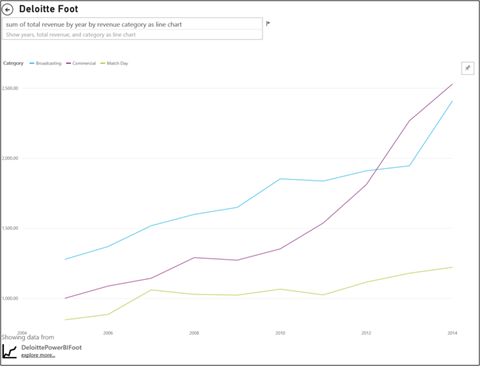

**Figur 55: Konvertér til et kurvediagram**

I dette kurvediagram er det nemmere at se, hvordan de kommercielle indtægter (Commercial) er steget mest efterfulgt af tv-indtægter (Broadcast) og indtægter på kampdagen (Match Day).

#### <a name="best-practices"></a>Bedste praksis

* Ligesom med søjlediagrammer og liggende søjlediagrammer kan du vælge mellem vandret eller lodret visning. Vandret er bedst, hvis du har lange navne, og lodret er bedst, hvis du har tidsbestemte data.

* Undgå stablede søjlediagrammer og liggende søjlediagrammer, hvis du vil vise tendenser og andre ændringsmønstre over tid. Andre diagrammer, f.eks. kurvediagrammer, er meget bedre til dette.

* Du kan også få fordelingen baseret på den samlede mængde eller som en procentdel af totalen.

* Som Stephen Few bemærkede:

    > *... er det svært at sammenligne segmenter i et stablet liggende søjlediagram. Hvis du arrangerede segmenterne side om side, og alle voksede opad fra den samme grundlinje, ville det være nemt at sammenligne deres højde, men når de er stablet oven på hinanden, bliver det svært. Og selvom det er relativt nemt at se, hvordan (indtægter) ændres fra måned til måned, er det ret svært at se, hvordan (indtægter) i andre (kategorier) har ændret sig*.

* 100 % stablede diagrammer er et godt valg, når du bruger procenter, der tilsammen giver 100. I nedenstående eksempel kan vi se en kategorifordeling efter hold. Procenterne er relative og gør det muligt for os hurtigt at se mønstre. Evertons indtægter er primært tv-indtægter ("Broadcasting") (mere end 70 %), mens PSG kun får 20 % af deres indtægter fra denne kategori. Valget af en vandret visning gør det nemmere at indpasse holdnavnene og at se effekten af indtægtstype.

  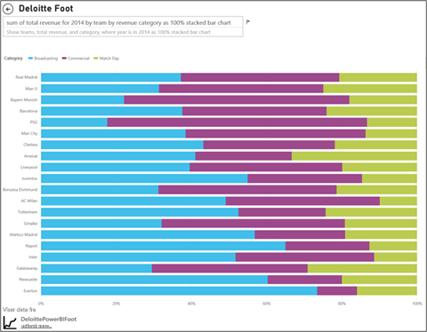

  **Figur 56: Vandret stablet diagram**

Her kan du finde flere oplysninger om stablede diagrammer:

* [Datavisualiseringskatalog: stablet liggende søjlediagram](http://www.datavizcatalogue.com/methods/stacked_bar_graph.html#top)

* [Hvornår er 100 % stablede liggende søjlediagrammer nyttige?](http://www.perceptualedge.com/blog/?p=2239)

### <a name="combo-bar-and-column-charts"></a>Kombinationsdiagram og søjlediagrammer


I Power BI kan du kombinere søjle- og kurvediagrammer i et kombinationsdiagram. Valgmulighederne er: 

* Kurvediagram og stablet søjlediagram 

* Kurvediagram og grupperet søjlediagram

Spar på den værdifulde lærredsplads ved at kombinere to separate visuals i én.

De to skærmbilleder nedenfor viser før og efter.


 **Figur 57: Som to separate diagrammer**

Det første har to separate visuals: et søjlediagram, der viser befolkningstallet over tid, og et kurvediagram, der viser BNP over tid. Disse diagrammer er velegnede til et kombinationsdiagram, fordi de har den samme x-akse (år) og værdier (2002 til 2012). Hvorfor ikke kombinere dem for at sammenligne disse to tendenser i én samlet visual? Ved at kombinere disse to diagrammer kan du lave en hurtigere sammenligning af dataene.


 **Figur 58: Som et enkelt kombinationsdiagram**

Den nye rapportside har en enkelt visual: et kurvediagram og et stablet søjlediagram. Vi kunne lige så nemt have oprettet et kurvediagram og et grupperet søjlediagram. Det er nu nemmere at kigge efter en relation mellem de to tendenser. Vi kan se, at indtil 2008 fulgte befolkningstal og BNP den samme tendens. Men fra 2009 blev BNP mere ustabilt, i takt med at befolkningstilvæksten stagnerede.

#### <a name="best-practices"></a>Bedste praksis

* Kombinationsdiagrammer fungerer bedst, når begge visuals har mindst én akse til fælles.

* Hold øje med dine akser! Er det nemt at læse og fortolke dit kombinationsdiagram? Anvender det uensartede intervaller og værdier? Hvis skalaen på søjlediagrammets y-akse er meget mindre end skalaen på kurvediagrammets y-akse, kommer dit kombinationsdiagram ikke til at give mening. Bemærk den tredje kurve (akvamarin) helt nede nederst.

   

   **Figur 59: et mislykket kurvediagram**

  Kombinationsdiagrammet vil altså derfor ikke give mening, hvis dit søjlediagram og dit kurvediagram anvender to forskellige målinger, og du ikke opretter dobbeltakser. For eksempel dollars i forhold til procent. Sørg for medtage begge akser, så læseren forstår diagrammet, og overvej også at tilføje aksenavne.

  Sådan opretter du to akser:

    1. Markér den pågældende visual for at aktivere den.

    1. Vælg  for at åbne ruden **Format**.

    1. Udvid **y-aksen**, og slå **Vis sekundær** **Til**.

          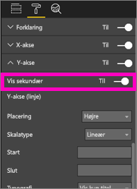

          **Figur 60: Vis sekundær akse**

    1. Slå **y-aksens (kolonne)**  > **Titel** **Til**.

    1. Slå **y-aksens (kurve)**  > **Titel** **Til**.

  Sådan ser det færdige diagram ud:

  

  **Figur 61: Opret et kombinationsdiagram i stedet for**

* Drag fordel af dobbeltakser. Det er nemt at sammenligne flere målinger med forskellige værdiintervaller. Det hjælper med at illustrere sammenhængen mellem to målinger i én visualisering.

Du kan få flere oplysninger under:

* [Kombinationsdiagram i Power BI](power-bi-visualization-combo-chart.md)

* [Dobbeltskalerede akser i diagrammer: Er de nogensinde den bedste løsning? ](http://www.perceptualedge.com/articles/visual_business_intelligence/dual-scaled_axes.pdf)

### <a name="scatter-chart"></a>Punktdiagram


Nogle gange har vi mange variabler, som vi vil have vist sammen, og her kan et punktdiagram være meget nyttigt til at danne sig et overblik. Punktdiagrammer viser relationer mellem to (punkt) eller tre (boble) kvantitative målinger. Et punktdiagram har altid to værdiakser for at vise ét sæt numeriske data langs en vandret akse og et andet sæt numeriske værdier langs en lodret akse. Diagrammet viser punkter ved skæringspunktet for en numerisk x- og y-værdi og kombinerer disse værdier i enkelte datapunkter. Power BI kan fordele disse datapunkter jævnt eller ujævnt på tværs af den vandrette akse. Det afhænger af dataene.

Et boblediagram erstatter datapunkterne med bobler, hvor boblestørrelsen repræsenterer en yderligere dimension af dataene.

Det nedenstående boblediagram ser på Sydamerika og sammenligner BNP pr. indbygger (Y-aksen), summen af BNP (X-aksen) befolkningstallet efter lande i Sydamerika.


**Figur 62: Sydamerikas BNP og befolkningstal som et boblediagram**

Størrelsen på boblerne repræsenterer det samlede befolkningstal i det pågældende land. Brasilien har det største befolkningstal (boblestørrelse) og den største andel af Sydamerikas BNP. Det ligger længst henne på x-aksen. Men bemærk, at BNP pr. indbygger for Uruguay, Chile og Argentina er højere end Brasilien. De er længere oppe på y-aksen.

Hvis du tilføjer en afspilningsakse, kan du lade som om, at du er Hans Rosling og fortælle historien over tid: [From Data to Insight & Impact: Showing Africa's Progress with Power View and PPI by Microsoft](https://www.youtube.com/watch?v=PbaDBJWCeD4). Hvis du vil tilføje en afspilningsakse, skal du trække et dato/klokkeslæt-felt ind på **Afspilningsakse**.

#### <a name="best-practices"></a>Bedste praksis

* Punkt- og boblediagrammer er fantastiske historiefortællere. Men de er ikke så nyttige, når du vil udforske data. Stephen Few påpeger, at:

    > *Styrken ved denne tilgang er, når den bruges til at fortælle en historie. Når Rosling fortæller, hvad der sker i diagrammet, når boblerne flytter rundt og ændrer værdi, og påpeger, hvad han vil have os til at se, så vækkes oplysningerne til live. Animerede boblediagrammer er dog meget mindre effektive til at udforske og udlede betydningen af data på egen hånd. Jeg tvivler på, at Rosling bruger denne metode til at opdage historierne, men kun til at fortælle dem, når de er kendt. Vi kan ikke følge mere end én boble ad gangen, når de flytter rundt, så vi er nødt til at køre animationen igen og igen for at forsøge at få en ide om, hvad der sker. Vi kan føje spor til udvalgte bobler, hvilket gør det muligt at følge hele den sti, disse bobler har flyttet sig, men hvis du bruger spor til mere end nogle få bobler, kan diagrammet hurtigt blive for rodet. I bund og grund forsøger jeg at pointere, at dette ikke er den bedste metode til at vise oplysninger til udforskning og analyse.*

* Føj mærkater til x- og y-aksen for at hjælpe med at fortælle historien. Især i forbindelse med boblediagrammer er der mange komponenter i spil, og mærkater gør det lettere for læserne at forstå en visual.

* Tilføj datamærkater for at gøre det lettere at fortolke en visualisering. Især i forbindelse med boblediagrammer kan det være svært at skelne mellem ensartede farver, når du har mange elementer i forklaringen. I den ovenstående visual er forklaringsfarverne for Surinam, Columbia og Ecuador meget ensartede.

* Har du oprettet et punktdiagram og kan kun se ét datapunkt, der lægger alle værdierne på x- og y-aksen sammen? Sammenlægger dit diagram alle værdierne langs en enkelt vandret eller lodret linje? Du løser dette problem ved at tilføje et felt i området **Oplysninger** for at fortælle Power BI, hvordan værdierne skal grupperes. Feltet skal være entydigt for hvert punkt, der skal afbildes. Hvis du har brug for hjælp, kan du se [selvstudiet om punktdiagrammer og boblediagrammer i Power BI](power-bi-visualization-scatter.md).

### <a name="treemap-charts"></a>Træstrukturdiagrammer


Træstrukturer kan være praktiske til at give et godt overblik over den relative størrelse af forskellige komponenter, der udgør en helhed – især når du kan gruppere dem efter kategorier. Hver gang du forsøger at forstå en ny virksomhed, kan det være en god hjælp at have en træstruktur over hovedkomponenterne for at lære den overordnede fordeling at kende.

I det første diagram nedenfor kan du med det samme se, at Brasilien tegner sig for cirka halvdelen af Sydamerikas BNP. Du kan også se, at Columbia og Chile har omtrent den samme størrelse.

Lad os sige, at du vil have mere kontekst og stadig have en ide om indvirkningen af de lande, der bidrager mest. Opret visuelle hierarkier med kategorimedlemmer (lande), der er indlejret i områder. Træstrukturen giver os først og fremmest en ide om den forholdsmæssige størrelse af områderne. I hvert område kan vi derefter se, hvilke enkelte lande der bidrager mest. Vi kan se, at der er tre store områder: Europa, Asien og Nordamerika. I disse områder kan vi nemt se de største lande/områder.

Den primære begrænsning ved en træstruktur er, at det er svært at sammenligne de mindre rektangler. Det er et godt diagram til at danne sig et overblik, men søjlediagrammer og liggende søjlediagrammer er nok et bedre valg, hvis man vil have en mere nøjagtig ide om den forholdsmæssige størrelse af forskellige komponenter.

Den første træstruktur giver et overordnet blik over rækkefølgen af størrelsen på BNP. Det er dog svært at identificere specifikke forskelle mellem lande, især de mindre blade uden mærkater. Når du for disse data skal sammenligne en enkelt gruppering, kan et søjlediagram eller liggende søjlediagram være et bedre valg.


**Figur 63: sammenligning af BNP i Sydamerika som en træstruktur**

Derefter har vi tilføjet Område som endnu et niveau af data. Vi kan se det samlede bidrag til BNP efter område. Vi kan også se den relative betydning i områderne. Vær opmærksom på, at hvis du gør dette med ikke-summative målinger (f.eks. gennemsnit), så repræsenterer summen af oplysningerne muligvis ikke den faktiske værdi samlet set.


**Figur 64: BNP efter område og land som en træstruktur**

Flere oplysninger om træstrukturer:

* [Discovering Business Intelligence Using Treemap Visualizations](http://www.perceptualedge.com/articles/b-eye/treemaps.pdf)

* [Datavisualiseringskatalog: træstruktur](http://www.datavizcatalogue.com/methods/treemap.html#.VYhylI3bL7Y)

### <a name="other-charts"></a>Andre diagrammer

#### <a name="pie-or-donut-charts"></a>Cirkel- eller kransediagrammer


Grundlæggende egner søjlediagrammer, liggende søjlediagrammer og kurvediagrammer sig til det meste. Der er bred enighed om, at mennesker kan have svært ved at tolke cirkel- og kransediagrammer korrekt. Faktisk kan de ofte forvrænge data. Undgå dem, hvor det er muligt. Stephen Few har skrevet en fremragende tekst om historien og farerne i [Save the Pies for Dessert](https://www.perceptualedge.com/articles/08-21-07.pdf).

Stephen forklarer det ene tilfælde, hvor cirkeldiagrammer kan være nyttige, nemlig når du vil sammenligne del-helhed-relationer. Det er sjældent bedre end et 100 % stablet liggende søjlediagram.

Du kan finde en anden sjov artikel (og animation) om cirkeldiagrammer på [Darkhorse Analytics-webstedet](http://www.darkhorseanalytics.com/blog/salvaging-the-pie).

#### <a name="radial-gauges--kpis"></a>Radiale målere og KPI'er


Radiale målere synes at fungere godt som visuals til gengivelse af resultater i forhold til en målsætning, og de er meget populære i forretningsdashboards. De er dog mangelfulde på to primære punkter. Ligesom med cirkeldiagrammer er det svært at fortolke vinklen på det skraverede område i forhold til 180-graderstregen eller stregen for målsætningen. Der bruges også meget plads på at vise en enkelt metrikværdi.

Et godt alternativ er en enkel KPI-visual:


KPI'er viser værdi, status, mål, afvigelse fra mål og tendens på den samme mængde plads. Den grønne farvelægning bliver rød, hvis dataene ikke opfylder målet, og gul, hvis dataene når et mellemliggende mål. Det er meget enklere at læse og fortolke end måleren.

Du kan få flere oplysninger under:

* [Radiale målerdiagrammer i Power BI](power-bi-visualization-radial-gauge-charts.md)

* [KPI-visualiseringer](power-bi-visualization-kpi.md)

## <a name="conclusion"></a>Konklusion

Nu er det blevet tid til, at du skal prøve disse bedste praksisser af i praksis. Bevar forbindelsen, og del dine egne bedste praksisser. Er du uenig i vores anbefalinger, eller har du fundet en enestående årsag til at bryde reglerne? Sådanne erfaringer vil vi også meget gerne høre om.

Har du flere spørgsmål? [Prøv at spørge Power BI-community'et](http://community.powerbi.com/)

### <a name="book-recommendations"></a>Boganbefalinger

Der findes mange gode bøger, som teams kan bruge til at opfriske deres viden om visuelle designteknikker. Stephen Fews bog *Information Dashboard Design* kommer man ikke udenom. Han går yderligere i detaljer i to andre bøger: *Show Me the Numbers* og *Now You See It*. Few og andre har fået inspiration fra Edward R. Tufte, hvis bog *The Visual Display of Quantitative Information* betragtes som en klassiker inden for emnet. Tufte har også skrevet *Visual Explanations*, *Envisioning Information* og *Beautiful Evidence*. Andy Kirks nye bog *Data Visualization: A Handbook for Data Driven Design* er også et godt valg. Følgende forfattere kan også anbefales: Lachlan James, William McKnight og Boris Evelson (Forrester), Darkhorse Analytics.
