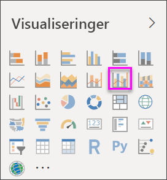
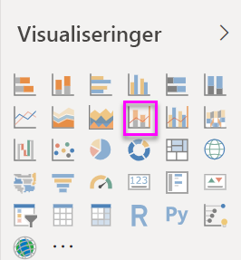
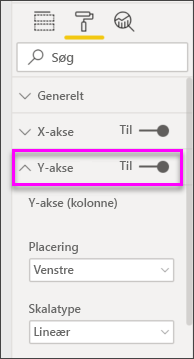
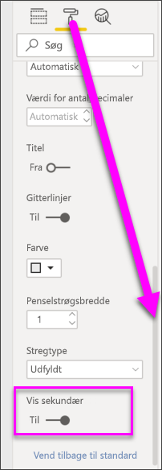

# Opret og brug kombinationsdiagrammer i Power BI

[!INCLUDE [power-bi-visuals-desktop-banner](../includes/power-bi-visuals-desktop-banner.md)]

I Power BI er et kombinationsdiagram en enkelt visualisering, der kombinerer et kurvediagram og et søjlediagram. Ved at kombinere disse to diagrammer kan du hurtigere sammenligne dine data.

Kombinationsdiagrammer kan have en eller to Y-akser.

## Hvornår skal et kombinationsdiagram bruges
Kombinationsdiagrammer er et fantastisk valg i følgende tilfælde:

* Når du har et kurvediagram og et søjlediagram med den samme X-akse.
* Til at sammenligne flere målinger med forskellige værdiintervaller.
* Til at illustrere sammenhængen mellem to målinger i én visualisering.
* Til at kontrollere, om en måling opfylder målet, der er defineret af en anden måling
* Til at spare plads på lærredet.

### Forudsætninger
I dette selvstudium bruges [PBIX-filen med eksemplet Detailhandelsanalyse](https://download.microsoft.com/download/9/6/D/96DDC2FF-2568-491D-AAFA-AFDD6F763AE3/Retail%20Analysis%20Sample%20PBIX.pbix).

1. Vælg **Fil** > **Åbn** i øverste venstre afsnit af menulinjen
   
2. Find din kopi af **PBIX-filen med eksemplet Detailhandelsanalyse**

1. Åbn **PBIX-filen med eksemplet Detailhandelsanalyse** i rapportvisning .

1. Markér  for at tilføje en ny side.

## Opret et grundlæggende kombinationsdiagram med én akse
Se, hvordan Will opretter et kombinationsdiagram ved hjælp af salgs- og marketingeksemplet.
   > [!NOTE]
   > I denne video bruges en ældre version af Power BI Desktop.
   > 
   > 
<iframe width="560" height="315" src="https://www.youtube.com/embed/lnv66cTZ5ho?list=PL1N57mwBHtN0JFoKSR0n-tBkUJHeMP2cP" frameborder="0" allowfullscreen></iframe>  

1. Start på en tom rapportside, og opret et søjlediagram, der viser dette års salg og bruttomargen pr. måned.

    a.  I ruden Felter skal du vælge **Sales** \> **This Year Sales** > **Value**.

    b.  Træk **Sales** \> **Gross Margin This Year** til beholderen **Value**.

    c. Vælg **Time**  \> **FiscalMonth** for at føje elementet til beholderen **Axis**.

    
5. Vælg **Flere indstillinger** (...) i øverste højre hjørne af visualiseringen, og vælg **Sortér efter > FiscalMonth**. Hvis du vil ændre sorteringsrækkefølgen, skal du vælge ellipsen igen og vælge enten **Sortér stigende** eller **Sortér faldende**. I dette eksempel bruger vi **Sortér stigende**.

6. Konvertér søjlediagrammet til et kombinationsdiagram. Der er to kombinationsdiagrammer: **Kurvediagram og stablet søjlediagram** og **Kurvediagram og grupperet søjlediagram**. Vælg søjlediagrammet, og vælg derefter **Line and clustered column chart** fra fanen **Visualizations**.

    
7. Fra ruden **Felter** kan du derefter trække **Sales** \> **Last Year Sales** til beholderen **Line Values**.

   

   Dit kombinationsdiagram bør ligne dette:

   

## Opret et kombinationsdiagram med to akser
I denne opgave skal vi sammenligne bruttomargen og salg.

1. Opret et nyt kurvediagram, der sporer **Bruttoavancen sidste år %** efter **FiscalMonth**. Vælg ellipsen for at sortere den efter **måned** og **stigende**.  
I januar var BM% på 35 %, den steg til 45 % i april, faldt i juli og steg igen i august. Kan vi se et tilsvarende mønster for salget i dette og sidste år?

   
2. Tilføj **This Year Sales > Value** og **Last Year Sales** i kurvediagrammet. Skalaen for **Gross Margin Last Year %** er meget mindre end skalaen for **Sales**, hvilket gør det svært at sammenligne.      

   
3. Hvis du vil gøre det nemmere at læse og fortolke en visual, skal du konvertere kurvediagrammet til et Kurve- og stablet søjlediagram.

   

4. Træk **Gross Margin Last Year %** fra **Kolonneværdier** til **Kurveværdier**. Der oprettes to akser i Power BI, og datasættene kan derfor skaleres forskelligt. Det kan ses ved, at den venstre akse for salg måles i dollar, mens den højre akse måles i procent. Og vi kan se svaret på vores spørgsmål. Ja, vi kan se et lignende mønster.

       

## Føj titler til akserne
1. Vælg malerrulleikonet 
1.  for at åbne formateringsruden.
1. Udvid indstillingerne for **Y-axis** ved at vælge den nedadvendte pil.
1. For **Y-aksen (søjle)** skal du angive **Placering** til **Venstre**, angive **Titel** til **Til**, **Type** til **Vis kun titel** og **Vis enheder** som **Millioner**.

   
4. Under **Y-akse (søjle)** skal du rulle ned, indtil du kan se **Vis sekundær**. Da der er så mange muligheder for Y-akserne, skal du muligvis bruge begge rullepaneler. I afsnittet Vis sekundær vises indstillingerne for formatering af kurvediagramdelen af kombinationsdiagrammet.

   
5. For **Y-Axis (Line)** skal du lade **Position** forblive **Right**, aktivere **Title** til **On** og indstille **Style** til **Show title only**.

   Dit kombinationsdiagram viser nu to akser, som begge har en titel.

   

6. Du har mulighed for at tilpasse tekstens skrifttype, størrelse og farve og ændre andre formatindstillinger for at forbedre diagrammets visning og læsbarhed.

Nu kan du f.eks.:

* [Tilføje kombinationsdiagrammet som et dashboardfelt](../service-dashboard-tiles.md).
* [Gem rapporten](../service-report-save.md).
* [Gør rapporten tilgængelig for personer med handicap](../desktop-accessibility.md).

## Tværgående fremhævning og krydsfiltrering

Fremhævning af en kolonne eller kurve i kombinationsdiagrammet fører til tværgående fremhævning og krydsfiltrering af andre visualiseringer på rapportsiden... og omvendt. Hvis du vil ændre denne standardfunktionsmåde, skal du bruge [visuelle interaktioner](../service-reports-visual-interactions.md).

## Næste trin

[Kransediagrammer i Power BI](power-bi-visualization-doughnut-charts.md)

[Visualiseringstyper i Power BI](power-bi-visualization-types-for-reports-and-q-and-a.md)
