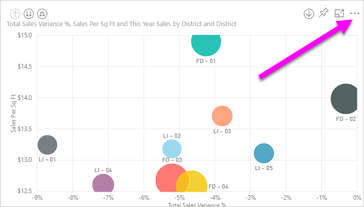
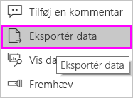
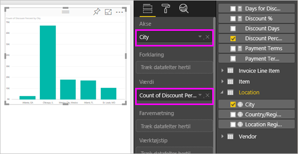
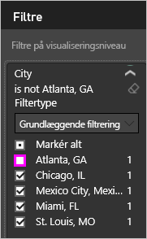
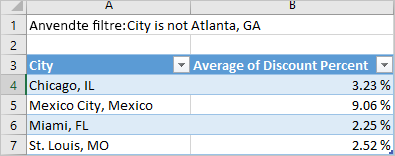
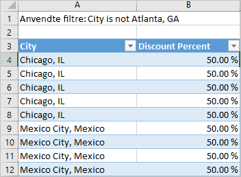
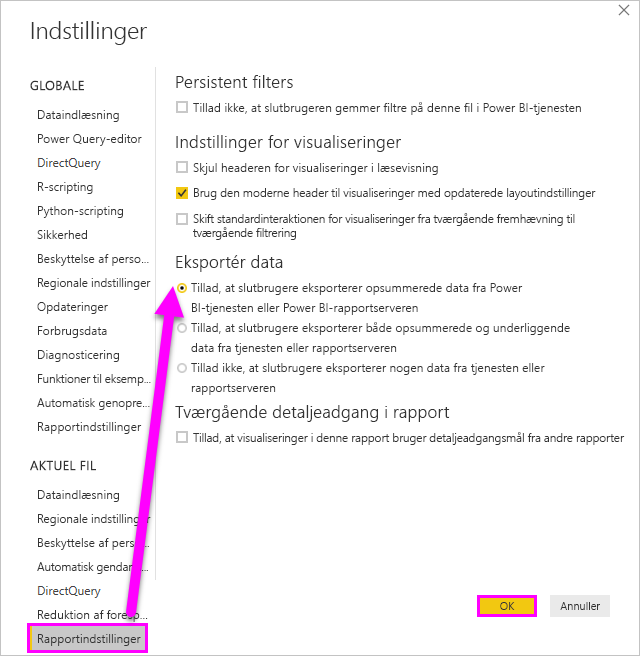

# Eksportér data fra visualiseringer
Hvis du gerne vil se de data, der bruges til at oprette en visualisering, kan du få vist de pågældende data i Power BI eller eksportere dataene til Excel som en .xlsx- eller .csv-fil. Indstillingen for eksport af data kræver en Pro- eller Premium-licens og redigeringstilladelser til datasættet og rapporten. 

Se med, når Will eksporterer dataene fra en af visualiseringerne i hans rapport, gemmer den som en .xlsx-fil og åbner den i Excel. Følg derefter den trinvise vejledning under videoen for at prøve det selv.

<iframe width="560" height="315" src="https://www.youtube.com/embed/KjheMTGjDXw" frameborder="0" allowfullscreen></iframe>

## Fra en anden visualisering på et Power BI-dashboard
1. Vælg ellipsen i visualiseringens øverste højre hjørne.

    
2. Vælg ikonet **Eksportér data**.

    
3. Dataene eksporteres til en .csv-fil. Hvis visualiseringen er filtreret, filtreres de downloadede data også.    
4. Via browseren bliver du bedt om at gemme filen.  Når du har gemt den, kan du åbne .csv-filen i Excel.

    

## Fra en visualisering i en rapport
Hvis du vil følge med, skal du åbne [eksempelrapporten med en indkøbsanalyse](../sample-procurement.md) i [Redigeringsvisning](../consumer/end-user-reading-view.md). Tilføj en ny tom rapportside. Følg derefter nedenstående trin for at tilføje en aggregering og et filter på visualiseringsniveau.

1. Opret et nyt søjlediagram.  I ruden Felter, skal du vælge **Placering > By** og **Faktura > Rabatprocent**.  Du skal muligvis flytte **Rabatprocent** til kilden Værdi. 

    
2. Skift aggregering for **Rabatprocent** fra **Antal** til **Gennemsnit**. I værdibrønden skal du vælge pilen til højre for **Rabatprocent** (der kan f.eks. stå **Antal rabatprocenter**), og vælg **Gennemsnit**.

    
3. Føj et filter til **By** for at fjerne **Atlanta**.

   

   Vi er nu klar til at prøve begge muligheder for eksport af data. 

4. Vælg ellipsen i visualiseringens øverste højre hjørne. Vælg **Eksportér data**.

   
5. I Power BI online, hvis visualiseringen har en aggregering (f.eks. hvis du har ændret **Antal** til *Gennemsnit*, *sum* eller *Minimum*), har du to valgmuligheder: **Opsummerede data** og **Underliggende data**. I Power BI Desktop har du kun indstillingen **Opsummerede data**. Hvis du vil have hjælp til at forstå sammenlægninger, kan du se under [Aggregater i Power BI](../service-aggregates.md).
    
6. Vælg **Opsummerede data** > **Eksportér**, og vælg .xlsx eller .csv. Dataene eksporteres i Power BI.  Hvis du har anvendt filtre for visualiseringen, vil de eksporterede data være filtreret. Når du vælger **Eksportér**, bliver du i browseren bedt om at gemme filen. Når du har gemt den, skal du åbne filen i Excel.

   **Opsummerede data**: Vælg denne indstilling, hvis du vil eksportere dataene til det, du ser i visualiseringen.  Denne type eksport viser kun de data, (kolonner og målinger), du vælger for at oprette visualiseringen.  Hvis visualiseringen har en aggregering, skal du eksportere aggregerede data. Hvis du f.eks. har et søjlediagram med fire søjler, vises der fire rækker med data. Opsummerede data er tilgængelige som .xlsx og .csv.

   I dette eksempel vises én total for hver by i Excel-eksporten. Da vi har filtreret Atlanta fra, er denne by ikke inkluderet i resultaterne.  I den første række i regnearket vises de filtre, der blev brugt under udtrækningen af data fra Power BI.

   
7. Prøv at vælge **Underliggende data** > **Eksportér**, og vælg .xlsx. Dataene eksporteres i Power BI. Hvis du anvendte filtre for visualiseringen, vil de eksporterede data være filtreret. Når du vælger **Eksportér**, bliver du i browseren bedt om at gemme filen. Når du har gemt den, skal du åbne filen i Excel.

   >[!WARNING]
   >Eksport af underliggende data giver brugerne mulighed at se alle de detaljerede data – for alle kolonner i dataene. Administratorer af Power BI-tjenesten kan slå denne funktion fra for deres organisation. Hvis du ejer datasættet, kan du angive, at beskyttede kolonner skal være "skjult", så de ikke vises på listen Felt i Desktop- eller Power BI-tjenesten.

   **Underliggende data**: Vælg denne indstilling, hvis du vil se dataene i visualiseringen ***og*** yderligere data fra modellen (se mere i diagrammet nedenfor).  Hvis visualiseringen har en aggregering, fjernes det, hvis du vælger *Underliggende data*. Når du vælger **Eksportér**, eksporteres data til en .xlsx-fil, og du bliver i browseren bedt om at gemme filen. Når du har gemt den, skal du åbne filen i Excel.

   I dette eksempel vises der kun én række for hver enkelt By-række i Excel-eksporten samt rabatprocenten for den pågældende post. Det vil sige, at dataene er flade og ikke aggregeres. I den første række i regnearket vises de filtre, der blev brugt under udtrækningen af data fra Power BI.  

   

## Eksporter oplysninger om underliggende data
Det kan variere, hvad du ser, når du vælger **Underliggende data**. Du skal eventuelt have hjælp af administratoren eller IT-afdelingen for at forstå disse oplysninger. I Power BI Desktop eller -tjenesten vises en *måling* på listen Felter med et lommeregnerikon, der , i rapportvisning. Målinger oprettes i Power BI Desktop og ikke Power BI-tjenesten.

| Visualiseringen indeholder |                                                                              Hvad eksporten viser                                                                              |
|-----------------|-------------------------------------------------------------------------------------------------------------------------------------------------------------------------------------|
|   Aggregeringer    |                                                 den *første* aggregering og ikke-skjulte data fra hele tabellen for denne aggregering                                                  |
|   Aggregeringer    | relaterede data – Hvis visualieringen bruger data fra andre tabeller, der er  *\* \*relaterede* \* til datatabellen, som indeholder aggregeringen (så længe relationen er \*:1 eller 1:1) |
|    Målinger     |                                      Alle målinger i visualiseringen *og* alle målinger fra en hvilken som helst datatabel med en måling, der bruges i visualiseringen                                      |
|    Målinger     |                                       Alle ikke-skjulte data fra tabeller, der indeholder målingen (så længe relationen er \*:1 eller 1:1)                                       |
|    Målinger     |                                      Alle data fra alle tabeller, der er relateret til tabel(ler) med målingerne via en kæde af \*:1 af 1:1)                                      |
|  Kun målinger  |                                                   Alle ikke-skjulte kolonner fra alle relaterede tabeller (for at udvide målingen)                                                   |
|  Kun målinger  |                                                             Opsummerede data for duplikerede rækker for modelmålinger.                                                              |

### Angiv eksportindstillingerne
Designere af Power BI-rapporter styrer, hvilke typer eksportindstillinger af data der er tilgængelige for deres forbrugere. Valgmulighederne er:
- Tillad kun eksport af opsummerede date (dette er standard for nye rapporter) 
- Tillad eksport af opsummerede og underliggende data (dette var standard før oktober 2018) 
- Tillad ikke eksport af data  

    > [!IMPORTANT]
    > Vi anbefaler, at rapportdesignere går tilbage til tidligere rapporter og manuelt nulstiller eksportindstillingen efter behov.

1. Du angiver disse indstillinger ved at starte i Power BI Desktop.

2. I øverste venstre hjørne skal du vælge **Filer** > **Indstillinger** > **Indstillinger**. 

3. Under **Aktuel fil** skal du vælge **Rapportindstillinger**.

    

4. Vælg på rullelisten **Eksportér data**.

Du kan også opdatere denne indstilling i Power BI-tjenesten.  

Vigtigt! Hvis der er konflikt mellem indstillingerne på Power BI-administratorportalen og rapportindstillingerne for eksport af data, overskriver administratorindstillingerne indstillingerne for eksport af data. 

## Begrænsninger og overvejelser
* Det maksimale antal rækker, der kan eksporteres fra **Power BI Desktop** og **Power BI-tjenesten** til CSV, er 30.000.
* Det maksimale antal rækker, der kan eksporteres til .xlsx er 150.000.
* Eksport ved hjælp af *Underliggende data* fungerer ikke, hvis datakilden er en direkte forbindelse til Analysis Services, og versionen er fra før 2016, og tabellerne i modellen ikke har en entydig nøgle.  
* Eksport ved hjælp af *Underliggende data* fungerer ikke, hvis indstillingen *Vis elementer uden data* er aktiveret for visualiseringen, der skal eksporteres.
* Når du bruger DirectQuery, er den maksimale datamængde, som kan eksporteres, 16 MB. Det kan medføre, at der eksporteres færre rækker end det maksimale antal, især hvis der er mange kolonner, hvis der er data, det er vanskeligt at komprimere, samt andre faktorer, der øger filstørrelsen og reducerer antallet af eksporterede rækker.
* Hvis visualiseringen bruger data fra mere end én datatabel, og der ikke findes nogen relation for disse tabeller i datamodellen, eksporteres kun data for den første tabel. 
* Brugerdefinerede visualiseringer og R-visualiseringer understøttes ikke i øjeblikket.
* Eksportér data er ikke tilgængelig for brugere uden for organisationen, som bruger et dashboard, der er blevet delt med dem. 
* I Power BI kan et felt (kolonne) omdøbes ved at dobbeltklikke på feltet og skrive et nyt navn.  Det nye navn kaldes et *alias*. Det er muligt at have dublerede feltnavne i en Power BI-rapport, men det understøttes ikke i Excel.  Hvis dataene eksporteres til Excel, vil feltaliasserne derfor bliver gendannet med de oprindelige feltnavne.  
* Hvis der er Unicode-tegn i .csv-filen, vises teksten muligvis ikke korrekt i Excel. Det fungerer dog fint, hvis du åbner den i Notesblok. Valutasymboler og fremmedord er eksempler på Unicode-tegn. En midlertidig løsning på dette er at importere csv-filen i Excel i stedet for at åbne filen direkte. Hvis du vil dette, skal du gøre som følger:

  1. Åbn Excel
  2. Under fanen **Data** skal du vælge **Hent eksterne data** > **Fra tekst**.
* Power BI-administratorer har mulighed for at deaktivere dataeksporten.

## Næste trin
[Dashboards i Power BI](../consumer/end-user-dashboards.md)  
[Power BI – Grundlæggende begreber](../consumer/end-user-basic-concepts.md)

Har du flere spørgsmål? [Prøv at spørge Power BI-community'et](http://community.powerbi.com/)

