# Visualisering af nøglefaktorer
Visualiseringen af nøglefaktorer hjælper dig med at forstå de faktorer, som driver en metrikværdi, du er interesseret i. Den analyserer dine data, rangerer de faktorer, der betyder noget, og viser dem som nøglefaktorer. Du vil f.eks. gerne finde ud af, hvad der påvirker medarbejderudskiftningen. En faktor kan være varigheden af ansættelsekontrakten og en anden kan være medarbejderens alder. 
 
## Hvornår er det en fordel at bruge nøglefaktorer? 
Det er en fordel at bruge visualiseringen af nøglefaktorer i følgende tilfælde: 
- Hvis du vil se, hvilke faktorer der påvirker den metrikværdi, der analyseres.

- Hvis du vil sammenligne den relative vigtighed af disse faktorer. Har ansættelseskontrakter med en kortere ansættelsesperiode en større betydning for medarbejderudskiftningen end ansættelseskontrakter med en længere ansættelsesperiode? 

## Krav til nøglefaktorer 
Den metrikværdi, du analyserer, skal være et kategorifelt.    

## Funktioner i visualiseringen af nøglefaktorer

    

1. ***Faner*** – vælg en fane for at skifte mellem visninger. Nøglefaktorer viser dig de største bidragydere til den valgte metrikværdi. Øverste segmenter viser dig de øverste segmenter, der bidrager til den valgte metrikværdi. Et *segment* består af en kombination af værdier.  Ét segment kan f.eks. være de forbrugere, som har været kunder i mindst tyve år, og som bor i det vestlige område. 

2. ***Rulleliste*** – værdien på den metrikværdi, der undersøges. I dette eksempel kigger vi på metrikværdien **bedømmelse**, og den værdi, vi har valgt, er **lav**.    

3. ***Tilpasning*** – hjælper os med at fortolke visualiseringen i venstre rude. 

4. ***Venstre rude*** – ruden til venstre indeholder én visualisering.  I dette tilfælde vises en liste over de vigtigste nøglefaktorer i venstre rude.

5. ***Tilpasning*** – hjælper os med at fortolke visualiseringen i højre rude.

6. ***Højre rude*** – ruden til højre indeholder én visualisering. I dette tilfælde viser søjlediagrammet alle værdierne for **nøglefaktoren** **Tema**, som er valgt i venstre rude. Den specifikke værdi (**Anvendelighed**) i venstre rude er grøn, og alle de andre værdier for **Tema** er sorte.

7. ***Gennemsnitslinje*** – gennemsnittet beregnes for alle de andre mulige værdier for **Tema**, undtagen **Anvendelighed**. Så beregningen anvendes på alle sorte værdier. Dette fortæller os, hvilken procentdel af de andre **temaer** der gav os en lav bedømmelse. Med andre ord, når en kunde giver en bedømmelse, beskriver kunden også årsagen eller **temaet** for bedømmelsen. Nogle af temaerne er f.eks. anvendelighed, hastighed, sikkerhed osv. **Temaet** er **Anvendelighed** og er den anden højeste nøglefaktor for en lav bedømmelse ifølge visualiseringen i venstre rude. Hvis vi beregner gennemsnittet af alle de andre temaer og deres bidrag til bedømmelsen **lav**, får vi det resultat, som vises her med rødt. 

8. ***Afkrydsningsfelt*** – viser kun de værdier, som er nøglefaktorer.

## Opret en visualisering af nøglefaktorer 
 
Se denne video for at se, hvordan du opretter en visualisering af nøglefaktorer, og følg derefter nedenstående trin for at oprette en selv. 

<iframe width="560" height="315" src="https://www.youtube.com/embed/fDb5zZ3xmxU" frameborder="0" allow="accelerometer; autoplay; encrypted-media; gyroscope; picture-in-picture" allowfullscreen></iframe>

Vores produktchef vil gerne finde ud af, hvilke faktorer der får kunderne til at give vores cloudtjeneste dårlige anmeldelser.  Åbn [PBIX-filen Customer Feedback](https://github.com/Microsoft/powerbi-desktop-samples/blob/master/2019/customerfeedback.pbix) i Power BI Desktop for at følge med. Du kan også downloade [Excel-filen Customer Feedback for Power BI-tjenesten eller Power BI Desktop](https://github.com/Microsoft/powerbi-desktop-samples/blob/master/2019/customerfeedback.xlsx). 

> [!NOTE]
> Kundefeedbackdatasættet er baseret på [Moro et al., 2014] S. Moro, P. Cortez og P. Rita. A Data-Driven Approach to Predict the Success of Bank Telemarketing. Decision Support Systems, Elsevier, 62:22-31, juni 2014 

1. Åbn rapporten, og vælg ikonet for nøglefaktorer.  

    

2. Træk den metrikværdi, som du vil undersøge, til feltet **Analysér**. Feltet **Analysér** understøtter kun kategoriske (ikke-fortløbende) variabler. Da vi er interesseret i at undersøge, hvad der får en kunde til at give vores tjeneste bedømmelsen **Lav**, vælger vi **Kundetabel** > **Bedømmelse**.    
3. Derefter skal du trække de felter, som du mener kunne påvirke **bedømmelsen**, til brønden **Forklar med**. Du kan trække så mange felter til brønden, som du vil. I dette tilfælde begynder vi med: 
    - Land-område 
    - Rolle i organisationen 
    - Abonnementstype 
    - Firmastørrelse 
    - Tema     
4. Da vi er interesseret i negative bedømmelser, skal du vælge **Lav** på rullelisten for **Hvad påvirker bedømmelsen til at være**.  

    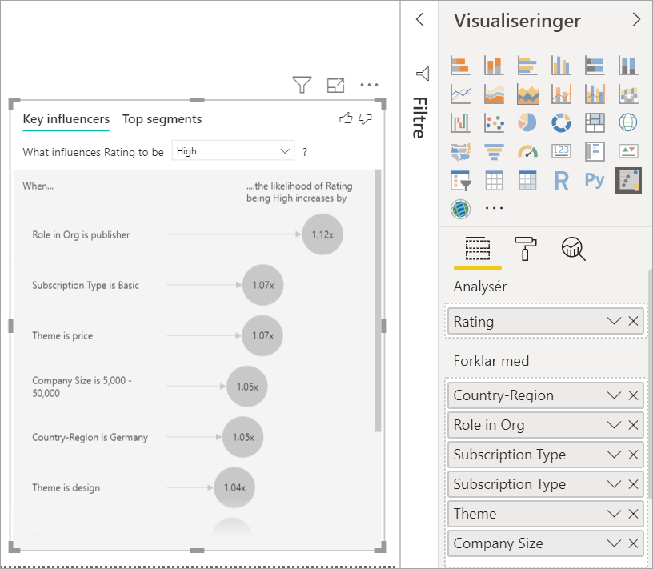

Analysen kører på tabelniveau for det felt, der analyseres. I dette tilfælde er vi interesseret i metrikværdien **Bedømmelse**, som er defineret på kundeniveau (hver kunde har enten givet en høj score eller lav score). Alle vores forklarende faktorer skal defineres på kundeniveau, for at visualiseringen kan gøre brug af dem. 

I eksemplet ovenfor har alle vores forklarende faktorer enten en en til en- eller en mange til én-relation med vores metrikværdi. Hver score har f.eks. nøjagtig ét tema, der er tilknyttet den (hvad var det vigtigste tema i kundeanmeldelsen). På samme måde kan kunder komme fra ét land, have én type medlemskab og én rolle i deres organisation. Vores forklarende faktorer er derfor allerede attributter for en kunde, og der er ikke behov for transformeringer – visualiseringen kan bruge dem direkte. 

Senere i selvstudiet ser vi på mere komplekse eksempler, hvor vi har én til mange-relationer. I disse tilfælde skal kolonnerne først samles ned til kundeniveauet, før analysen kan køres.  

De målinger og samlinger, der bruges som forklarende faktorer, bedømmes også på tabelniveau af metrikværdien **Analysér**, og vi vil se nogle eksempler senere i denne artikel. 

## Sådan fortolker du kategoriske nøglefaktorer 
Lad os se nærmere på vores nøglefaktorer for lave bedømmelser. 

### Den største enkeltfaktor, der påvirker sandsynligheden for en lav bedømmelse

Der er tre roller i virksomheden: forbrugere, administratorer og udgivere. Vi kan se, at det er forbrugerne, som er den største faktor, der bidrager til en lav bedømmelse. 

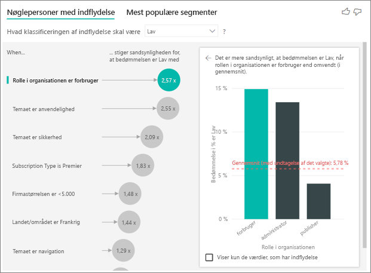

Mere nøjagtigt er der 2,57 gange større sandsynlighed for, at forbrugerne giver os en negativ score. Diagrammet over nøglefaktorer angiver **Rolle i organisationen er forbruger** først på listen til venstre. Ved at vælge **Rolle i organisationen er forbruger** viser Power BI os flere oplysninger i ruden til højre – den komparative betydning af hver enkelt **rolle** med hensyn til sandsynligheden for en lav bedømmelse.
  
- 14,93 % af forbrugerne giver en lav score  
- I gennemsnit giver alle andre roller en lav score i 5,78 % af gangene 
- Der er derfor 2,57 gange større sandsynlighed for, at forbrugerne giver en lav score sammenlignet med alle de andre roller (forskellen mellem grøn linje og rød stiplet linje) 

### Den næststørste enkeltfaktor, der påvirker sandsynligheden for en lav bedømmelse

Visualiseringen af nøglefaktorerne kan sammenligne og rangordne faktorer fra mange forskellige variabler.  Den næststørste nøglefaktor har intet med **Rolle i organisationen** at gøre.  Vælg den næststørste nøglefaktor på listen: **Tema er anvendelighed**. 

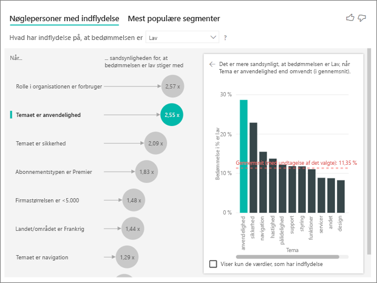

Her kan vi se, at den næstvigtigste nøglefaktor er forbundet med temaet for kundens bedømmelse. Der var 2,21 gange større sandsynlighed for, at de kunder, der kommenterede på produktets *anvendelighed*, gav en lav score i forhold til de kunder, som kommenterede på andre temaer, f.eks. driftssikkerhed, design eller hastighed. 

Du kan se, at gennemsnittet (rød stiplet linje) har ændret sig fra 5,78 % til 11,34 % fra den ene visualisering til den anden. Gennemsnittet er dynamisk, da det er baseret på gennemsnittet af alle de andre værdier. I tilfældet med den første nøglefaktor omfattede gennemsnittet ikke kunderollen, men i tilfældet med den anden omfattede den ikke anvendelighedstemaet. 
 
Hvis du markerer afkrydsningsfeltet nederst i visualiseringen, vil det bevirke, at visualiseringen kun filtreres til at vise de værdier, som betyder noget (i dette tilfælde de roller, som genererer en lav score). Vi går derfor fra at se på 12 temaer til de fire, som Power BI har identificeret som dem, der genererer lave bedømmelser. 

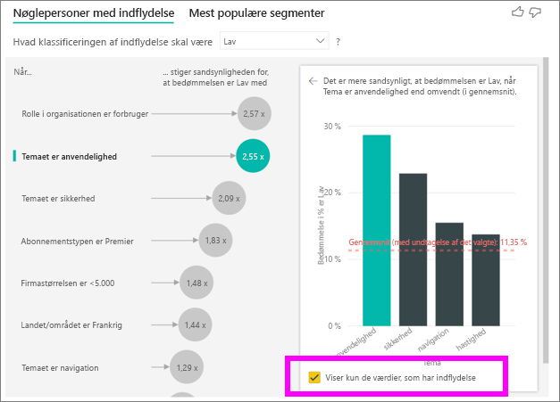

## Interaktion med andre visualiseringer 
 
Hver gang en bruger klikker på et udsnit, filter eller andre visualiseringer på lærredet, kører visualiseringen af nøglefaktorerne analysen på de nye dele af dataene. Lad os f.eks. trække Firmastørrelse til rapporten og bruge det som et udsnit. Vi vil gerne se, om nøglefaktorerne for vores virksomhedskunder (med over 50.000 ansatte) er anderledes end befolkningen som helhed.  
 
Hvis du vælger **>50.000**, køres analysen igen, og vi kan se, at nøglefaktorerne har ændret sig. For store virksomhedskunder har den vigtigste nøglefaktor for lave bedømmelser et **tema**, der relaterer til **sikkerhed**. Det kan være, at vi skal undersøge det nærmere for at se, om der er bestemte sikkerhedsfunktioner, som vores store kunder er utilfredse med. 

## Fortolkning af faste nøglefaktorer 
 
Indtil videre har vi brugt visualiseringen til at se på, hvordan de forskellige kategorifelter påvirker lave bedømmelser. Det er også muligt at føje faste faktorer (f.eks. alder, højde, pris osv.) til "Forklar med". Lad os se, hvad der sker, hvis vi trækker "Brugsperiode" fra tabellen Kunde til "Forklar med". Brugsperiode viser, hvor længe kunden har brugt tjenesten. 
 
Vi kan se, at efterhånden som værdien for **Brugsperiode** stiger, stiger sandsynligheden for en lavere bedømmelse også. Denne tendens antyder, at der er større sandsynlighed for, at langtidskunderne giver en negativ score, hvilket er en interessant indsigt og én, som jeg vil følge op på senere.  
 
Visualiseringen fortæller os, at hver gang brugsperioden stiger med 13,44 måneder, stiger sandsynligheden for en lav bedømmelse med 1,23 gange. I dette tilfælde skildrer de 13,44 måneder standardafvigelsen for brugsperiode. Så den indsigt, vi får, ser på, hvordan en forhøjelse af brugsperioden med en standardmængde (standardafvigelsen for brugsperiode) påvirker sandsynligheden for en lav bedømmelse. 
 
Scatterplottet i højre side viser den gennemsnitlige % af lave bedømmelser for hver værdi af ansættelse og indeholder en tendenslinje for at fremhæve hældningen.  

## Fortolkning af målinger/samlinger som nøglefaktorer 
 
Til sidst kan brugerne også bruge målinger og samlinger som forklarende faktorer i deres analyse. Det kan f.eks. være, at vi gerne vil se, hvilken indflydelse antallet af supportanmodninger fra kunden eller den gennemsnitlige varighed, som en supportanmodning er åben, påvirker scoren. 
 
I dette tilfælde vil vi gerne se, om antallet af supportanmodninger fra en kunde har indflydelse på den score, kunden giver. Vi henter id'et for supportanmodningen fra tabellen Supportanmodning. Da en kunde kan have flere supportanmodninger, skal vi samle id'et på kundeniveau. Denne samling er vigtig, da vi kører analysen på kundeniveau, så alle drivere skal være defineret på dette niveau. 
 
Vi vil se på antallet af id'er (så hver kunderække har en optælling af de supportanmodninger, der er knyttet til dem). I dette tilfælde kan vi se, at når antallet af supportanmodninger stiger, vil sandsynligheden for en lav bedømmelse stige til 5,51x. I visualiseringen i højre side vises det gennemsnitlige antal supportanmodninger for forskellige bedømmelsesværdier (evalueret på kundeniveau). 

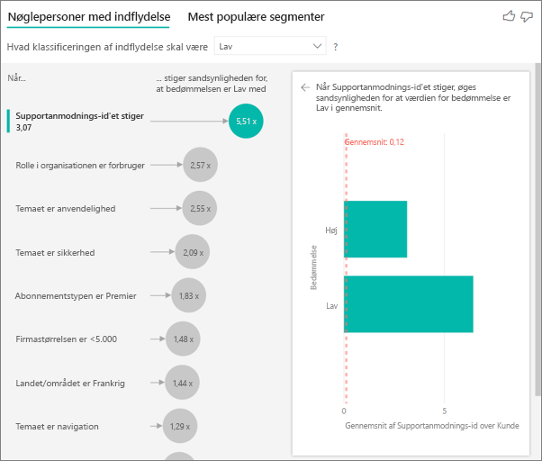

## Fortolkning af resultaterne: største segmenter 
 
Under fanen ‘Nøglefaktorer’ kan brugerne bedømme hver faktor individuelt, og brugerne kan skifte til ‘Største segmenter’ for at se, hvordan en kombination af faktorer påvirker de metrikværdier, de analyserer. 
 
Under de største segmenter vises der en oversigt over alle de segmenter, der er blevet registreret af Power BI. I nedenstående eksempel kan vi se, at der er fundet seks segmenter. Disse segmenter er rangeret efter procentdelen af lave bedømmelser i segmentet. Vi kan f.eks. se, at segment 1 har 74,3 % lave kundebedømmelser.  Jo højere boblen er, jo højere er andelen af lave bedømmelser. Størrelsen på boblerne repræsenterer, hvor mange kunder der er i segmentet. 

Når du vælger en boble, får du vist flere detaljer for segmentet. Hvis vi vælger Segment 1, kan vi se, at det udgøres af relativt faste kunder (som har været kunder i mere end 29 måneder), og som har et stort antal supportanmodninger (mere end 4). Og til sidst kan vi se, at de ikke er udgivere, så de er enten forbrugere eller administratorer.  
 
I denne gruppe har 74,3 % givet en lav bedømmelse. Den gennemsnitlige kunde giver en lav bedømmelse 11,7 % af tiden, så dette segment har en væsentligt større andel af lave bedømmelser (63 procentpoint højere). Vi kan også se, at segment 1 indeholder ca. 2,2 % af dataene, så det repræsenterer en adresserbar del af stikprøven. 

## Overvejelser og fejlfinding 
 
**Hvilke begrænsningerne er der i prøveversionen?** 
 
Visualiseringen med nøglefaktorer er i øjeblikket i offentlig prøveversion, og der er flere begrænsninger, som brugerne bør være opmærksomme på. Funktioner, der aktuelt ikke er tilgængelige, omfatter: 
- Analyse af metrikværdier, der er samlinger/målinger 
- Forbrug af visualiseringen i integreret 
- Forbrug af visualiseringen på Power BI til mobilenheder 
- Understøttelse af RLS 
- Understøttelse af Direct Query 
- Understøttelse af Live Query 
 
**Jeg får vist en fejl om, at der ikke blev fundet nogen faktorer/segmenter. Hvorfor sker det?**  

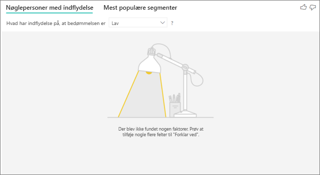

Denne fejl opstår, når du har medtaget felter i **Forklar ved**, men der ikke blev fundet nogen faktorer.   
- Du inkluderede den metrikværdi, du analyserede, i både 'Analysér' og 'Forklar ved' (du skal fjerne den fra **Forklar ved**) 
- Dine forklarende felter indeholder for mange kategorier med få observationer. Det gør det svært at bestemme, hvilke faktorer der er nøglefaktorer, da det er svært at generalisere ting baseret på nogle få observationer 
- Dine forklarende faktorer har et tilstrækkeligt antal observationer til at foretage generaliseringer, men visualiseringen fandt ikke nogen meningsfulde korrelationer 
 
**Jeg får vist en fejl om, at den metrikværdi, jeg analyserer, ikke har tilstrækkeligt mange data til at kunne analyseres. Hvorfor sker det?**  

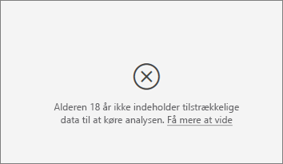

Visualiseringen virker ved at se efter mønstre i dataene for en gruppe, f.eks. de kunder, der gav lave bedømmelser, i forhold til andre grupper, f.eks. de kunder, der gav høje bedømmelser. Hvis dataene i din model har meget få observationer, er det svært at finde mønstre. Hvis visualiseringen ikke har nok data til at finde betydningsfulde nøglefaktorer, vil den indikere, at der kræves flere data for at kunne analysere dem. Det anbefales, at der er mindst 100 observationer for den valgte tilstand (kundeafgang) og mindst 10 observationer for den tilstand, du bruger til sammenligning (blivende kunder).  
 
**Jeg får vist en fejl om, at et felt i ‘Forklar ved’ ikke er entydigt relateret til den tabel, der indeholder den metrikværdi, jeg analyserer. Hvorfor sker det?**  
 
Analysen kører på tabelniveau for det felt, der analyseres. Hvis du f.eks. analyserer kundefeedback for din tjeneste, kan det være en tabel, der fortæller dig, om en kunde har givet en høj eller lav bedømmelse. I dette tilfælde vil din analyse køre på kundetabelniveau. 

Hvis du har en relateret tabel, der er defineret på et mere detaljeret niveau end den tabel, der indeholder dine metrikværdier, kan du kan støde på denne fejl. Lad os illustrere dette via et eksempel: 
 
- Du analyserer det, der medfører, at kunderne giver din tjeneste en lav bedømmelse 
- Du vil gerne vide, om den enhed, som kunderne bruger din tjeneste på, har indflydelse på deres bedømmelse 
- En kunde kan bruge tjenesten på flere forskellige måder   
- I eksemplet nedenfor bruger kunde 10000000 både en browser og en tablet til at bruge tjenesten 

Hvis du prøver at bruge kolonnen for enheder som en forklarende faktor, får du vist følgende fejl: 

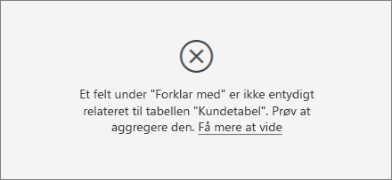

Det skyldes, at enheden ikke er defineret på kundeniveau. Kunden kan bruge den samme tjeneste på flere forskellige enheder. Hvis visualiseringen skal kunne finde mønstre, skal enheden være en attribut for kunden. I dette tilfælde har jeg flere løsninger afhængigt af min forståelse af virksomheden: 
 
- Jeg kan ændre opsummeringen af enheder til f.eks. et antal, hvis jeg mener, at antallet af enheder kan have betydning for kundens bedømmelse 
- Jeg kan oprette en pivot for enhedskolonnen for at se, om den anvendte type enhed har betydning for kundens bedømmelse  
 
I dette eksempel har jeg pivoteret mine data for at oprette nye kolonner for browser, mobil og tablet. Jeg kan nu bruge disse i 'Forklar ved'. Som du kan se, er alle enheder nøglefaktorer, mens browseren har den største betydning for kundens bedømmelse. 

De kunder, der ikke bruger tjenesten via en browser, vil være 3,79 gange mere tilbøjelige til at give en lav score end dem, der bruger tjenesten via en browser. Længere nede på listen kan vi se, at for mobilenheder gælder det modsatte. De kunder, der bruger mobilappen, vil med større sandsynlighed give end lavere score end dem, der ikke bruger mobilappen.  

**Jeg får vist en advarsel om, at målingerne ikke var inkluderet i min analyse. Hvorfor sker det?** [2052261] 

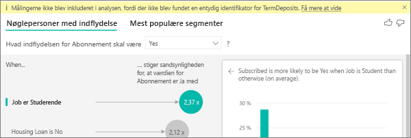

Analysen kører på tabelniveau for det felt, der analyseres. Hvis du analyserer kundeafgangen, har du muligvis en tabel, hvor du kan se, om kunden stadig er kunde eller ej. I dette tilfælde vil din analyse køre på kundetabelniveau.
 
Målinger og samlinger analyseres som standard på tabelniveau. Hvis vi havde en måling for 'Gennemsnitligt månedligt forbrug' ville det blive analyseret på kundetabelniveau.  

Hvis kundetabellen ikke har et entydigt id, kan vi ikke evaluere målingen, og den ignoreres af analysen. Hvis du vil undgå dette, skal du sikre, at tabellen med din metrikværdi (i dette tilfælde kundetabellen) har et entydigt id (f.eks. kunde-id). Det er også meget nemt at tilføje en indekskolonne med Power-forespørgsel.
 
**Jeg får vist en advarsel om, at den metrikværdi, jeg analyserer, har mere end 10 entydige værdier, og at dette kan påvirke kvaliteten af min analyse. Hvorfor sker det?**  

AI-visualiseringen er optimeret til analyse af kategorier, f.eks. er Afgang ‘Ja’ eller ‘Nej’, Kundetilfredshed er ‘Høj’, ‘Mellem’ eller ‘Lav’ osv.) Hvis du øger det antal kategorier, der skal analyseres, er der færre observationer pr. kategori, hvilket gør det sværere for visualiseringen at finde mønstre i dataene. 

Hvis du vil finde stærkere nøglefaktorer, anbefales det, at du grupperer ensartede værdier til en enkelt gruppering. Hvis du f.eks. har en metrikværdi for pris, vil du sandsynligvis opnå bedre resultater, hvis du grupperer ensartede priser i grupperingerne ‘Høj’, ‘Mellem’, ‘Lav’. 

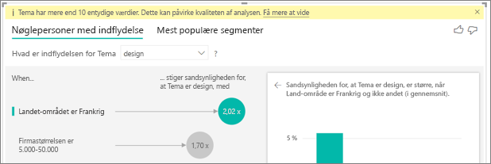

**Mine data indeholder faktorer, hvor det ser ud til, at de burde være nøglefaktorer, men ikke er det. Hvordan kan det ske?**

I nedenstående eksempel kan det ses, at de kunder, som er forbrugere, giver de fleste lave bedømmelser (14,93 % af bedømmelserne er lave). Som du kan se, har administratorrollen også en stor del lave bedømmelser (13,42 %), men den betragtes ikke som en nøglefaktor. 

Årsagen til dette er, at visualiseringen også tager antallet af datapunkter i betragtning, når der skal findes nøglefaktorer. I nedenstående eksempel har vi mere end 29.000 forbrugere og 10 gange færre administratorer (ca 2.900). Kun 390 af dem gav en lav bedømmelse. Visualiseringen har derfor ikke tilstrækkeligt med data til at bestemme, om det har fundet et faktisk mønster for administratorernes bedømmelser, eller om det blot er tilfældigheder.  

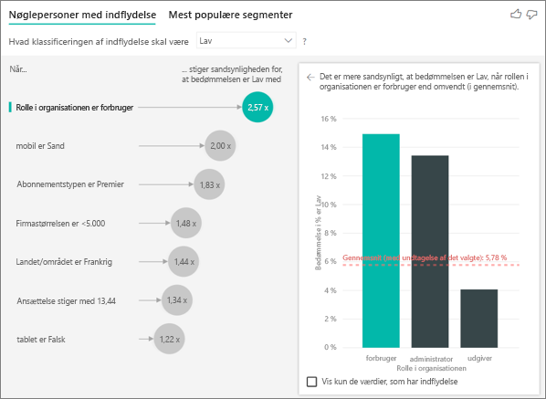

**Hvordan findes nøglefaktorerne?**

AI-visualiseringen kører en logistisk regression for at beregne nøglefaktorerne. En logistisk regression er en statistisk model, der sammenligner forskellige grupper med hinanden. Hvis vi skal se på, hvad der styrer de lave bedømmelser, vil den logistiske regression se på, hvordan de kunder, der gav en lav bedømmelse, adskiller sig fra dem, der gav en høj bedømmelse. Hvis vi havde flere kategorier (høj score, neutral score, lav score), ville vi se på, hvad forskellen er mellem dem, der gav en lav score, og dem der ikke gjorde (hvordan de adskiller sig fra dem, der gav enten en høj eller neutral bedømmelse). 
 
Logistisk regression søger efter mønstre i dataene og leder efter, hvordan de kunder, som gav en lav bedømmelse, adskiller sig fra de kunder, der gav en høj bedømmelse. Det kan f.eks. finde frem til, at de kunder, som har flere supportanmodninger, giver en større andel af lave bedømmelser end dem, som har få eller ingen supportanmodninger.
 
Den logistiske regression tager også antallet af datapunkter i betragtning. Hvis eksempelvis de kunder, som har en administratorrolle, giver forholdsvis flere negative bedømmelser, men der kun er tale om få administratorer, vil de ikke blive anset for at være faktorer, der har nogen indflydelse. Det skyldes, at der ikke er nok datapunkter til at udlede et mønster. En statistisk test (Wald-test) bruges til at bestemme, om en faktor betragtes som en nøglefaktor. Visualiseringen bruger en p-værdi på 0,05 til at bestemme tærsklen. 
 
**Hvordan beregnes segmenter?**

AI-visualiseringen kører et beslutningstræ for at finde interessante undergrupper. Målet med beslutningstræet er at finde frem til en undergruppe af datapunkter, der er relativt høj inden for de metrikværdier, vi er interesseret i (f.eks. de kunder, der gav en lav bedømmelse). 

Beslutningstræet tager hver forklarende faktor og forsøger at finde frem til, hvilken faktor der giver den bedste opdeling. Hvad hvis vi f.eks. filtrerer dataene, så de kun inkluderer store virksomhedskunder, som vil separere de kunder, som gav en høj eller lav bedømmelse? Eller hvad nu, hvis vi filtrerer dataene, så de kun inkluderer de kunder, som har skrevet kommentarer om sikkerheden? 

Når beslutningstræet foretager en opdeling, tager den undergruppen af data, f.eks. de kunder, som har skrevet kommentarer om sikkerheden, og forsøger at finde ud af, hvad der kan være den næste bedste opdeling af de data. Efter hver opdeling tager det også antallet af datapunkter i betragtning for at sikre, at det er en repræsentativ gruppe, som det kan udlede et mønster ud fra, eller om det blot er en afvigelse i dataene og derfor ikke et rigtigt segment. Der anvendes en anden statistisk test for at kontrollere den statistiske signifikans af opdelingsbetingelsen, som har en p-værdi på 0,05). 

Når beslutningstræet er færdigt, tager det alle opdelingerne (kommentarer om sikkerhed, store virksomheder) og opretter Power BI-filtre. Denne kombination af filtre vises som et segment i visualiseringen. 
 
**Hvorfor bliver nogle faktorer nøglefaktorer/stopper med at være nøglefaktorer, når jeg trækker flere felter til ‘Forklar ved’?**

Visualiseringen evaluerer alle forklarende faktorer samlet. Det betyder, at selvom faktoren i sig selv er en nøglefaktor, er den muligvis ikke en nøglefaktor, når den tages i betragtning i forhold til andre faktorer. Forestil dig, at vi vil analysere os frem til, hvad der medfører en høj pris og bruge antal værelser og husets størrelse som forklarende faktorer: 
- Ekstra værelser kan i sig selv være styrende for en højere pris 
- Hvis vi medtager husets størrelse i analysen, ser vi også på, hvad der sker i forhold til antal værelser, hvis størrelsen på huset er konstant 
- Hvis vi vælger en fast størrelse på 140 kvm, er det usandsynligt, at prisen vil stige væsentligt, selvom der er flere værelser. Antal værelser vil da ikke være helt så vigtig en faktor, som før vi tog størrelsen på huset med i betragtning. 

## Næste trin
[Kombinationsdiagrammer i Power BI](power-bi-visualization-combo-chart.md)

[Visualiseringstyper i Power BI](power-bi-visualization-types-for-reports-and-q-and-a.md)
