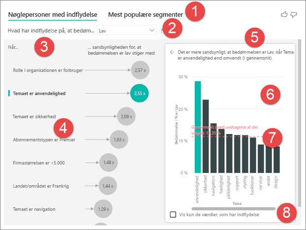
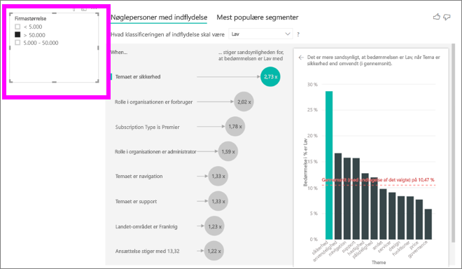
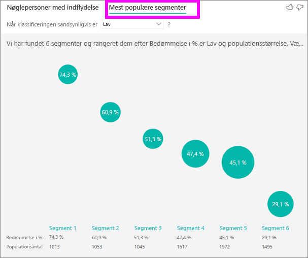
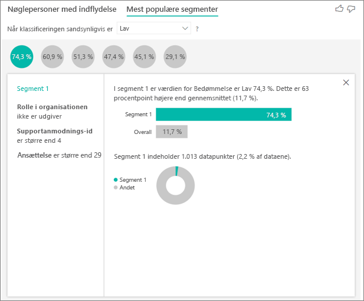
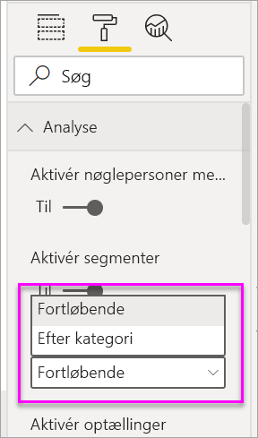
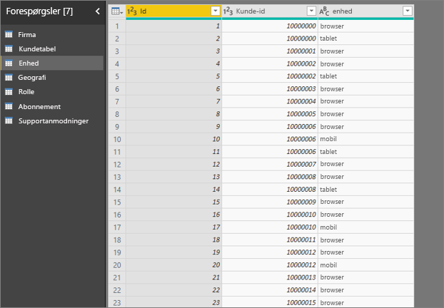
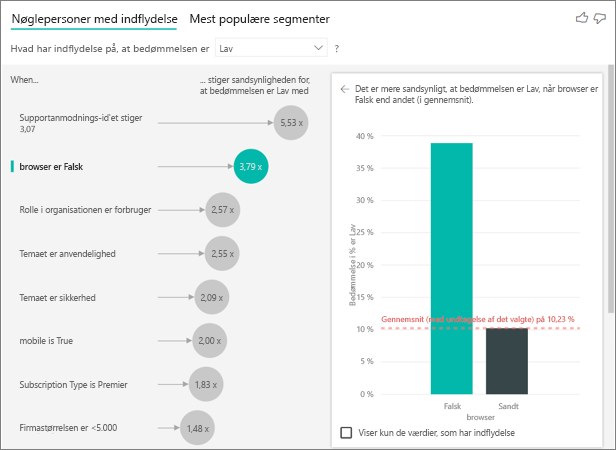

# Visualisering af nøglefaktorer
De vigtigste lobbyister visual hjælper dig med at forstå faktorer, der har en metrikværdi, som du er interesseret i. Den analyserer dine data, rangerer de faktorer, der betyder noget, og viser dem som nøglefaktorer. Lad os antage, at du vil finde ud af, hvilke medarbejder omsætningen, hvilket er også kendt som churn indvirkninger. En faktor muligvis ansættelse kontrakt længde, og en anden faktor kan være medarbejder alder. 
 
## Når du bruger vigtige lobbyister 
De vigtigste lobbyister visual er et godt valg, hvis du vil: 
- Se, hvilke faktorer der påvirker metrikværdien analyseres.
- Kontrast den relative vigtighed af disse faktorer. Har ansættelseskontrakter med en kortere ansættelsesperiode en større betydning for medarbejderudskiftningen end ansættelseskontrakter med en længere ansættelsesperiode? 

## Krav til nøglefaktorer 
Du analysere metrikværdien skal være enten kategoriske eller numerisk felt (aggregeringer og målinger understøttes endnu ikke).

## Funktioner i de vigtigste lobbyister visual

1. **Faner**: Vælg en fane for at skifte mellem visninger. **Vigtige lobbyister** viser de vigtigste bidragsydere til den valgte metriske værdi. **Top segmenter** viser de øverste segmenter, der bidrager til den valgte metrikværdi. Et *segment* består af en kombination af værdier. F.eks, være ét segment forbrugere, der har været kunderne i mindst 20 år og direkte i det vestlige område. 

2. **Rullelisten**: Værdien af metrikværdien under undersøgelse. I dette eksempel kigger på metrikværdien **Rating**. Den valgte værdi er **lav**.

3. **Tilpasningen**: Det hjælper dig med at fortolke det visuelle element i venstre rude.

4. **Venstre rude**: Ruden til venstre indeholder ét visuelt element. I dette tilfælde viser ruden til venstre en liste over de øverste vigtige lobbyister.

5. **Tilpasningen**: Det hjælper dig med at fortolke det visuelle element i ruden til højre.

6. **Højre rude**: Ruden til højre indeholder ét visuelt element. I dette tilfælde søjlediagrammet viser alle værdierne for de vigtigste øver indflydelse **tema** , der er valgt i venstre rude. Den specifikke værdi af **anvendelighed** i venstre rude vises med grønt. Alle de andre værdier for **tema** vises i sort.

7. **Gennemsnitslinje**: Gennemsnittet beregnes for alle de andre mulige værdier for **tema** undtagen **anvendelighed**. Så beregningen anvendes på alle sorte værdier. Den fortæller dig, hvilken procentdel af den anden **temaer** gav dig et lave bedømmelse. Med andre ord, når har fået en bedømmelse af en kunde, beskriver pågældende kunde også årsagen til eller tema for bedømmelse. Nogle temaer er anvendelighed, hastighed og sikkerhed. 

   **Tema er anvendelighed** er den næstbedste vigtige øver indflydelse for en lave bedømmelse, i henhold til det visuelle element i venstre rude. Hvis du gennemsnitlig alle de andre temaer og deres bidrag til en bedømmelse af **lav**, får du resultatet vises med rødt. Alle de andre temaer givet, kun 11.35% er højere end **anvendelighed**.

8. **Markér afkrydsningsfeltet**: **Vis kun værdier, der er lobbyister**.

## Opret en visualisering af nøglefaktorer 
 
Se denne video for at få mere at vide, hvordan du opretter en nøgle lobbyister visual. Derefter skal du følge disse trin for at oprette en. 

<iframe width="560" height="315" src="https://www.youtube.com/embed/fDb5zZ3xmxU" frameborder="0" allow="accelerometer; autoplay; encrypted-media; gyroscope; picture-in-picture" allowfullscreen></iframe>

Din Product Manager, ønsker du at regne ud, som faktorer potentielle kunder for at lade negativ anmeldelser om din skytjeneste. Åbn [PBIX-filen Customer Feedback](https://github.com/Microsoft/powerbi-desktop-samples/blob/master/2019/customerfeedback.pbix) i Power BI Desktop for at følge med. Du kan også downloade den [kunde Feedback Excel-fil til Power BI-tjenesten eller Power BI Desktop](https://github.com/Microsoft/powerbi-desktop-samples/blob/master/2019/customerfeedback.xlsx). 

> [!NOTE]
> Kundefeedback datasættet er baseret på [Moro og andet udrulningen, 2014] S. Moro, s. Cortez og s. Rita. "En datadrevet tilgang til at forudsige Bank Telemarketing succes." *Decision supportsystemer*, Elsevier, 62:22-31, juni 2014. 

1. Åbn rapporten, og vælg den **nøgle lobbyister** ikonet. 

    

2. Flyt den metrikværdi, som du vil undersøge i den **analysér** felt. Den **analysér** understøtter kun kategoriske eller ej, variabler i feltet. Se det, der driver en kunde bedømmelse af tjenesten til at være lav, skal du vælge **kundetabel** > **bedømmelse**. 
3. Flyt felter, som du synes, kan påvirke **Rating** i den **ved at forklare** felt. Du kan flytte lige så mange felter, som du ønsker. I dette tilfælde skal starte med:
    - Land-område 
    - Rolle i organisationen 
    - Abonnementstype 
    - Firmastørrelse 
    - Tema 
1. Vælg for at fokusere på den negative bedømmelse, **lav** i den **hvad købsadfærden bedømmelse skal være** rullelisten.  

    

Analyse, der kører på tabelniveau på det felt, der analyseres. I dette tilfælde er den **Rating** metrikværdi. Denne metrikværdi er defineret på en kundeniveau. Hver enkelt kunde har givet enten en høj score eller en lav score. Alle forklarende faktorer skal være defineret på niveauet kunden til det visuelle element at gøre brug af dem. 

I det foregående eksempel har alle de forklarende faktorer enten en en til en eller en mange-til-en-relation med metrikværdi. I dette tilfælde har hver score nøjagtigt én tema, der er knyttet til den. Dette tema var det vigtigste tema Review kunde. På samme måde kan kommer kunder fra ét land, du har én type af medlemskab og udføre én rolle i deres organisation. Forklarende faktorer er allerede attributter for en kunde, og ingen transformationer, der er nødvendige. Det visuelle element kan gøre øjeblikkelig brugen af dem. 

Senere i dette selvstudium skal se du mere komplekse eksempler, der har en-til-mange-relationer. I disse tilfælde har kolonnerne, der skal først sammenlægges ned til niveauet kunde før du kan køre analyse. 

Målinger og aggregeringer, der bruges som forklarende faktorer også evalueres på tabelniveau af den **analysér** metrikværdi. Senere i denne artikel vises nogle eksempler. 

## Fortolk kategoriske vigtige lobbyister 
Lad os se nærmere på de vigtigste lobbyister for lave bedømmelse. 

### Øverste enkelt faktor, der påvirker sandsynligheden for en lave bedømmelse

Organisationen i dette eksempel har tre roller: forbruger-administrator og udgiver. Der forbruger er den vigtigste faktor, der bidrager til en lave bedømmelse. 

Dine forbrugere er mere præcist, 2.57 gange mere tilbøjelig til at give en negativ score for din tjeneste. De vigtigste lobbyister diagram lister **rolle i organisationen er forbruger** første på listen til venstre. Ved at vælge **rolle i organisationen er forbruger**, Power BI viser flere detaljer i ruden til højre. Hver rolle comparative indvirkning på sandsynligheden for en lave bedømmelse vises.
  
- 14.93% af forbrugere giver en lav score. 
- Alle andre roller giver i gennemsnit, en lav score 5.78% af tiden.
- Forbrugere er 2.57 gange mere tilbøjelig til at give en lav score, sammenlignet med alle andre roller. Du kan se dette ved at dividere den grønne linje med den røde stiplede linje. 

### Anden enkelt faktor, der påvirker sandsynligheden for en lave bedømmelse

De vigtigste lobbyister visual sammenligner og rangerer faktorer fra mange forskellige variabler. Den anden øver indflydelse har ikke noget at gøre med **rolle i organisationen**. Vælg den anden øver indflydelse på listen, som er **tema er anvendelighed**. 

Den anden vigtigste faktor er relateret til temaet for kundens gennemgang. Kunder, der kommenterede om anvendelighed af produktet var 2.55 gange mere sandsynligt, at give en lav score, sammenlignet med kunder, der kommenterede på andre temaer, f.eks pålidelighed, design eller hastighed. 

Mellem de visuelle elementer ændres den gennemsnitlige, der vises af den røde stiplede linje, fra 5.78% til 11.34%. Gennemsnittet er dynamisk, fordi den er baseret på gennemsnittet af alle andre værdier. Gennemsnitlige udelades for den første øver indflydelse, kunderollen. Den udelades anvendelighed temaet for det andet øver indflydelse. 
 
Vælg den **kun at vise værdier, der er lobbyister** afkrydsningsfelt for at filtrere ved hjælp af de vigtige værdier. I dette tilfælde, er de de roller, der driver en lav score. 12-temaer er reduceret til de fire, som Power BI, der er identificeret som de temaer, der driver lave bedømmelse. 

## Interagere med andre visuelle elementer 
 
Hver gang du vælger et udsnit, filtrere eller andre visuelle elementer på lærredet, kører de vigtigste lobbyister visual igen at analysere på den nye del af data. Du kan f.eks, flytte **firmastørrelse** i rapporten og bruge det som et udsnit. Brug den til at se, om de vigtigste lobbyister til din enterprise-kunder er anderledes end befolkningen. En enterprise-firmastørrelse er større end 50.000 medarbejdere.
 
Hvis du vælger **> 50.000** genudsendelser analysen, og du kan se, at lobbyister ændres. Store Virksomhedskunder har den øverste øver indflydelse for lav klassifikationer et tema, der er relateret til sikkerhed. Du vil undersøge vist et diagram, hvis der er specifikke sikkerhedsfunktioner dine store kunder er tilfreds om. 

## Fortolk løbende vigtige lobbyister 
 
Indtil videre, du har set, hvordan du bruger det visuelle element til at udforske, hvordan de forskellige kategorifelter påvirke lave bedømmelse. Det er også muligt at have løbende faktorer, f.eks alder, højde og pris i den **ved at forklare** felt. Lad os se på, hvad sker der, når **ansættelse** er flyttet fra kundetabellen i **Forklar ved**. Ansættelse viser, hvor lang tid en kunde har brugt tjenesten. 
 
Eftersom ansættelse stiger, øges sandsynligheden for modtagelse af en lavere bedømmelse også. Denne tendens foreslår, at kunderne længerevarende er mere tilbøjelig til at give en negativ score. Denne indsigt er interessant, og én, som du vil følge op på senere. 
 
Visualiseringen vises, hver gang ansættelse stiger med 13.44 måneder, i gennemsnit sandsynligheden for en lave bedømmelse øges ved 1,23 gange. I dette tilfælde skildrer de 13,44 måneder standardafvigelsen for brugsperiode. Så den indsigt, modtager du ser på, hvordan du øger ansættelse med et fast beløb, som er standardafvigelsen for ansættelse, påvirker sandsynligheden for modtagelse af en lave bedømmelse. 
 
Punktdiagram i ruden til højre viser den gennemsnitlige procentdel af lave bedømmelse for hver værdi af ansættelse. Den fremhæver hældningen med en tendenslinje.

## Fortolkning af målinger og aggregeringer som nøgle lobbyister 
 
Du kan bruge målinger og aggregeringer som forklarende faktorer i din analyse. Eksempelvis kan du se, hvilken effekt antallet af kunden supportanmodninger eller den gennemsnitlige varighed af en åben billet har på resultatet, du modtager. 
 
I dette tilfælde kan du se, hvis antallet supportanmodninger, der har en kunde købsadfærden scoren de giver. Nu du samle **understøtter billet ID** fra tabellen support billet. Da en kunde kan have flere supportanmodninger, kan du aggregere ID'ET til niveauet kunde. Aggregering er vigtigt, da analysen, der kører på niveauet kunde, så alle drivere, der skal defineres på dette niveau af granularitet. 
 
Lad os se på antallet id'er. Hver kunderække har en optælling af supportanmodninger, der er knyttet til den. Sandsynligheden for, at den klassificering, der går i dette tilfælde, som antallet af support billetter øges, lav op 5.51 gange. Det visuelle element til højre viser det gennemsnitlige antal supportanmodninger ved forskellige **Rating** værdier, der evalueres på niveauet for kunden. 

## Fortolk resultaterne: Mest populære segmenter 
 
Du kan bruge den **nøgle lobbyister** fane for at vurdere hver faktor individuelt. Du kan også bruge den **Top segmenter** fane for at se, hvordan en kombination af faktorer påvirker metrikværdi, som du er ude. 
 
Øverste segmenter vise begynde med en oversigt over alle de målgrupper, der registreres i Power BI. Følgende eksempel viser, at der blev fundet seks segmenter. Disse segmenter er sorteret efter procentdelen af lave bedømmelse i målgruppen. Segment 1, f.eks, har 74.3% kunde klassifikationer, der er lav. Jo højere boblen er, jo højere er andelen af lave bedømmelser. Størrelsen på boblerne repræsenterer, hvor mange kunder, der er i målgruppen. 

Når du vælger en boble, får du vist flere detaljer for segmentet. Hvis du vælger Segment 1, f.eks, finde du, det består af relativt etablerede kunder. De kunder, der har været i mere end 29 måneder og har mere end fire supportanmodninger. Til sidst, de er ikke udgivere, så de er enten forbrugere eller administratorer. 
 
I denne gruppe gav 74.3% af en lave bedømmelse. Gennemsnitlig kunden har givet lav rating 11,7% af tiden, så dette segment har en større andel af lave bedømmelse. Det er 63 procent datapunkter højere. Segment 1 indeholder også ca. 2.2% af dataene, så det repræsenterer en adresserbare del af en population. 

## Arbejde med numeriske data

Hvis du flytter et numerisk felt i den **analysér** felt, du selv vælge, hvordan du kan håndtere dette scenarie. Du kan ændre funktionsmåden for det visuelle element ved at gå til den **ruden formatering** og skifte mellem **kategoriske Analysis Type** og **fortløbende Analysis Type**.

A **kategoriske Analysis Type** fungerer som beskrevet ovenfor. Hvis du søgte på undersøgelse vurderinger, der strækker sig fra 1 til 10, kan du bede 'Hvad købsadfærden undersøgelse vurderinger, der skal være 1'?

A **fortløbende Analysis Type** ændrer spørgsmålet til en løbende. I ovenstående eksempel vil vores nye spørgsmål være 'Hvad købsadfærden undersøgelse vurderinger til at øge/reducere'?

Denne skelnen er meget nyttigt, når du har masser af entydige værdier i feltet, du analyserer. I nedenstående eksempel kigger vi på hus priser. Det er ikke mening at stille 'Hvad købsadfærden hus pris, der skal være 156,214'? det er meget vil specifikke, og vi sandsynligvis ikke har nok data til at udlede et mønster.

I stedet vi måske beder, 'Hvad købsadfærden hus prisen for at øge'? som giver os mulighed at behandle hus priser som et område i stedet for entydige værdier.

## Fortolk resultaterne: Nøglepersoner med indflydelse 

I dette scenarie kan vi se på 'Hvad købsadfærden hus prisen for at øge'. Vi ser på en række forklarende faktorer, der kan påvirke en hus pris som **år er bygget** (år huset blev bygget), **KitchenQual** (køkken kvalitet) og **YearRemodAdd** (år huset blev remodeled). 

I nedenstående eksempel kan vi se på vores mest populære øver indflydelse, som er køkken kvalitet ved at blive Fortræffelig. Resultaterne er meget lig med dem, der er vi så, da vi analysere kategoriske målinger med nogle få vigtige forskelle:

- Søjlediagrammet til højre ser den gennemsnit i stedet for procenter. Det derfor viser os det gennemsnitlige hus prisen for et hus med en fremragende køkken er (grøn på værktøjslinjen) sammenlignet med gennemsnitlige hus prisen for et hus uden en fremragende køkken (stiplede linje)
- Tallet i boblen er stadig forskellen mellem den røde stiplede linje og en grøn linje, men det er angivet som et tal ($158. 49K) i stedet for en sandsynligheden (1.93 x). Osv gennemsnit, huse med fremragende køkkener er næsten $160K dyrere end huse uden fremragende køkkener.

I nedenstående eksempel vi ser på påvirkningen har en løbende faktor (år hus blev remodeled) på hus pris. Forskellen sammenlignet med, hvordan vi analyserer løbende lobbyister for kategoriske målepunkter er som følger:

-   Punktdiagram i ruden til højre viser den gennemsnitlige hus pris for hver distinkte værdi for år remodeled. 
-   Værdien i boblen viser ved, hvor meget det gennemsnitlige hus prisen stiger (i dette tilfælde $2. 87k) når året huset blev remodeled øges ved dens standardafvigelse (i dette tilfælde 20 år)

Til sidst skal kunne være målinger, vi ser på det gennemsnitlige år blev et hus bygget. Analysen her er som følger:

-   Scatterplot i højre rude viser den gennemsnitlige hus pris for hver distinkte værdi i tabellen
-   Værdien i boblen viser ved, hvor meget det gennemsnitlige hus prisen stiger (i dette tilfælde $1. 35K) når gennemsnittet år øger med dens standardafvigelse (i dette tilfælde 30 år)

## Fortolk resultaterne: Øverste segmenter

Øverste målgrupper er for numeriske mål Vis grupper, hvor priserne huset i gennemsnit højere end i den overordnede datasættet. For eksempel nedenfor vi kan se, at **Segment 1** består af huse hvor **GarageCars** (antallet af biler, der kan tilpasses garagen) er større end 2 og **RoofStyle** scanningsprogrammet. Huse med disse egenskaber har en gennemsnitlig pris på $355K sammenlignet med det samlede gennemsnit i de data, som er $180K.

## Overvejelser og fejlfinding 
 
**Hvad er begrænsningerne for prøveversionen?** 
 
De vigtigste lobbyister visual er i øjeblikket tilgængelig som offentlig prøveversion, og det har nogle begrænsninger. Funktioner, der ikke er tilgængelig i øjeblikket omfatter: 
- Analysere målinger, der er aggregeringer eller målinger.
- Forbruger Visualiseringen i Power BI Embedded.
- Brug det visuelle element til Power BI-mobilapps.
- Understøtter RLS.
- Understøttelse af direkte forespørgsler.
- Understøttelse af direkte forbindelse.

**Jeg kan se en fejl, der ikke blev fundet nogen lobbyister eller segmenter. Hvorfor sker det?** 

Denne fejl opstår, når du inkluderede felter i **Forklar ved** , men der blev ikke fundet nogen lobbyister. 
- Du har medtaget metrikværdien du analysere i både **analysér** og **Forklar ved**. Fjerne den fra **Forklar ved**. 
- Dine forklarende felter indeholder for mange kategorier med få observationer. Denne situation er det svært at bestemme, hvilke faktorer der lobbyister Visualiseringen. Det er svært at generalize baseret på kun nogle få bemærkninger. Hvis du analyserer et numerisk felt du vil skifte fra **kategoriske Analysis** til **løbende Analysis** i den **ruden formatering** under den  **Analyse** kort.
- Din forklarende faktorer har nok observationer generalize, men Visualiseringen blev ikke fundet nogen meningsfulde korrelationer til rapporten.
 
**Jeg kan se en fejl, ikke har jeg. analyserer metrikværdien nok data til at køre analyse på. Hvorfor sker det?** 

Visualiseringen fungerer ved at kigge på mønstre i dataene for én gruppe sammenlignet med andre grupper. F.eks, det ser ud til kunder, som gav lave bedømmelse sammenlignet med priserne for kunder, som gav høje bedømmelse. Hvis dataene i din model indeholder kun nogle få bemærkninger, findes der svært at finde mønstre. Hvis Visualiseringen ikke har nok data til at finde relevant lobbyister, angiver det, at der kræves flere data til at køre analysen. 

Vi anbefaler, at du har mindst 100 observationer for den valgte tilstand. I dette tilfælde er staten kunder, der churn. Du skal også mindst 10 observationer for de stater, du bruger til sammenligning. I dette tilfælde er tilstanden sammenligning af kunder, der ikke churn.

Hvis du analyserer et numerisk felt du vil skifte fra **kategoriske Analysis** til **løbende Analysis** i den **ruden formatering** under den  **Analyse** kort.

**Jeg får vist en fejl, som et felt i *Forklar ved* er ikke entydigt relateret til den tabel, der indeholder den jeg. analyserer metrikværdi. Hvorfor sker det?**
 
Analyse, der kører på tabelniveau på det felt, der analyseres. F.eks, hvis du analyserer kundefeedback for din tjeneste, kan det være en tabel, der fortæller dig, om en kunde har givet en høj vurdering eller en lave bedømmelse. I dette tilfælde din analyse, der kører på niveauet for table kunde. 

Hvis du har en relateret tabel, der er defineret på en mere detaljeret niveau end den tabel, der indeholder dine metrikværdi, får du vist denne fejl. Her er et eksempel: 
 
- Du kan analysere det, der driver kunder til at give lave bedømmelse af din tjeneste.
- Du vil se, hvis den enhed, som kunden bruger for din tjeneste har indflydelse på de giver anmeldelser.
- En kunde kan forbruge tjenesten på flere forskellige måder.
- I følgende eksempel bruger kunden 10000000 både en browser og en tablet til at kommunikere med tjenesten.

Hvis du forsøger at bruge kolonnen enhed som en forklarende faktor, kan du se følgende fejl: 

Denne fejlmeddelelse vises, fordi enheden ikke er defineret på niveauet for kunden. En kunde kan forbruge tjenesten på flere enheder. Enheden skal være en attribut for kunden for Visualiseringen til at finde mønstre. Der er flere løsninger, der afhænger af din forståelse for virksomheden: 
 
- Du kan ændre opsummering af enheder, der skal tælles. Brug f.eks, antal, hvis antallet af enheder, der kan påvirke det resultat, der giver en kunde. 
- Du kan pivotere kolonnen enhed for at se, hvis forbruger tjenesten på en bestemt enhed har indflydelse på en kundes bedømmelse.
 
I dette eksempel blev pivoteret dataene for at oprette nye kolonner til browseren, mobil, og tablet. Du kan nu bruge disse specifikke enheder i **Forklar ved**. Alle enheder slå til at være lobbyister, og browseren har den største indvirkning på kunden score.

Kunder, der ikke bruger browseren til at bruge tjenesten er mere præcist, 3,79 gange mere tilbøjelig til at give en lav score end de kunder, der gør. Lavere ned på listen til mobil inverteret er true. Kunder, der bruger mobilappen er mere tilbøjelig til at give en lav score end de kunder, der ikke. 

**Jeg kan se en advarsel om, at målinger ikke var inkluderet i Mine analyse. Hvorfor sker det?** 

Analyse, der kører på tabelniveau på det felt, der analyseres. Hvis du analyse af kundeafgang, kan det være en tabel, der fortæller dig, om en kunde churned eller ej. I dette tilfælde din analyse, der kører på niveauet for table kunde.
 
Målinger og aggregeringer er som standard på niveauet for table analyseres. Hvis der var et mål for gennemsnitlig månedligt forbrug, vil det analyseres på niveauet for table kunde. 

Hvis kundetabellen ikke har et entydigt id, du kan ikke evalueres målingen og ignoreres den af analysen. Kontrollér, at tabellen med din metrikværdi er et entydigt id for at undgå denne situation. I dette tilfælde, det er kundetabellen, og det entydige id er kunde-ID. Det er også nemt at tilføje et indekskolonne ved hjælp af Power-forespørgsel.
 
**Jeg kan se en advarsel, jeg. analyserer metrikværdien har mere end 10 entydige værdier og, at dette beløb kan påvirke kvaliteten af min analyse. Hvorfor sker det?** 

AI-Visualiseringen kan analysere kategorifelter og numeriske felter. Hvis kategorifelter, et eksempel kan være data, der er Ja eller Nej, og kundetilfredshed er høj, mellem eller lav. Øger antallet af kategorier til at analysere betyder, at der er færre observationer pr. kategori. Denne situation gør det sværere for Visualiseringen for at finde mønstre i dataene. 

Når du analyserer numeriske felter du har et valg mellem at behandle de numeriske felter som tekst, i hvilket tilfælde du vil køre samme analyse, som du gør for kategoriske data (**kategoriske Analysis**). Hvis du har masser af forskellige værdier, som vi anbefaler, at du skifte til analysen **løbende Analysis** som det betyder, at vi kan udlede mønstre fra når tal øger eller reducerer stedet behandle dem som entydige værdier. Du kan skifte fra **kategoriske Analysis** til **løbende Analysis** i den **ruden formatering** under den **Analysis** kort.

Du kan finde stærkere lobbyister, anbefaler vi, at du gruppere lignende værdier i en enkelt enhed. F.eks, hvis du har en metrik for pris, sandsynligvis du opnå bedre resultater ved at gruppere lignende priser i høj, mellem og lav kategorier vs. ved hjælp af individuelle prispoint. 

**Der er faktorer i mine data, der ser på, at de skal være vigtige lobbyister, men de er ikke. Hvordan kan det ske?**

I eksemplet nedenfor drive-kunder, der forbrugere lave bedømmelse og 14.93% af klassifikationer, der er lav. Rollen som administrator har også en høj andel af lav klassifikationer, 13.42%, men det er ikke opfattes som en øver indflydelse. 

Årsagen til denne bestemmelse er, at Visualiseringen også anser antallet af datapunkter, når det finder lobbyister. Følgende eksempel har mere end 29,000 forbrugere og 10 gange færre administratorer, om 2,900. Kun 390 af dem har givet en lave bedømmelse. Det visuelle element har ikke nok data til at bestemme, om det fundet et mønster med administratoren bedømmelse eller om det er blot en chance for at finde. 

**Sådan du beregner vigtige lobbyister til kategoriske analyse?**

Bag kulisserne, AI Visualiseringen bruger [ML.NET](https://dotnet.microsoft.com/apps/machinelearning-ai/ml-dotnet) til at køre en logistic regression for at beregne de vigtigste lobbyister. En logistisk regression er en statistisk model, der sammenligner forskellige grupper med hinanden. 

Hvis du vil se det, der driver lav klassifikationer, ser hvordan kunder, som gav en lav score adskiller sig fra de kunder, som gav en høj score den logistic regression. Hvis du har flere kategorier, f.eks høj, neutral og lav score, se du hvordan de kunder, som gav en lave bedømmelse adskiller sig fra de kunder, der ikke blev give en lave bedømmelse. I dette tilfælde, hvor de kunder, som gav en lav score adskiller sig fra de kunder, som gav en høj vurdering eller en neutral vurdering? 
 
Den logistic regression søger efter mønstre i dataene, og det ser ud til, hvordan kunder, som gav en lave bedømmelse kan adskille sig fra de kunder, som gav en høje bedømmelse. Det vil muligvis opdage, f.eks, at kunder med flere supportanmodninger give en højere procentdel af lave bedømmelse end kunder med kun få eller ingen supportanmodninger.
 
Den logistic regression anser også, hvor mange datapunkter er til stede. Hvis kunder, der afspiller en administratorrolle giver mere proportionalt negative resultater, men der er kun et par administratorer, er ikke denne faktor f.eks, som indflydelse. Denne bestemmelse foretages, fordi der er ikke nok datapunkter, der er tilgængelige til at udlede et mønster. En statistisk test, kendt som en Wald test, der bruges til at bestemme, om en faktor betragtes som en øver indflydelse. Visualiseringen bruger en p-værdi på 0,05 til at bestemme tærsklen. 

**Sådan du beregner vigtige lobbyister til numeriske analyse?**

Bag kulisserne, AI Visualiseringen bruger [ML.NET](https://dotnet.microsoft.com/apps/machinelearning-ai/ml-dotnet) til at køre en lineær regression for at beregne de vigtigste lobbyister. En lineær regression er en statistisk model, der viser, hvordan resultatet af det felt, du analyserer ændres baseret på dine forklarende faktorer.

Hvis vi analyserer hus priser, ser f.eks, en lineær regression på indvirkning having har en fremragende køkken på hus prisen. Har huse med fremragende køkkener generelt lavere eller højere hus priser, sammenlignet med huse uden fremragende køkkener?

Den lineære regression anser også antallet af datapunkter. For eksempel hvis huse med tennisbaner har højere priser, men vi har meget få huse, der har en Tennisbane, anses denne faktor ikke indflydelse. Denne bestemmelse foretages, fordi der er ikke nok datapunkter, der er tilgængelige til at udlede et mønster. En statistisk test, kendt som en Wald test, der bruges til at bestemme, om en faktor betragtes som en øver indflydelse. Visualiseringen bruger en p-værdi på 0,05 til at bestemme tærsklen. 

**Hvordan beregnes segmenter?**

Bag kulisserne, AI Visualiseringen bruger [ML.NET](https://dotnet.microsoft.com/apps/machinelearning-ai/ml-dotnet) til at køre et beslutningstræ for at finde interessante undergrupper. Formålet med beslutningstræet er at ender med en undergruppe af datapunkter, der er relativt høj i den metrikværdi, som du er interesseret i. Det kan være kunderne med lave bedømmelse eller huse med høje priser.

Beslutningstræet tager hver forklarende faktor og forsøger at årsag, hvilke Authentication giver det bedste *Opdel*. F.eks, hvis du filtrerer dataene, så det indeholder kun store virksomhedskunder, der afregnes ud af kunder, som gav en høje bedømmelse vs. en lave bedømmelse? Eller måske er det bedre til at filtrere dataene for at inkludere kun kunder, der kommenterede om sikkerhed? 

Når beslutningstræet gør en opdeling, det tager undergruppen af data og bestemmer det næste bedste Opdel for disse data. I dette tilfælde er undergruppen kunder, der kommenterede på sikkerhed. Efter hver opdeling, at det også tager om den har nok datapunkter til denne gruppe skal være repræsentant nok til at udlede et mønster fra, eller om det er en afvigelse i dataene, og ikke en rigtig segment. Der anvendes en anden statistiske test for at kontrollere, om statistiske betydningen af betingelsen Opdel med p-værdi på 0,05. 

Når beslutningstræet er afsluttet, det tager alle opdeling, f.eks sikkerhed kommentarer og store virksomheder, og opretter filtre i Power BI. Denne kombination af filtre vises som et segment i visualiseringen. 
 
**Hvorfor visse faktorer bliver lobbyister eller stop ved at blive lobbyister, som jeg kan flytte flere felter i den *ved at forklare* felt?**

Visualiseringen evaluerer alle forklarende faktorer samlet. En faktor kan være en øver indflydelse i sig selv, men når anses den med andre faktorer den muligvis ikke. Antag, at du vil analysere det, der driver en hus prisen for at være høj, med værelser og hus størrelse som forklarende faktorer:

- Med sig selv, kan flere værelser være en driver til hus priser til at være høj.
- Herunder hus størrelse i analysen betyder, at du nu se hvad sker der med værelser, mens hus størrelsen konstant.
- Hvis størrelsen på hus er fast på 1.500 kvadratfod, er det usandsynligt, at en konstant stigning i antallet af værelser drastisk stiger hus prisen. 
- Værelser kan ikke være så vigtig af en faktor, som det var før blev betragtet som hus størrelse. 

## Næste trin
- [Kombinationsdiagrammer i Power BI](power-bi-visualization-combo-chart.md)
- [Visualiseringstyper i Power BI](power-bi-visualization-types-for-reports-and-q-and-a.md)
