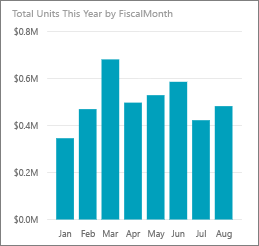
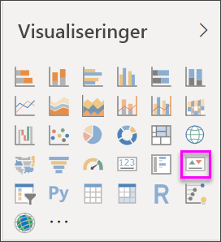
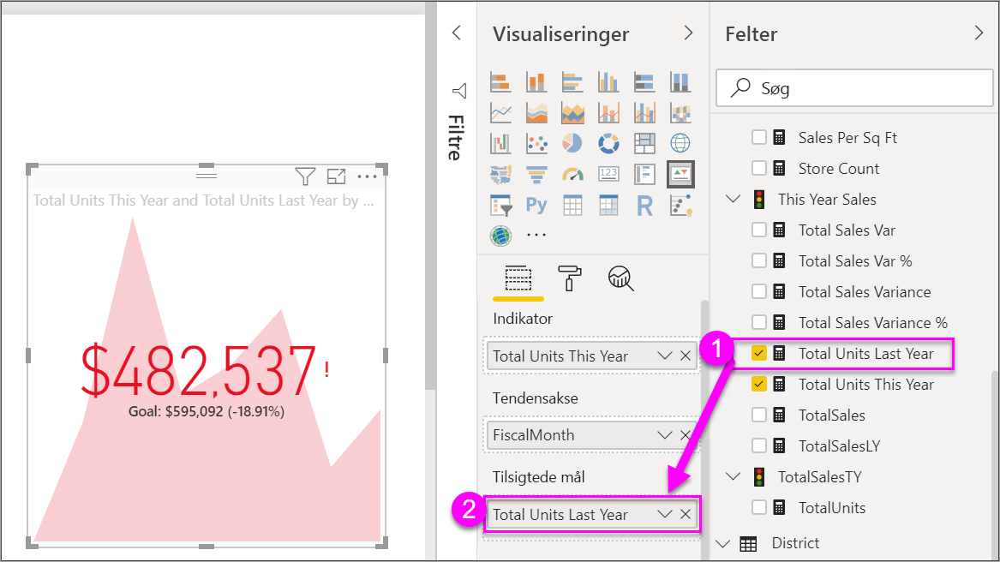

# KPI-visualiseringer
Et nøgletal (KPI) er en visuel ledetråd, der viser fremgangen mod et målbart mål. Du kan finde flere oplysninger om KPI'er ved at se [Microsoft Developer Network](https://msdn.microsoft.com/library/hh272050).

Hvis du ikke er tilmeldt Power BI, kan du [tilmelde dig en gratis prøveversion](https://app.powerbi.com/signupredirect?pbi_source=web), før du begynder.

## Forudsætninger
* [Power BI Desktop er gratis.](https://powerbi.microsoft.com/en-us/get-started/)
* [Eksempel på detailhandelsanalyse PBIX](http://download.microsoft.com/download/9/6/D/96DDC2FF-2568-491D-AAFA-AFDD6F763AE3/Retail%20Analysis%20Sample%20PBIX.pbix)

## Hvornår bruger man et KPI
KPI'er er et godt valg:

* til at måle fremgang (hvad er jeg foran eller bagefter med?)
* til at måle afstanden til et mål (hvor langt foran eller bagefter er jeg?)   

## KPI-krav
Et nøgletal (KPI) er baseret på et bestemt mål og er designet til at hjælpe dig med at evaluere den aktuelle værdi og status for en metrik i henhold til et angivet mål. KPI-visualiseringer kræver derfor en *basismåling*, som evalueres til en værdi, og en *mål*-måling eller -værdi, og en *tærskel* eller et *mål*.

I øjeblikket skal et KPI-datasæt indeholde målværdier for et KPI. Hvis dit datasæt ikke indeholder et mål, kan du oprette dem ved at føje et Excel-ark med mål til din datamodel eller PBIX-fil.

## Sådan opretter du et KPI
Åbn [.PBIX-filen med Eksempel på detailhandelsanalyse](http://download.microsoft.com/download/9/6/D/96DDC2FF-2568-491D-AAFA-AFDD6F763AE3/Retail%20Analysis%20Sample%20PBIX.pbix) i Power BI Desktop. Vi opretter et KPI, der måler vores fremgang mod et salgsmål.

Eller du kan se med, når Will viser, hvordan du opretter visualiseringer med en enkelt måling: målere, kort og KPI'er.

<iframe width="560" height="315" src="https://www.youtube.com/embed/xmja6EpqaO0?list=PL1N57mwBHtN0JFoKSR0n-tBkUJHeMP2cP" frameborder="0" allowfullscreen></iframe>

1. Åbn rapporten i rapportvisning, og vælg den gule fane for at tilføje en ny side.    
2. I ruden Felter skal du vælge **Sales > Total Units This Year**.  Dette er indikatoren.
3. Tilføj **Time > FiscalMonth**.  Dette repræsenterer tendensen.
4. VIGTIGT! Sorteé diagrammet efter **FiscalMonth**. Når du konverterer visualiseringen til et KPI, er der ikke muligt at sortere.

    
5. Konverter visualiseringen til et KPI ved at vælge ikonet KPI i visualiseringsruden.
   
    
6. Tilføj et mål. Tilføj sidste års salg som målet. Træk **Total Units Last Year** til feltet **Target goals**.
   
    
7. Du kan eventuelt formatere KPI'et ved at vælge malerrulleikonet for at åbne ruden Formatering.
   
   * **Indicator** – -styrer indikatorens visningsenheder og decimalpladser.
   * **Trend axis** – når den er slået **Til**, vises tendensaksen som baggrund i KPI-visualiseringen.  
   * **Goals** – når det er slået **Til**, viser visualiseringen målet og afstanden til målet som en procentdel.
   * **Farvekodning > Retning** – nogle KPI'er anses som *bedre* for højere værdier, og nogle anses som *bedre* for lavere værdier. For eksempel indtægter i forhold til ventetid. En højere værdi for indtjening er typisk bedre i forhold til en højere værdi for ventetid. Vælg **høj er bedre**, og rediger eventuelt farveindstillingerne.

KPI'er er også tilgængelige i Power BI-tjenesten og på dine mobilenheder, så du altid har fingeren på virksomhedens puls.

## Overvejelser og fejlfinding
* Hvis KPI'et ikke ligner det ovenfor, kan det skyldes, at du skal sortere efter fiscalmonth. Da KPI'er ikke har en sorteringsindstilling, skal du sorterer efter fiscalmonth, *før* du konverterer din visualisering til et KPI.

## Næste trin

[Grundlæggende kort i Power BI](power-bi-map-tips-and-tricks.md)

[Visualiseringstyper i Power BI](power-bi-visualization-types-for-reports-and-q-and-a.md)