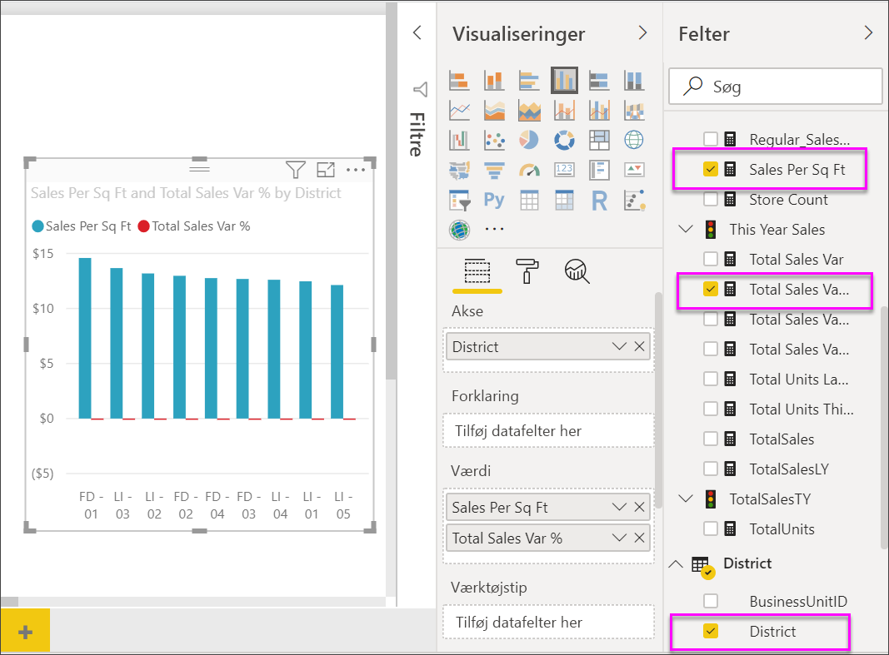
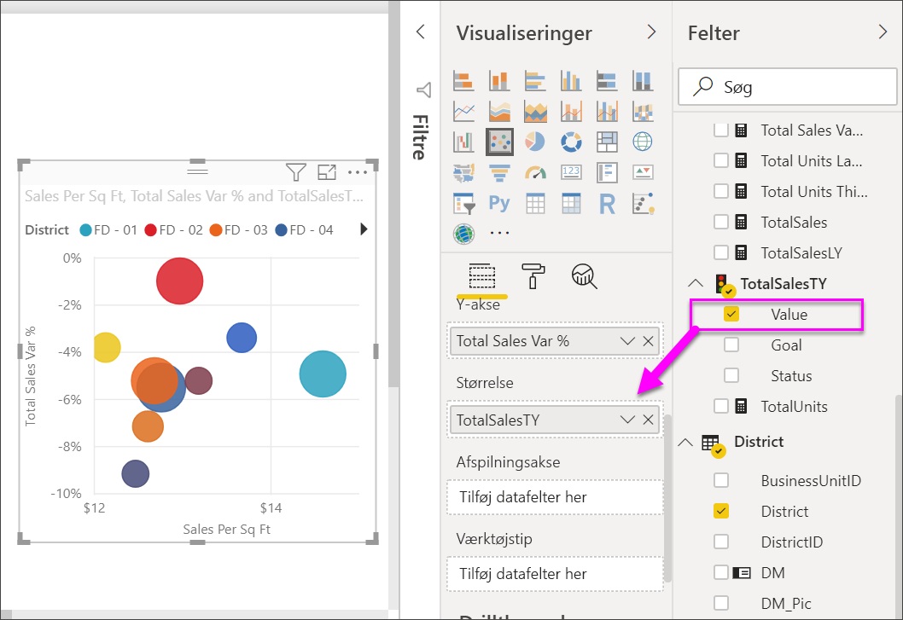

# Punktdiagrammer, boblediagrammer og prikdiagrammer i Power BI

Et punktdiagram har altid to værdiakser, der vises: ét sæt numeriske data langs en vandret akse og et andet sæt numeriske værdier langs en lodret akse. Diagrammet viser punkter ved skæringspunktet for en numerisk x- og y-værdi og kombinerer disse værdier i enkelte datapunkter. Power BI kan fordele disse datapunkter jævnt eller ujævnt på tværs af den vandrette akse. Det afhænger af de data, der repræsenteres i diagrammet.

Se denne video for at se Will oprette et punktdiagram, og følg derefter nedenstående trin for at oprette et selv.

<iframe width="560" height="315" src="https://www.youtube.com/embed/PVcfPoVE3Ys?list=PL1N57mwBHtN0JFoKSR0n-tBkUJHeMP2cP" frameborder="0" allowfullscreen></iframe>

Du kan fastsætte antallet af datapunkter, højst 10.000.  

## Hvornår skal man bruge et punktdiagram, et boblediagram eller et prikdiagram?

### Punkt- og boblediagrammer

Et punktdiagram viser relationen mellem to numeriske værdier. Et boblediagram erstatter datapunkter med bobler, hvor boblernes *størrelse* repræsenterer en yderligere tredje dimension af dataene.

Punktdiagrammer er praktiske til følgende situationer:

* Hvis du vil vise relationer mellem to numeriske værdier.

* Hvis du vil afbilde to grupper af tal som en serie af x- og y-koordinater.

* Hvis du vil bruge det i stedet for et kurvediagram, når du vil ændre skalaen for den vandrette akse.

* Hvis du vil ændre den vandrette akse til en logaritmisk skala.

* Hvis du vil vise projektmappedata, der inkluderer par eller grupperede værdisæt.

    > [!TIP]
    > I et punktdiagram kan du tilpasse akseskalaerne uafhængigt af hinanden for at afsløre flere oplysninger om grupperede værdier.

* Hvis du vil vise mønstre i store datasæt, for eksempel ved at vise lineære eller ikke-lineære tendenser, klynger og udenforliggende værdier.

* Hvis du vil sammenligne store antal datapunkter uden hensyntagen til tiden.  Jo flere data du medtager i et punktdiagram, jo bedre sammenligninger kan du udføre.

Ud over det, punktdiagrammer kan gøre for dig, er boblediagrammer et godt valg:

* Hvis dine data har tre dataserier, som hver især indeholder et sæt værdier.

* Hvis du vil præsentere finansielle data.  Forskellige boblestørrelser er praktiske til visuel fremhævning af specifikke værdier.

* Til brug med kvadranter.

### Prikdiagrammer

Et prikdiagram svarer til et boblediagram og et punktdiagram, men du kan også plotte numeriske eller kategoriske data langs X-aksen.

De er et godt valg, hvis du vil medtage kategoriske data langs X-aksen.

## Forudsætninger

* Power BI-tjenesten

* Rapporten Retail Analysis Sample

## Opret et punktdiagram

Hvis du vil følge med, skal du logge på [Power BI-tjenesten](https://app.powerbi.com) og åbne rapporten [Retail Analysis Sample](../sample-datasets.md) i visningen [Rediger rapport](../service-interact-with-a-report-in-editing-view.md).

1. Vælg  for at oprette en tom rapportside.

1. I ruden **Felter** skal du vælge disse felter:

    * **Salg** > **Salg pr. kvm.**

    * **Salg** > **Samlet salgsvarians i %**

    * **Distrikt** > **Distrikt**

    

1. I ruden **Visualiseringer** skal du vælge  for at konvertere det grupperede søjlediagram til et punktdiagram.

   

1. Træk **District** fra **Detaljer** til **Forklaring**.

    Power BI viser et punktdiagram med **Total Sales Variance %** langs Y-aksen og **Sales Per Square Feet** langs X-aksen. Datapunkternes farver repræsenterer distrikter:

    

Nu tilføjer jeg en tredje dimension.

## Opret et boblediagram

1. I ruden **Felter** skal du trække **Sales** > **This Year Sales** > **Value** til området **Størrelse**. Datapunkterne udvides til mængder, der er proportionale med salgsværdien.

   

1. Peg på en boble. Boblens størrelse afspejler værdien af **This Year Sales**.

    

1. Hvis du vil angive antallet af datapunkter, der skal vises i dit boblediagram, skal du udvide **Generelt** i ruden **Visualiseringer** i sektionen **Formatér** og justere **Datamængde**.

    

    Du kan angive, at den maksimale datamængde skal være et vilkårligt tal op til 10.000. Når du når til højere tal, anbefaler vi, at du tester det først for at sikre, at der bibeholdes en brugbar ydeevne.

    > [!NOTE]
    > Flere datapunkter kan betyde en længere indlæsningstid. Hvis du vælger at publicere rapporter med begrænsninger i den højere ende af skalaen, skal du sørge for at teste dine rapporter på både internettet og mobilenheder. Du ønsker at bekræfte, at diagrammets ydeevne svarer til dine brugeres forventninger.

1. Du kan [formatere farver, navne, titler, baggrund og mere i dine visualiseringer](service-getting-started-with-color-formatting-and-axis-properties.md).

    Hvis du vil [forbedre tilgængeligheden](../desktop-accessibility.md), bør du overveje at føje mærkeformer til hver enkelt linje. Hvis du vil vælge mærkeformen, skal du udvide **Figurer**, vælge **Mærkeform** og derefter vælge en form.

    

    Du kan ændre mærkeformen til en diamant, trekant eller firkant. Hvis du bruger en anden mærkeform for hver enkelt linje, kan brugere af rapporter nemmere adskille linjer (eller områder) fra hinanden.

## Opret et prikdiagram

Hvis du vil oprette et prikdiagram, skal du erstatte det numeriske felt **X-akse** med et kategorifelt.

Fra ruden **X-akse** skal du fjerne **Sales per sq ft** og erstatte det med **District** > **District Manager**.

## Overvejelser og fejlfinding

### Dit punktdiagram har kun ét datapunkt

Har dit punktdiagram kun ét datapunkt, der aggregerer alle værdierne på X- og Y-aksen?  Eller aggregeres alle værdierne langs en enkelt vandret eller lodret linje?

Tilføj et felt i området **Detaljer** for at angive, hvordan værdierne skal grupperes i Power BI. Feltet skal være entydigt for hvert punkt, der skal afbildes. Et enkelt rækkenummer eller id-felt er nok.

Hvis det ikke findes i dine data, kan du oprette et felt, der sammensætter X- og Y-værdierne til noget entydigt pr. punkt:

Du kan oprette et nyt felt ved at [bruge Forespørgselseditor i Power BI Desktop til at tilføje en indekskolonne](../desktop-add-custom-column.md) i dit datasæt. Tilføj derefter denne kolonne i området **Detaljer** for din visualisering.

## Næste trin

* [Stikprøvetagning med høj tæthed i Power BI-punktdiagrammer](desktop-high-density-scatter-charts.md)

* [Visualiseringstyper i Power BI](power-bi-visualization-types-for-reports-and-q-and-a.md)

Har du flere spørgsmål? [Prøv at spørge Power BI-community'et](http://community.powerbi.com/)
