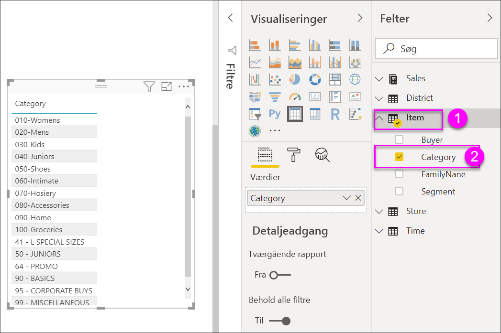
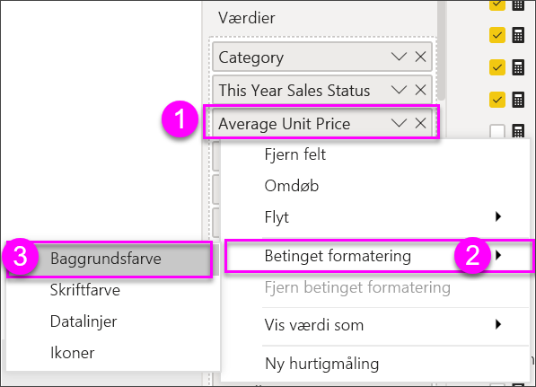
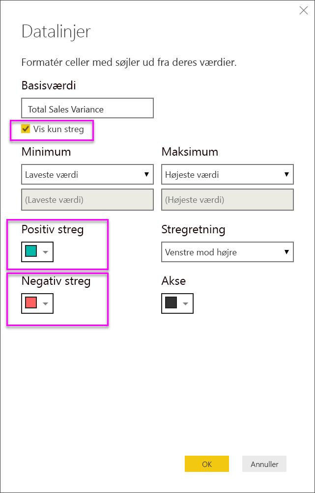
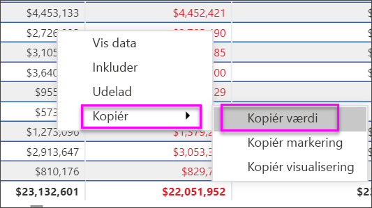

# Tabeller i Power BI-rapporter og -dashboards
En tabel er et gitter, der indeholder relaterede data i logiske serier af rækker og kolonner. Den kan også indeholde overskrifter og en række til totaler. Tabeller fungerer godt med kvantitative sammenligninger, hvor du får vist mange værdier for en enkelt kategori. Denne tabel viser for eksempel fem forskellige målinger for **Category**.

Opret tabeller i rapporter, og udfør tværgående fremhævning af elementer i tabellen med andre visuals på samme rapportside.  Derudover kan du vælge rækker, kolonner og endda individuelle celler og tværgående fremhævning. Enkelte celler og markeringer med flere celler kan kopieres og indsættes i andre programmer.

## Du skal bruge en tabel, til at
Tabeller er et godt valg til at:

* Se og sammenligne detaljerede data og nøjagtige værdier (i stedet for visuelle repræsentationer).
* Se data i tabelformat.
* Se numeriske data efter kategorier.   

> [!NOTE]
> Hvis en tabel indeholder for mange værdier, kan du overveje at konvertere den til en matrix og/eller bruge detailudledning. Det maksimale antal datapunkter, der vises i en tabel, er 3.500.

## Forudsætninger
- Power BI-tjenesten eller Power BI Desktop
- Eksempel på analyse af detailhandel

## Opret en tabel
I selvstudiet kan du oprette den tabel, der vises herover, for at få vist salgsværdierne efter varekategori. Log på Power BI-tjenesten for at følge fremgangsmåden, og vælg **Hent Data \>Eksempler \> Eksempel på detailhandelsanalyse > Opret forbindelse**, og vælg **Gå til dashboard**. Oprettelse af en visualisering kræver redigeringsrettigheder til datasættet og rapporten. Heldigvis kan alle Power BI-eksemplerne redigeres. Hvis en rapport er blevet delt med dig, kan du ikke oprette visualiseringer i den.

1. I navigationsruden til venstre skal du vælge **Arbejdsområder > Mit arbejdsområde**.    
2. Vælg fanen Datasæt, og rul ned til eksempeldatasættet Detailhandelsanalyse, som du lige har tilføjet.  Vælg ikonet **Opret rapport**.

    
2. Vælg **Item** > **Category** i rapporteditoren.  Power BI opretter automatisk en tabel over alle kategorierne.

    
3. Vælg **Sales > Average Unit Price**, **Sales > Last Year Sales** og **Sales > This Year Sales**, og vælg alle tre indstillinger (Value, Goal, Status).   
4. Find **Værdier** i ruden Visualiseringer, og træk og slip værdierne, indtil rækkefølgen af diagramkolonnerne stemmer overens med det første billede på denne side.  Du skulle nu se følgende under Værdier.

    
5. Fastgør tabellen til dashboardet ved at vælge ikonet med tavlenålen  

     

## Formatér tabellen
Der er mange måder, hvorpå du kan formatere en tabel, og jeg beskriver kun nogle få af dem her. Hvis du vil vide mere om andre formateringsindstillinger, kan du åbne ruden Formatering (ikonet med malerrullen ) og prøve dig frem.

* Prøv at formatere tabelgitteret. Her har jeg tilføjet et blåt lodret gitter, tilføjet mellemrum mellem rækkerne og forstørret kanten og tekststørrelsen en smule.

    

    
* I kolonneoverskrifterne har jeg ændret baggrundsfarven, tilføjet en kant og øget skriftstørrelsen. 

    

    

* Du kan også formatere enkelte kolonner og kolonneoverskrifter. Start ved at udvide **feltformatering**, og vælg den kolonne, der skal formateres, på rullelisten. Afhængigt af kolonneværdierne kan du med feltformateringen angive oplysninger som: visningsenheder, skriftfarve, antal decimaler, baggrund, justering med mere. Når du har valgt de ønskede indstillinger, kan du beslutte, om du også vil anvende disse indstillinger til sidehovedet og rækken Totaler.

    

* Efter lidt yderligere formatering ser den endelige tabel sådan ud. Da der er så mange formateringsindstillinger, kan det være en god idé at starte med standardformateringen, åbne ruden Formatering  og så ellers prøve dig frem. 

    

### Betinget formatering
Der findes en type formatering, der kaldes *betinget formatering*, og den anvendes på felterne under **Værdier** i ruden **Visualiseringer** i Power BI-tjenesten eller Power BI Desktop. 

Med betinget formatering af tabeller kan du angive brugerdefinerede baggrundsfarver og skriftfarver for celler baseret på celleværdier, bl.a. ved hjælp af gradueringsfarver. 

1. Vælg den nedadvendte pil ud for den værdi under **Værdier** i ruden **Visualiseringer** i Power BI-tjenesten eller Power BI Desktop, du vil formatere (eller højreklik på feltet). Du kan kun administrere betinget formatering for felter i området **Værdier** under **Felter**.

    
2. Vælg **Baggrundsfarveskalaer**. Du kan konfigurere farven og *Minimum*- og *Maksimum*-værdierne i den dialogboks, der vises. Hvis du vælger feltet **Divergerende**, kan du også konfigurere en valgfri værdi af typen *Centreret*.

    

    Jeg vil prøve at anvende brugerdefineret formatering til Average Unit Price-værdierne. Vælg **Divergerende**, tilføj nogle farver, og vælg **OK**. 

    
3. Tilføj et nyt felt i tabellen, der har både positive og negative værdier.  Vælg **Sales > Total Sales Variance**. 

    
4. Tilføj betinget formatering for datalinjen ved at vælge den nedadvendte pil ud for **Total Sales Variance** og vælge **Betinget formatering > Datalinjer**.

    
5. I den viste dialogboks kan du angive farver for **Positiv streg**, **Negativ streg**, markere afkrydsningsfeltet **Vis kun streg** og foretage eventuelle andre ændringer.

    

    Når du vælger **OK**, erstatter datalinjerne de numeriske værdier i tabellen, så den er nemmere at skimme.

    
6. Hvis du vil fjerne betinget formatering fra en visualisering, skal du blot højreklikke på feltet igen og vælge **Fjern betinget formatering**.

> [!TIP]
> Du kan også angive betinget formatering i ruden Format (ikonet med malerullen). Vælg den værdi, du vil formatere, og angiv derefter **Farveskalaer** eller **Datalinjer** til **Til** for at anvende standardindstillingerne. Hvis du vil tilpasse indstillingerne, skal du vælge **Avancerede kontrolelementer**.
> 
## Kopiér værdier fra Power BI-tabeller til brug i andre programmer

Din tabel eller matrix kan have indhold, som du ønsker at bruge i andre programmer, f.eks. Dynamics CRM, Excel og endda andre Power BI-rapporter. Ved at højreklikke i Power BI kan du kopiere en enkelt celle eller en markering med flere celler til udklipsholder og indsætte det i det andet program.

* Hvis du vil kopiere værdien af en enkelt celle, skal du markere cellen, højreklikke og vælge **Kopiér værdi**. Med den ikke-formaterede celleværdi i din udklipsholder kan du nu indsætte det i et andet program.

    

* Hvis du vil kopiere mere end en enkelt celle, skal du vælge et celleområde eller bruge Ctrl til at markere en eller flere celler. Kopien inkluderer kolonne- og rækkeoverskrifterne.

    

    Kopien inkluderer kolonne- og rækkeoverskrifterne.

    

## Tilpas kolonnebredden i en tabel
Nogle gange kan Power BI afskære en kolonneoverskrift i en rapport og på et dashboard. Hvis du vil kunne se hele kolonnenavnet, skal du pege på mellemrummet til højre for overskriften for at få vist dobbeltpilene og klikke og trække.

## Overvejelser og fejlfinding
* Når du anvender kolonneformatering, kan du kun vælge én indstilling for justering pr. kolonne: automatisk, venstre, centreret, højre. En kolonne indeholder som regel enten tekst eller tal og ikke en blanding. Hvis en kolonne indeholder både tal og tekst, vil indstillingen **Automatisk** venstrejustere tekst og højrejustere tal. Denne funktionalitet understøtter de sprog, der læses fra venstre mod højre.   

## Næste trin

[Trækort i Power BI](power-bi-visualization-treemaps.md)

[Visualiseringstyper i Power BI](power-bi-visualization-types-for-reports-and-q-and-a.md)