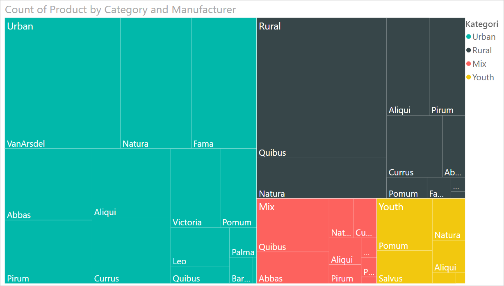
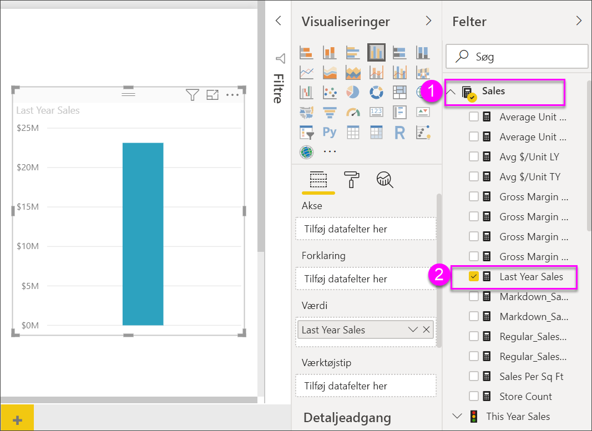
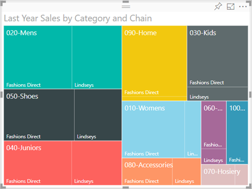

# Trækort i Power BI

[!INCLUDE[consumer-appliesto-nyyn](../includes/consumer-appliesto-nyyn.md)]

[!INCLUDE [power-bi-visuals-desktop-banner](../includes/power-bi-visuals-desktop-banner.md)]

Træstrukturer viser hierarkiske data som et sæt af indlejrede rektangler. Hvert niveau i hierarkiet er repræsenteret af et farvet rektangel (gren), der indeholder mindre rektangler (blade). Power BI baserer størrelsen på pladsen inden i de enkelte rektangler på den målte værdi. Rektanglerne er arrangeret efter størrelse fra øverst til venstre (størst) til nederst til højre (mindst).

Hvis du f.eks. analyserer dit salg, har du muligvis grene på øverste niveau for tøjkategorierne: **Urban**, **Rural**, **Youth** og **Mix**. Power BI opdeler dine kategorirektangler i blade for tøjproducenterne inden for den pågældende kategori. Disse blades størrelse tilpasses, og de får skygger ud fra antal solgte styk.

I grenen **Urban** ovenfor blev der solgt meget tøj af mærket **VanArsdel**. Der blev solgt mindre af **Natura** og **Fama**. Der blev kun solgt meget lidt af **Leo**. Så grenen **Urban** i træstrukturen har:

* det største rektangel for **VanArsdel** i øverste venstre hjørne.

* lidt mindre rektangler for **Natura** og **Fama**.

* mange andre rektangler for alle andre solgte tøjgenstande.

* et lille rektangel for **Leo**.

Du kan sammenligne antallet af varer, der er solgt på tværs af de andre tøjkategorier, ved at sammenligne størrelse og skygge på hver bladnode – større og mørkere rektangler betyder højere værdi.

## Hvornår bruger man en træstruktur?

Træstrukturer er et godt valg:

* til at vise store mængder hierarkiske data

* når et liggende søjlediagram ikke kan håndtere det store antal værdier effektivt

* til at vise proportionerne mellem de enkelte dele og en helhed

* til at vise fordelingsmønsteret for målingen på tværs af hvert niveau af kategorier i hierarkiet

* til at vise attributter ved hjælp af størrelse og farvekodning

* til at identificere mønstre, udenforliggende værdier, de vigtigste bidragydere samt undtagelser.

## Forudsætning

I dette selvstudium bruges [PBIX-filen med eksemplet Detailhandelsanalyse](https://download.microsoft.com/download/9/6/D/96DDC2FF-2568-491D-AAFA-AFDD6F763AE3/Retail%20Analysis%20Sample%20PBIX.pbix).

1. Vælg **Fil** > **Åbn** i øverste venstre afsnit af menulinjen
   
2. Find din kopi af **PBIX-filen med eksemplet Detailhandelsanalyse**

1. Åbn **PBIX-filen med eksemplet Detailhandelsanalyse** i rapportvisning .

1. Markér  for at tilføje en ny side.

> [!NOTE]
> Når du deler din rapport med en Power BI-kollega, kræves det, at I begge har individuelle Power BI Pro-licenser, eller at rapporten er gemt i en Premium-kapacitet.    

Når du har hentet datasættet for **Retail Analysis Sample**, kan du komme i gang.

## Opret en grundlæggende træstruktur

Du opretter en rapport og tilføjer en grundlæggende træstruktur.

1. I ruden **Felter** skal du vælge målingen **Sales** > **Last Year Sales**.

   

1. Vælg ikonet for træstruktur  for at konvertere diagrammet til en træstruktur.

   

1. Vælg **Element** > **Kategori**, så føjes **Kategori** til brønden **Gruppe**.

    I Power BI oprettes en træstruktur, hvor størrelsen af rektanglerne er baseret på det samlede salg, og farven repræsenterer kategorien. Egentlig har du oprettet et hierarki, som visuelt beskriver den relative størrelse af det samlede salg efter kategori. Kategorien **Men's** har det højeste salg, og kategorien **Hosiery** har det laveste.

    

1. Vælg **Butik** > **Kæde**, så føjes **Kæde** til brønden **Detaljer** for at færdiggøre din træstruktur. Nu kan du sammenligne sidste års salg efter kategori og kæde.

   

   > [!NOTE]
   > Farvemætning og Detaljer kan ikke bruges samtidig.

1. Hold markøren over **Chain** for at få vist værktøjstippet til den del af **Category**.

    Når du f.eks. fører musen hen over **Fashions Direct** i rektanglet **090-Home**, vises værktøjstippet for Fashion Directs del af kategorien Home.

   

## Fremhævning og krydsfiltrering

Hvis du fremhæver en **Kategori** eller **Detaljer** i en træstruktur, så krydsfremhæves og krydsfiltreres de andre visualiseringer på rapportsiden. For at følge med skal du enten tilføje nogle visualiseringer på denne rapportside eller kopiere træstrukturen til en af de andre sider i denne rapport. Det nedenstående billede, som træstrukturen blev kopieret til, på siden **Oversigt**. 

1. Vælg enten **Kategori** eller **Kæde** i en **Kategori** i træstrukturen. Derved krydsfremhæves de andre visualiseringer på siden. Hvis du f.eks. vælger **050-Shoes**, får du vist sidste års salg af sko, som var **$16,352,432**, hvor **Fashions Direct** stod for **$2,174,185** af dette salg.

   

1. I cirkeldiagrammet **Sidste års salg efter kæde** krydsfiltreres træstrukturen, når du vælger udsnittet **Fashions Direct**.
   

1. Hvis du vil administrere, hvordan diagrammer krydsfremhæver og krydsfiltrerer hinanden, skal du se [Skift, hvordan visualiseringer interagerer i en Power BI-rapport](../create-reports/service-reports-visual-interactions.md).

## Næste trin

* [Vandfaldsdiagrammer i Power BI](power-bi-visualization-waterfall-charts.md)

* [Visualiseringstyper i Power BI](power-bi-visualization-types-for-reports-and-q-and-a.md)

