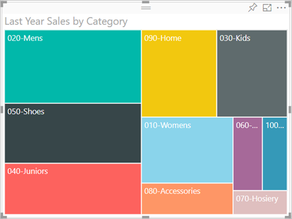
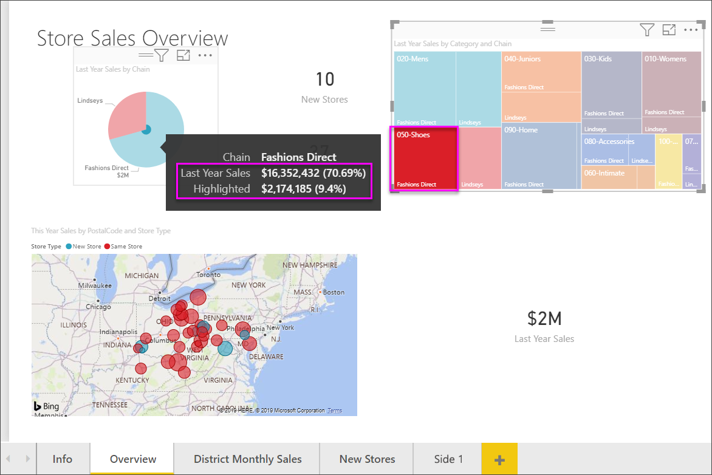

# Trækort i Power BI
Træstrukturer viser hierarkiske data som et sæt af indlejrede rektangler.  Hvert niveau i hierarkiet er repræsenteret af et farvet rektangel (ofte kaldte en "gren"), der indeholder andre rektangler ("blade").  Pladsen inde i hvert rektangel er allokeret ud fra den værdi, der måles. Og rektanglerne er arrangeret efter størrelse fra øverst til venstre (størst) til nederst til højre (mindst).

Hvis jeg f.eks. analyserer mit salg, så kunne jeg have nogle rektangler, også kaldet *grene*, på øverste niveau for tøjkategorierne: **Urban**, **Rural**, **Youth** og **Mix**.  Mit rektangel med kategorier skulle opdeles i mindre rektangler, også kaldet *blade*, for tøjproducenterne i den pågældende kategori. Og disse mindre rektanglers størrelse ville blive tilpasset, og de ville få skygger ud fra antal solgte styk.  

I grenen **Urban** ovenfor blev der solgt meget tøj af typen `Maximus`, mindre af typen `Natura` og `Fama` og lidt af typen `Leo`.  Så grenen **Urban** i min træstruktur ville have:
* det største rektangel for `Maximus` i øverste venstre hjørne
* lidt mindre rektangler for `Natura` og `Fama`
* mange andre rektangler for alle andre solgt tøjgenstande og 
* et lille rektangel for `Leo`.  

Og jeg kan sammenligne antallet af varer, der er solgt på tværs af de andre tøjkategorier, ved at sammenligne størrelse og skygge på hver bladnode – større og mørkere rektangler betyder højere værdi.

## Hvornår bruger man en træstruktur?
Træstrukturer er et godt valg:

* til at vise store mængder hierarkiske data
* når et liggende søjlediagram ikke effektivt kan håndtere det store antal værdier
* til at vise proportionerne mellem de enkelte dele og et hele
* til at vise fordelingsmønsteret for målingen på tværs af hvert niveau af kategorier i hierarkiet
* til at vise attributter ved hjælp af størrelse og farvekodning
* til at identificere mønstre, udenforliggende værdier, de vigtigste bidragsydere samt undtagelser.

### Forudsætninger
 - Power BI-tjenesten eller Power BI Desktop
 - Eksempel på analyse af detailhandel

## Opret en grundlæggende træstruktur
Vil du gerne se en anden oprette en træstruktur først?  Gå til 2:10 i denne video for at se Amanda oprette en træstruktur.

<iframe width="560" height="315" src="https://www.youtube.com/embed/IkJda4O7oGs" frameborder="0" allowfullscreen></iframe>

Eller opret din egen træstruktur. I denne vejledning bruges Retail Analysis Sample (Eksempel på detailhandelsanalyse). Log på Power BI-tjenesten for at følge fremgangsmåden, og vælg **Hent Data \>Eksempler \> Eksempel på detailhandelsanalyse \> Opret forbindelse \> Gå til dashboard**. Oprettelse af visualiseringer i en rapport kræver redigeringsrettigheder til datasættet og rapporten. Heldigvis kan Power BI-eksemplerne redigeres. Men du kan ikke føje visualiseringer til en rapport, en anden har delt med dig.  

1. Vælg feltet "Butikker i alt" for at åbne rapporten Eksempel på detailhandelsanalyse.    
2. Åbn [Redigeringsvisning](../service-interact-with-a-report-in-editing-view.md), og vælg målingen **Salg** > **Sidste års salg**.   
      
3. Konvertér diagrammet til en træstruktur.  
      
4. Træk **Item** > **Category** til feltet **Group**. I Power BI oprettes en træstruktur, hvor størrelsen af rektanglerne er baseret på det samlede salg, og farven repræsenterer kategorien.  Egentlig har du oprettet et hierarki, som visuelt beskriver den relative størrelse af det samlede salg efter kategori.  Kategorien **Men's** har det højeste salg, og kategorien **Hosiery** har det laveste.   
      
5. Træk **Store** > **Chain** til feltet **Detaljer** for at fuldende din træstruktur. Nu kan du sammenligne sidste års salg efter kategori og kæde.   
   
   
   > [!NOTE]
   > Farvemætning og Detaljer kan ikke bruges samtidig.
   > 
   > 
5. Hold markøren over **Chain** for at få vist værktøjstippet til den del af **Category**.  Når du f.eks. fører musen hen over **Fashions Direct** i rektanglet **090-Home**, vises værktøjstippet for Fashion Directs del af kategorien Home.  
   
6. [Tilføj træstrukturen som et dashboardfelt (fastgør din visual)](../service-dashboard-tiles.md). 
7. [Gem rapporten](../service-report-save.md).

## Fremhævning og krydsfiltrering
Du kan få mere at vide om brug af ruden Filters under [Føj et filter til en rapport](../power-bi-report-add-filter.md).

Hvis du fremhæver kategori eller detaljer i en træstruktur, krydsfremhæves og krydsfiltreres de andre visualiseringer på rapportsiden ... og omvendt. For at følge med skal du enten tilføje nogle visuelle elementer på denne rapportside eller kopiere træstrukturen til en af de andre ikke-tomme sider i denne rapport.

1. Vælg enten Category eller Chain i en kategori på træstrukturen.  Dette krydsfremhæver de andre visualiseringer på siden. Hvis du f.eks. vælger **050 Shoes**, kan du se, at sidste års salg af sko var 3.640.471 USD, hvoraf 2.174.185 USD kom fra Fashions Direct.  
   

2. I cirkeldiagrammet **Sidste års salg efter kæde** krydsfiltreres træstrukturen, når du vælger udsnittet **Fashions Direct**.  
       

3. Hvis du vil administrere, hvordan diagrammer krydsfremhæver og krydsfiltrerer hinanden, skal du se [Interaktioner mellem visualiseringer i en Power BI-rapport](../service-reports-visual-interactions.md)

## Næste trin

[Vandfaldsdiagrammer i Power BI](power-bi-visualization-waterfall-charts.md)

[Visualiseringstyper i Power BI](power-bi-visualization-types-for-reports-and-q-and-a.md)