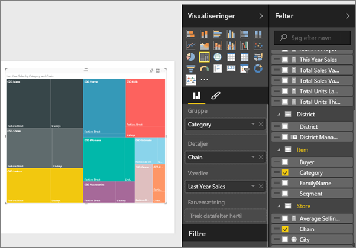

# Trækort i Power BI
Træstrukturer viser hierarkiske data som et sæt af indlejrede rektangler.  Hvert niveau i hierarkiet er repræsenteret af et farvet rektangel (ofte kaldte en "gren"), der indeholder andre rektangler ("blade").  Pladsen inde i hvert rektangel allokeres ud fra den kvantitative værdi, der måles, hvor rektanglerne er arrangeret efter størrelse fra øverste til venstre (størst) til nederst til højre (mindst).

Hvis jeg f.eks. analyserer mit salg, så kunne jeg have nogle rektangler (grene) på øverste niveau for tøjkategorierne: **Urban**, **Rural**, **Youth** og **Mix**.  Min rektangel med kategorier indeholder mindre rektangler (blade) for tøjproducenterne inden for den pågældende kategori, og disse mindre rektangler får størrelse og skygge baseret på det antal, der er solgt.  I grenen **Urban** ovenfor er der blevet solgt meget tøj fra Maximus og mindre fra Natura og Fama og meget lidt fra Leo.  Så grenen **Urban** i min træstruktur har det største rektangel for Maximus (i øverste venstre hjørne), lidt mindre rektangler for Natura og Fama og mange andre rektangler, der repræsenterer alt det andet tøj, der er blevet solgt, og et lillebitte rektangel for Leo.  Og jeg kan sammenligne antallet af varer, der er solgt på tværs af de andre tøjkategorier, ved at sammenligne størrelse og skygge på hver bladnode – jo større rektangel og jo mørkere skygge, desto højere værdi.

## Hvornår bruger man en træstruktur?
Træstrukturer er et godt valg:

* til at vise store mængder hierarkiske data
* når et liggende søjlediagram ikke effektivt kan håndtere det store antal værdier
* til at vise proportionerne mellem de enkelte dele og et hele
* til at vise fordelingsmønsteret for målingen på tværs af hvert niveau af kategorier i hierarkiet
* til at vise attributter ved hjælp af størrelse og farvekodning
* til at identificere mønstre, udenforliggende værdier, de vigtigste bidragsydere samt undtagelser.

### Forudsætninger
 - Power BI-tjenesten eller Power BI Desktop
 - Eksempel på analyse af detailhandel

## Opret en grundlæggende træstruktur
Vil du gerne se en anden oprette en træstruktur først?  Gå til 2:10 i denne video for at se Amanda oprette en træstruktur.

<iframe width="560" height="315" src="https://www.youtube.com/embed/IkJda4O7oGs" frameborder="0" allowfullscreen></iframe>

Eller opret din egen træstruktur. I denne vejledning bruges Retail Analysis Sample (Eksempel på detailhandelsanalyse). Hvis du vil følge med, skal du logge på Power BI-tjenesten (ikke Desktop) for at følge fremgangsmåden, og vælg **Hent Data \> Eksempler \> Eksempel på detailhandelsanalyse \> Opret forbindelse \> Gå til dashboard**. Oprettelse af visualiseringer i en rapport kræver redigeringsrettigheder til datasættet og rapporten. Heldigvis kan Power BI-eksemplerne redigeres. Men hvis nogen deler en rapport med dig, kan du ikke kan føje nye visualiseringer.

1. Vælg feltet "Butikker i alt" for at åbne rapporten Eksempel på detailhandelsanalyse.    
2. Åbn [Redigeringsvisning](../service-interact-with-a-report-in-editing-view.md), og vælg målingen **Salg** > **Sidste års salg**.   
      
3. Konvertér diagrammet til en træstruktur.  
      
4. Træk **Item** > **Category** til feltet **Group**. I Power BI oprettes en træstruktur, hvor størrelsen af rektanglerne afspejler det samlede salg, og farven repræsenterer kategorien.  Egentlig har du oprettet et hierarki, som visuelt beskriver den relative størrelse af det samlede salg efter kategori.  Kategorien **Mens** har det højeste salg, og kategorien **Hosiery** har det laveste.   
      
5. Træk **Store** > **Chain** til feltet **Detaljer** for at fuldende din træstruktur. Nu kan du sammenligne sidste års salg efter kategori og kæde.   
   
   
   > [!NOTE]
   > Farvemætning og Detaljer kan ikke bruges samtidig.
   > 
   > 
5. Hold markøren over **Chain** for at få vist værktøjstippet til den del af **Category**.  Hvis du f.eks. holder markøren over **Lindseys** i rektanglet **040 Juniors**, vises værktøjstippet for Lindsey's del af kategorien Juniors.  
   
6. [Tilføj træstrukturen som et dashboardfelt (fastgør din visual)](../service-dashboard-tiles.md). 
7. [Gem rapporten](../service-report-save.md).

## Fremhævning og krydsfiltrering
Du kan få mere at vide om brug af ruden Filtre under [Føj et filter til en rapport](../power-bi-report-add-filter.md).

Fremhævning af en kategori eller detaljer i en træstruktur krydsfremhæver og krydsfiltrerer de andre visualiseringer på rapportsiden ... og vice versa. For at følge med skal du enten tilføje nogle visuals på den samme side eller kopiere/indsætte træstrukturen på en rapportside, hvor der allerede er andre visuals.

1. Vælg enten Category eller Chain i en kategori på træstrukturen.  Dette krydsfremhæver de andre visualiseringer på siden. Hvis du f.eks. vælger **050 Shoes**, kan du se, at sidste års salg af sko var 3.640.471 USD, hvoraf 2.174.185 USD kom fra Fashions Direct.  
   

2. I cirkeldiagrammet **Sidste års salg efter kæde** krydsfiltreres træstrukturen, når du vælger udsnittet **Fashions Direct**.  
       

3. Hvis du vil administrere, hvordan diagrammer krydsfremhæver og krydsfiltrerer hinanden, skal du se [Interaktioner mellem visualiseringer i en Power BI-rapport](../service-reports-visual-interactions.md)

## Næste trin
[Fastgør en visualisering til et dashboard](../service-dashboard-pin-tile-from-report.md)  
[Power BI – Grundlæggende begreber](../service-basic-concepts.md)  

Har du flere spørgsmål? [Prøv at spørge Power BI-community'et](http://community.powerbi.com/)  

