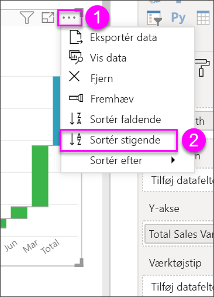

# Vandfaldsdiagrammer i Power BI

[!INCLUDE [power-bi-visuals-desktop-banner](../includes/power-bi-visuals-desktop-banner.md)]

Vandfaldsdiagrammer viser en løbende total, efterhånden som Power BI lægger værdier til eller trækker dem fra. Det er nyttigt at forstå dem for at se, hvordan en indledende værdi (f.eks. årets resultat) påvirkes af en række positive og negative ændringer.

Kolonnerne er farvekodet, så du hurtigt kan se stigninger og fald. Kolonnerne med den indledende og endelige værdi [starter ofte på den vandrette akse](https://support.office.com/article/Create-a-waterfall-chart-in-Office-2016-for-Windows-8de1ece4-ff21-4d37-acd7-546f5527f185#BKMK_Float "start på den vandrette akse"), mens de mellemliggende værdier er flydende kolonner. Vandfaldsdiagrammer kaldes også brodiagrammer på grund af deres format.

   > [!NOTE]
   > I denne video bruges en ældre version af Power BI Desktop.
   > 
   > 

<iframe width="560" height="315" src="https://www.youtube.com/embed/qKRZPBnaUXM" frameborder="0" allow="autoplay; encrypted-media" allowfullscreen></iframe>

## Hvornår skal du bruge et vandfaldsdiagram?

Vandfaldsdiagrammer er et godt valg:

* Når der er ændringer af målingen på tværs af tid, en serie eller forskellige kategorier.

* Til overvågning af overordnede ændringer, der bidrager til den samlede værdi.

* Til afbildning af virksomhedens årsresultatet ved at vise flere omsætningskilder og opnå det samlede resultat.

* Til illustration af antal medarbejdere ved årets start og slutning.

* Til visualisering af, hvor mange penge du tjener og bruger hver måned, samt den løbende kontosaldo.

## Forudsætning

I dette selvstudium bruges [PBIX-filen med eksemplet Detailhandelsanalyse](http://download.microsoft.com/download/9/6/D/96DDC2FF-2568-491D-AAFA-AFDD6F763AE3/Retail%20Analysis%20Sample%20PBIX.pbix).

1. Vælg **Fil** > **Åbn** i øverste venstre afsnit af menulinjen
   
2. Find din kopi af **PBIX-filen med eksemplet Detailhandelsanalyse**

1. Åbn **PBIX-filen med eksemplet Detailhandelsanalyse** i rapportvisning .

1. Markér  for at tilføje en ny side.

## Opret et vandfaldsdiagram

Du opretter et vandfaldsdiagram, der viser afvigelsen i salg (anslået salg i forhold til faktisk salg) pr. måned.

1. I ruden **Felter** skal du markere **Sales** > **Total Sales Variance**.

   

1. Vælg ikonet for vandfaldsdiagram 

    

1. Vælg **Time** > **FiscalMonths** for at føje det til området **Category**.

    

1. Kontrollér, at Power BI har sorteret vandfaldsdiagrammet kronologisk. Vælg **Flere indstillinger** (...) i øverste højre hjørne af diagrammet.

    I dette eksempel vælger vi **Sortér stigende**

    Kontrollér, at der er en gul indikator til venstre for **Sortér stigende**. Dette angiver, at din valgte indstilling anvendes.

    

    Derefter klikker vi på **Sortér efter** og vælger **FiscalMonth** Som i det tidligere trin vises der en gul indikator ud for dit valg, hvilket angiver, at dit valg af indstillinger anvendes.

    

    Du kan også kigge på værdierne for X-aksen og se, at de vises i rækkefølge fra **Jan** til **Aug**.

    Se lidt nærmere på, hvad der bidrager mest til ændringerne måned for måned.

1.  Vælg **Butik** > **Område**, hvorved **Område** føjes til bucket'en **Opdeling**.

    

    Som standard tilføjes de øverste fem bidragydere for stigninger eller fald pr. måned i Power BI. På nedenstående billede er vores visualiseringsrude udvidet, så den indeholder flere data. 

    

    Du er kun interesseret i de øverste to bidragydere.

1. I ruden **Formatér** skal du vælge **Breakdown** og angive **Max breakdowns** til **2**.

    

    En hurtig gennemgang viser, at områderne Ohio og Pennsylvania er de største bidragydere til bevægelser, både negative og positive, i vandfaldsdiagrammet.

    

## Næste trin

* [Rediger, hvordan visualiseringer interagerer i en Power BI-rapport](../service-reports-visual-interactions.md)

* [Visualiseringstyper i Power BI](power-bi-visualization-types-for-reports-and-q-and-a.md)
